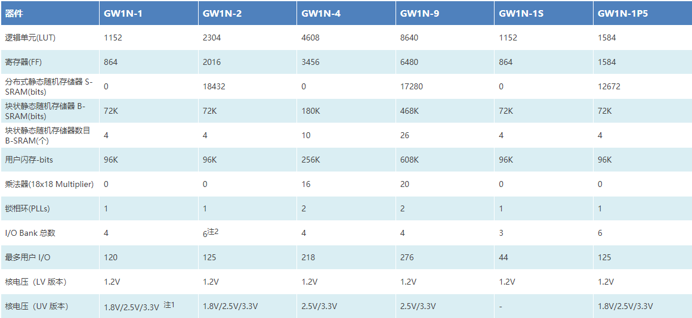
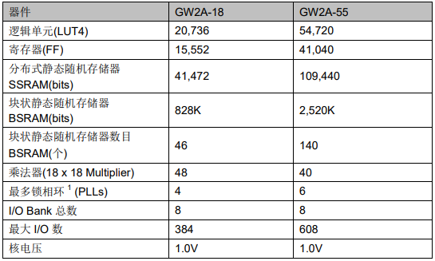
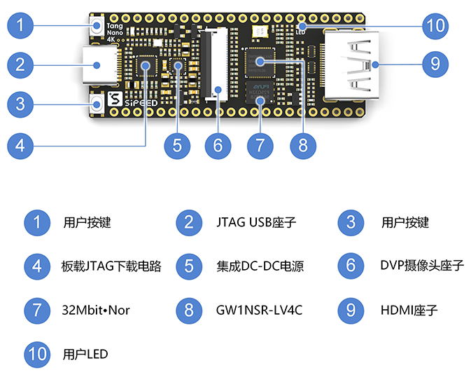
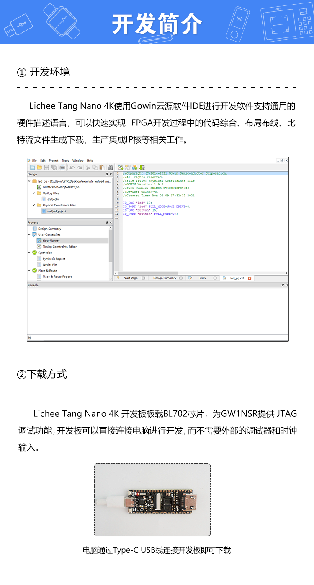
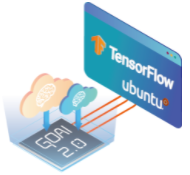

.. _gw1nsr:

GW1NSR
===============

* 关键词：``Gowin`` ``FPGA`` ``SIP`` ``Cortex-M3`` ``USB2.0 PHY``
* 资源库：`GitHub <https://github.com/SoCXin/GW1NSR>`_

.. contents::
    :local:

Xin简介
-----------

高云半导体 GW1NSR 系列 FPGA 产品是高云半导体小蜜蜂(LittleBee)家族第一代 FPGA 产品，是一款SIP芯片(55nm)，集成GW1NS系列FPGA和PSRAM存储芯片。

.. contents::
    :local:

规格参数
~~~~~~~~~~~

基本参数
^^^^^^^^^^^

* 供电电压：1.8V - 3.6V
* 工作温度：-40°C - 105°C

特征参数
^^^^^^^^^^^

* 4 输入LUT(LUT4)
* 免费使用 LittlevGL 软件库
* 轻松创建图形软件（SUD）
* 支持各式液晶显示模块（LCM）

芯片架构
~~~~~~~~~~~

GW1NSR-2C 和 GW1NSR-4C 是 SoC 芯片，以 ARM Cortex-M3 硬核处理器为核心，具备了实现系统功能所需要的最小内存。

GW1NSR-2C 最高支持 30MHz 的工作频率，GW1NSR-4C 最高支持 80MHz 的工作频率。

GW1NSR-2C
^^^^^^^^^^^

.. image:: images/GW1NSR-2C.png
    :target: http://www.gowinsemi.com.cn/prod_view.aspx?TypeId=10&FId=t3:10:3&Id=168

GW1NSR-4C
^^^^^^^^^^^

.. image:: images/GW1NSR-2C.png
    :target: http://www.gowinsemi.com.cn/prod_view.aspx?TypeId=10&FId=t3:10:3&Id=168

Xin选择
-----------
.. contents::
    :local:

品牌对比
~~~~~~~~~

`Gowin <http://www.gowinsemi.com.cn/>`_ 是全球增长最快的可编程逻辑公司，作为中国的FPGA厂商，相对传统的国际巨头，在低阶产品上具有很高的性价比。

Lattice iCE40
^^^^^^^^^^^^^^^

使用开源工具链fpga-toolchain，可以基于`PlatformIO <https://platformio.org/platforms/lattice_ice40>`_ 开发，开源工具链有以下几个优点：

* 开源工具链的中所有组件均有源代码提供，可以自行编译或者使用已经构建好的二进制文件，不需要任何厂商许可证。
* 体积小，包含了 Lattice iCE40 系列、ECP5 系列 FPGA 支持的工具链压缩包大小在 100 MB 左右，而厂商提供的安装包有几个到几十个 GB。
* 速度快，节省上板调试时间，以笔者测试用的几个小工程为例，完成代码综合、布局布线并下载到 FPGA 中仅需几秒钟的时间。
* 跨平台支持，开源工具链不仅支持 Windows，Linux 和 Mac OS 等操作系统，而且支持 x86 之外的处理器平台。

型号对比
~~~~~~~~~

GW2A系列(晨熙)
^^^^^^^^^^^^^^^

版本对比
~~~~~~~~~

.. image:: images/GW1NSR.png
    :target: http://www.gowinsemi.com.cn/prod_view.aspx?TypeId=10&FId=t3:10:3&Id=168

配置规格
^^^^^^^^^^^

.. image:: images/GW1NSR-R.png
    :target: http://cdn.gowinsemi.com.cn/DS861-1.4.4_GW1NSR%E7%B3%BB%E5%88%97FPGA%E4%BA%A7%E5%93%81%E6%95%B0%E6%8D%AE%E6%89%8B%E5%86%8C.pdf

封装规格
^^^^^^^^^^^

.. image:: images/GW1NSR-P.png
    :target: http://www.gowinsemi.com.cn/prod_view.aspx?TypeId=10&FId=t3:10:3&Id=168

Xin应用
-----------

.. contents::
    :local:

硬件资源
~~~~~~~~~~~~~

Tang Nano 4K
^^^^^^^^^^^^^^

Tang Nano 4K FPGA 板是Tang Nano FPGA板的一个升级，采用了更强大的 GOWIN GW1NSR-LV4C FPGA，它配备的是 4608 LUT（不再是之前的1152）和嵌入到芯片中的 Cortex-M3 微控制器。

Tang Nano对比

.. image:: images/TangNano.png
    :target: http://tangnano.sipeed.com/zh/

工具资源
~~~~~~~~~~~~~

Gowin IDE
^^^^^^^^^^^^^^

框架资源
~~~~~~~~~~~~~

GoAI开发套件
^^^^^^^^^^^^^^

GoAI 2.0是一个通过在高云FPGA器件上部署卷积神经网络(CNNs)的机器学习开发平台。它包含用于转换TensorFlow文件和加速器FPGA IP的软件脚本，以运行训练好的机器学习模型以及教程和示例。

GoAI 2.0集成到TensorFlow和TensorFlow Lite框架中，比起遗留平台及其他可替代平台更加方便使用。

基于TensorFlow的广泛软件开发环境，GoAI 2.0通过生成所需的所有固件，将机器学习模型直接部署到高云FPGA中，不需编写任何额外的RTL或C代码。完全支持Windows和Linux系统，包括Ubuntu。

* ARM Keil v5
* Gowin IDE or Gowin Programmer

Xin总结
--------------

.. contents::
    :local:

能力构建
~~~~~~~~~~~~~

要点提示
~~~~~~~~~~~~~

问题整理
~~~~~~~~~~~~~

