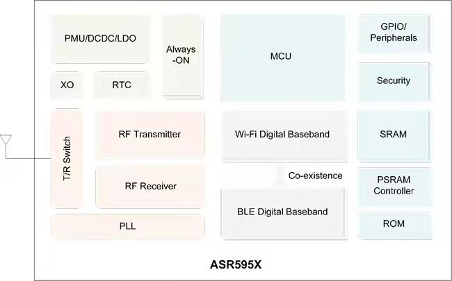

.. _asr6501:

ASR595X
===============

* `ASR <http://www.asrmicro.com/>`_ : ``SoC``
* `Tags <https://github.com/SoCXin/ASR595X>`_ : :ref:`wifi` / :ref:`ble`

.. contents::
    :local:
    :depth: 1

Xin简介
-----------

2022年4月13日，翱捷科技ASR595X系列Wi-Fi 6 + Bluetooth LE 5.1 Combo芯片顺利通过Wi-Fi联盟Wi-Fi 6 QuickTrack Qualified Solution认证，成为目前首批通过该认证的Wi-Fi 6芯片。ASR595X支持802.11ax，BLE 5.1和SIG Mesh协议，支持WPA3、OFDMA、TWT、LDPC、DL-MU等关键功能，搭载芯来科技RISC-V处理器内核，支持鸿蒙OS、阿里OS、FreeRTOS等多操作系统。已在主要头部白电厂商design in，并在摄像头、无人机、机顶盒等领域推广。

ASR595X是一系列兼具高性能和低功耗特性的高集成度的Wi-Fi 6 + Bluetooth LE 5.1 Combo芯片，广泛适用于各种物联网（IoT）场景。它搭载芯来科技RISC-V处理器内核，时钟频率高达160 MHz。内置512 KB SRAM，128 KB ROM，内部可集成最大4 MB Flash，可实现程序的OTA升级。支持GPIO、ADC、SPI、UART、I2C、I2S、PSRAM、Timer、RTC、WatchDog、SDIO和PWM等外设。支持双云/多云/BLE Mesh/Wi-Fi Mesh等多种应用方案。

ASR595X的重要优势在于支持最新的2.4 GHz Wi-Fi 6 协议 (802.11ax)，并向下兼容802.11 b/g/n。

ASR595X支持802.11b/g/n/ax 20/40 MHz带宽，支持MCS8/9数据传输速率。芯片支持单Station、单SoftAP、Sniffer以及Station/SoftAP共存等多种模式，为设备提供更高的传输速率和更低的功耗。

ASR595X支持802.11ax所带来的各种新的关键功能：支持上行正交频分多址接入 (UL-OFDMA) 和下行多用户 (HE DL-MU) 正交频分多址传输，可以辅助用户的终端产品在复杂的无线网络环境中，进行高效率、低延迟的工作。802.11ax协议的另一个重要功能是目标唤醒时间 (Target Wake Time, TWT)，可以延长设备睡眠时间，提高电池设备的使用寿命。此外，ASR595X支持LDPC和BCC编码调制，具备更优的接收灵敏度和抗干扰特性。

ASR595X支持Bluetooth LE 5.1全功能，为用户提供更便捷和快速的BLE配网方式。

支持125K/500K/1M/2M bps速率以及BLE LongRange、2Mbps、500/125Kbps Coded等多种调制模式，可用于不同传输速率和数据吞吐量要求的应用场景。支持SIG Mesh，最多可达1000个中继/代理节点。支持AOA/AOD厘米级别室内定位，适合于室内导航、安防管理等应用。

此外，ASR595X芯片还支持一整套多层次的安全解决方案：硬件安全引擎、AES/RSA/ECC/MAC、HMAC/SHA1/SHA-224/SHA256/SHA512/D-H库、真随机数发生器 (TRNG)/PRNG、Flash镜像文件加密/解密、客户数据的动态加密/解密、片上eFuse OTP。

规格配置
~~~~~~~~~~~

基本参数
^^^^^^^^^^^

特征参数
^^^^^^^^^^^

电源参数
^^^^^^^^^^^

