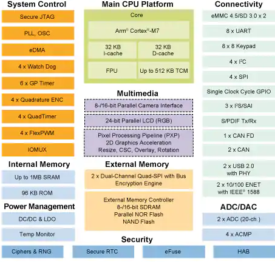
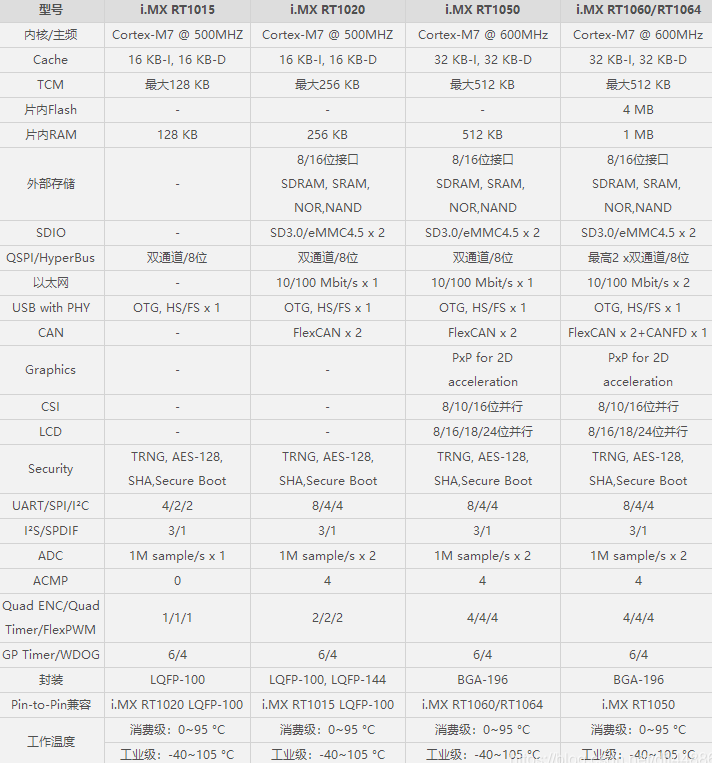

.. _rt1060:

RT1060
=============

* 关键词：``Cortex-M7`` ``600MHz`` ``USB-HS-PHY`` ``ETH-MAC-100``
* 资源库：`GitHub <https://github.com/SoCXin/RT1060>`_

.. contents::
    :local:

Xin简介
-----------

.. contents::
    :local:

规格参数
~~~~~~~~~~~

基本参数
^^^^^^^^^^^

* 发布时间：
* 供电电压：1.71 to 3.6 V
* 工作温度：40°C to +95°C
* 处理性能：1284 :ref:`DMIPS`, 3020 :ref:`CoreMark`
* RAM容量：1 MB
* Flash容量：
* 封装规格：BGA196

.. image:: ./images/RT1060p.png
    :target: https://www.nxp.com/products/processors-and-microcontrollers/arm-microcontrollers/i-mx-rt-crossover-mcus/i-mx-rt1060-crossover-mcu-with-arm-cortex-m7-core:i.MX-RT1060

特征参数
^^^^^^^^^^^

* 600 MHz :ref:`cortex_m7`

Xin选择
-----------

.. contents::
    :local:

品牌对比
~~~~~~~~~

STM32H7系列的主要竞争对手是NXP的i.MX RT系列

* STM32H7支持32位SDRAM，RT1050仅支持16位SDRAM
* STM32H7有JPEG硬解，RT的分辨率是1368 * 768，H7是1024*768
* RT带的两个USB都带高速PHY，H7系列无，得外置
* RT1060系列带双网口，H7系列仅一个

型号对比
~~~~~~~~~

.. image:: ./images/NXPRT.png
    :target: https://www.nxp.com/products/processors-and-microcontrollers/arm-microcontrollers/i-mx-rt-crossover-mcus:IMX-RT-SERIES

