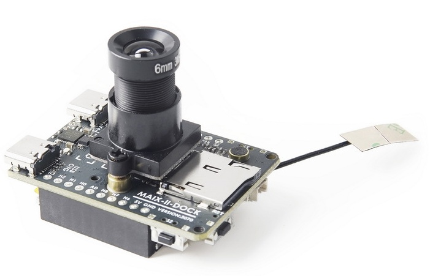

.. _v831:

V831
=============

* 关键词：``Cortex-A7`` ``800MHz`` ``64M DDR2`` ``0.2TOPS`` ``QFN88``
* 资源库：`GitHub <https://github.com/SoCXin/V831>`_

.. contents::
    :local:

Xin简介
-----------

.. image:: ./images/V831.jpg
    :target: https://linux-sunxi.org/images/b/b9/V833%EF%BC%8FV831_Datasheet_V1.0.pdf

.. contents::
    :local:

规格参数
~~~~~~~~~~~

基本参数
^^^^^^^^^^^

* 发布时间：
* 发布价格：
* 工作温度：-40°C to +85°C
* 封装规格：QFN88
* 处理性能：3000 :ref:`DMIPS` + 0.2TOPS
* RAM容量：64MB DDR2
* Flash容量：

特征参数
^^^^^^^^^^^

* 800MHz :ref:`cortex_a7`

电源参数
^^^^^^^^^^^

* 供电电压：2.0 to 3.6 V

芯片架构
~~~~~~~~~~~

Xin选择
-----------

.. contents::
    :local:

品牌对比
~~~~~~~~~

系列对比
~~~~~~~~~

.. image:: images/VS831.jpg
    :target: https://zhuanlan.zhihu.com/p/337674885

型号对比
~~~~~~~~~

Xin应用
-----------

.. contents::
    :local:

开发板
~~~~~~~~~~

Sipeed MAIX-II
^^^^^^^^^^^^^^^^^^^

.. image:: images/B_V831.jpg

.. image:: images/VS_V831.jpeg
    :target: https://baijiahao.baidu.com/s?id=1689929535408242635&wfr=spider&for=pc

