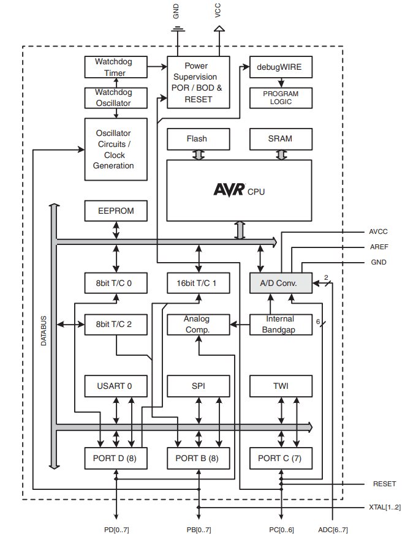

.. _mega328p:

ATMEGA328P
============

* 关键词：``ATMEL`` ``AVR`` ``20MHz`` ``8bit`` ``Arduino Uno``
* 资源库：`GitHub <https://github.com/SoCXin/MEGA328P>`_

.. contents::
    :local:

Xin简介
-----------

如果不因为Arduino，你应该找不到理由来了解这颗不值得的AVR单片机，也可以考虑下兼容的国产寨版  :ref:`lgt328p`

规格参数
~~~~~~~~~~~

基本参数
^^^^^^^^^^^

* 发布时间：
* 制程工艺：
* 工作温度：-40°C to +85°C
* 处理性能：
* RAM容量：2 KB
* Flash容量：32 KB
* 封装规格：TQFP32

特征参数
^^^^^^^^^^^

* 20 MHz AVR
* 1KB EEPROM

电源参数
^^^^^^^^^^^

* 供电电压: 1.8 to 5.5 V
* 运行功耗:

芯片架构
~~~~~~~~~~~

Xin选择
-----------

.. contents::
    :local:

品牌对比
~~~~~~~~~

.. _lgt328p:

LGT328P
^^^^^^^^^^^

* 关键词：``AVR`` ``16MHz`` ``8bit``
* 资源库：`GitHub <https://github.com/SoCXin/LGT8F328P>`_

兼容 :ref:`mega328p` 生态，同时具有更高的主频32MHz ,具有更丰富的外设如 DAC/OPA/CMP

* QFP48 (7×7mm)
* QFP32 (7×7mm)
* SSOP20

