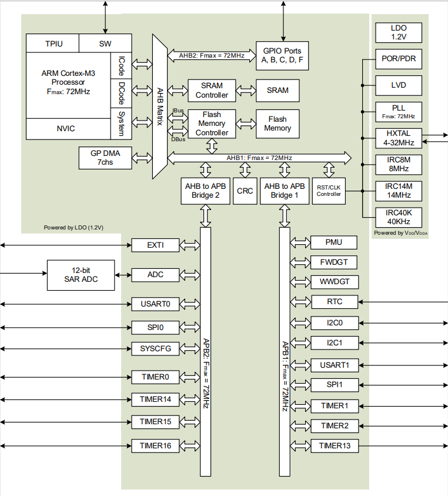
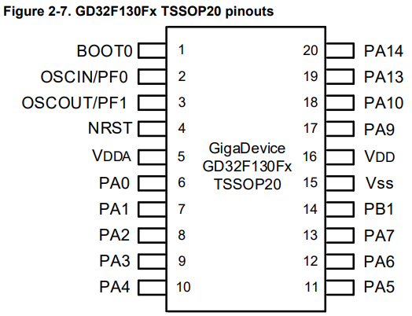

.. _gd32f130:

GD32F130
============

* 关键词：``Cortex-M3`` ``48MHz``
* 资源库：`GitHub <https://github.com/SoCXin/GD32F130>`_

.. contents::
    :local:

Xin简介
-----------

 :ref:`low` , :ref:`ref030`

规格参数
~~~~~~~~~~~

基本参数
^^^^^^^^^^^

* 发布时间：
* 制程工艺：
* 工作温度：-40°C to +85°C
* 处理性能：60 :ref:`DMIPS`, 140 :ref:`CoreMark`
* RAM容量：4/8 KB
* Flash容量：16/32/64 KB
* 封装规格：LQFP64/LQFP48/LQFP32/QFN32/QFN28/ :ref:`gd32_tssop20`

特征参数
^^^^^^^^^^^

* 48 MHz :ref:`cortex_m3`
* 16ch 1x12bit ADC (1.0 MSps)
* 6x timer

电源参数
^^^^^^^^^^^

* 供电电压: 2.6 to 3.6 V
* 运行功耗: 100μA/MHz

芯片架构
~~~~~~~~~~~

.. _gd32_tssop20:

TSSOP20
^^^^^^^^^^^

* 封装尺寸：6.5 x 4.4 x 1mm, 0.65mm pitch

* QFN28 (4 x 4 x 0.75mm)
* QFN32 (5 x 5 x 0.75mm)
* LQFP48 (7 x 7 x 1mm)
* LQFP64 (10 x 10 x 1.4mm)

Xin选择
-----------

.. contents::
    :local:

品牌对比
~~~~~~~~~

版本对比
~~~~~~~~~

型号对比
~~~~~~~~~

.. image:: ./images/GD32F130l.png
    :target: https://www.gigadevice.com/wp-content/uploads/2021/04/2021-GigaDevice-Selection-Guide_21.04.21.pdf

