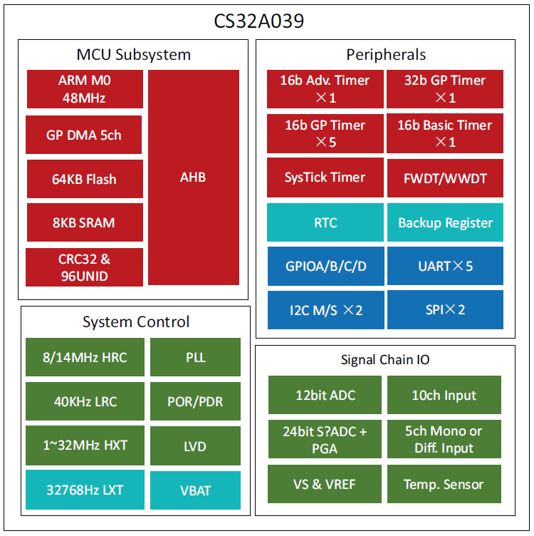

.. _cs32a039:

CS32A039
===============

* 关键词：``Cortex-M0`` ``48MHz`` ``24bit ΣΔADC`` ``信号链``
* 资源库：`GitHub <https://github.com/SoCXin/CS32A039>`_

.. contents::
    :local:

Xin简介
-----------

:ref:`cortex_m0` MCU 芯海科技推出的32位工业级信号链MCU，采用ARM® Cortex®-M0 内核，频率48MHz，最高集成64Kbytes flash和8Kbytes SRAM，并提供丰富的通信接口（I2C、SPI/I2S和USART）和多达12个定时器，具备可靠性高、精度高、功耗低等特点。

.. contents::
    :local:

规格参数
~~~~~~~~~~~

基本参数
^^^^^^^^^^^

* 供电电压：2.0 to 5.5V
* 工作温度：-40 °C to 105 °C
* 封装规格：LQFP64 (7x7mm)
* 处理性能：45 :ref:`DMIPS`
* RAM容量：8 KB
* Flash容量：64 KB

特征参数
^^^^^^^^^^^

* :ref:`cortex_m0` 48 MHz
* 1路12位ADC，1us转换时间，最多10个外部输入通道，INL低至1.2LSB
* 输入电压转换范围: 0~3.6V
* 内置1.22V参考电压，60ppm低温漂
* 内置温度传感器,精度±2℃
* VBAT内部监测,精度1%，工作电压：1.65~5.5V
* 1路24位ΣΔADC，ENOB最高22.3位
* 5个输入通道，可配置为单端或差分输入
* 内置1.225V基准电压，30ppm低温漂
* 全差分零漂移放大器，增益1/2/4/8/16/32/64/128倍可调
* 12bit 1μS ADC，INL低至1.2LSB
* 24bit ΣΔADC，ENOB 22.3bit

Xin应用
-----------

.. contents::
    :local:

PGA + ADC
~~~~~~~~~~~

高精度模数转换器 Sigma-Delta ADC（简称为 ADC2）通过一个低噪声，低漂移的 PGA 放大器将输入信号放大后送入一个 2 阶的 Sigma-Delta ADC 进行模数转换。

如图 PAG 和 Sigma-Delta ADC 结构图所示，其中 PGA 的增益由 PGA[1:0]选择，具有 1\8\16\32 四档可选；
ADC 的增益由 ADGN[1:0]所选择、具有 1\2\4\8 四档可选；参考电压来自输入的 REFP-REFN。

.. image:: ./images/CS32A039adc.png
    :target: http://www.chipsea.com/32weimcu/CS32A039R8T6.html
