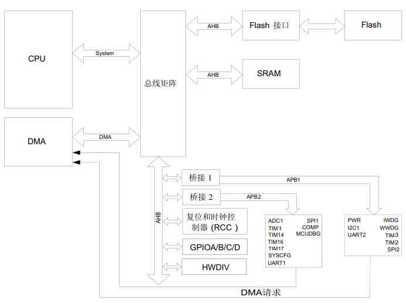
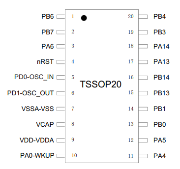

.. _mm32spin:

MM32SPIN
===============

* 关键词：``Cortex-M0`` ``72MHz``
* 资源库：`GitHub <https://github.com/SoCXin/MM32SPIN05>`_

.. contents::
    :local:

Xin简介
-----------

.. contents::
    :local:

规格参数
~~~~~~~~~~~

基本参数
^^^^^^^^^^^

* 发布时间：
* 制程工艺：
* 供电电压：2.0 to 5.5 V
* 工作温度：-40°C to +85°C
* 处理性能：68 :ref:`DMIPS`
* RAM容量：4 KB
* Flash容量：32 KB
* 封装规格：LQFP48/LQFP32/QFN32/QFN20/ :ref:`mm32_tssop20`

特征参数
^^^^^^^^^^^

* 72 MHz :ref:`cortex_m0`

芯片架构
~~~~~~~~~~~

.. _mm32_tssop20:

TSSOP20
^^^^^^^^^^^

* 封装尺寸：6.5 x 4.4 mm, 0.65mm pitch

Xin选择
-----------

.. contents::
    :local:

品牌对比
~~~~~~~~~

版本对比
~~~~~~~~~

型号对比
~~~~~~~~~

.. image:: ./images/MM32SPIN05l.png
    :target: https://www.mindmotion.com.cn/product.aspx

