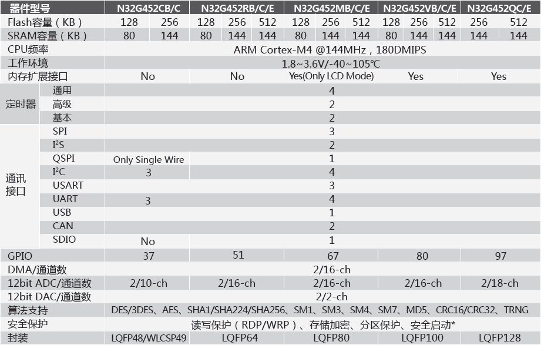

.. _n32g452:

N32G452
===============

* 关键词：``Cortex-M4`` ``144MHz`` ``MD5`` ``SM1/SM3/SM4/SM7``
* 资源库：`GitHub <https://github.com/SoCXin/N32G452>`_

.. contents::
    :local:

Xin简介
-----------

 :ref:`cortex_m4` 单核 MCU

.. contents::
    :local:

规格参数
~~~~~~~~~~~

基本参数
^^^^^^^^^^^

* 供电电压：1.8V - 3.6V
* 工作温度：-40°C - 105°C
* 内核频率：144 MHz

特征参数
^^^^^^^^^^^

* 10余种密码算法硬件：MD5/SM1/SM3/SM4/SM7

芯片架构
~~~~~~~~~~~

时钟体系
^^^^^^^^^^^

Xin选择
-----------
.. contents::
    :local:

品牌对比
~~~~~~~~~

型号对比
~~~~~~~~~

版本对比
~~~~~~~~~

Xin总结
--------------

.. contents::
    :local:

要点提示
~~~~~~~~~~~~~

问题整理
~~~~~~~~~~~~~

