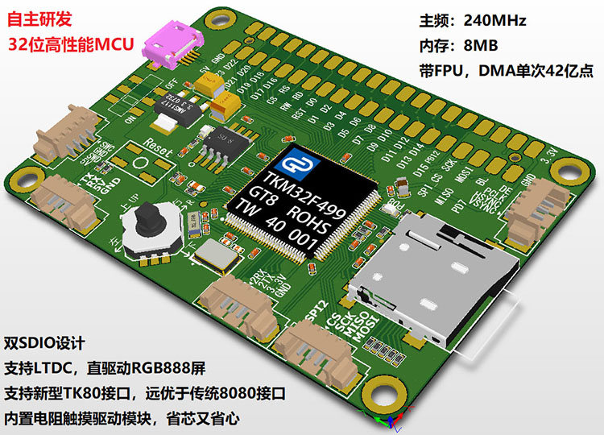

.. _tkm32f499:

TKM32F499
===============

* 关键词：``Cortex-M4`` ``240MHz`` ``Tiky`` ``LTDC`` ``TK80`` ``RGB888`` ``1024x600``
* 资源库：`GitHub <https://github.com/SoCXin/TKM32F499>`_

.. contents::
    :local:

Xin简介
-----------

.. contents::
    :local:

.. note::
    :ref:`tkm32f499` 极有可能是 :ref:`stm32f429` 的核心设计，阉割内置的Flash和SRAM，外挂8M的32bit sdram，程序存在外置spi flash上(启动时拷贝到sdram执行,不再支持从QSPI XIP启动)，所以启动流程跟ARM9和CortexA系列比较相似。

规格参数
~~~~~~~~~~~

基本参数
^^^^^^^^^^^

* 供电电压：2.0 to 3.6 V
* 工作温度：40°C to +85°C
* 封装规格：LQFP128(0.4mm pitch)
* 处理性能：300 :ref:`DMIPS`
* RAM容量：8MB
* Flash容量：8MB QSPI FLASH

.. note::
    :ref:`tkm32f499` 是0.4 pitch的LQFP128，体积跟0.5 pitch的LQFP100一样。

特征参数
^^^^^^^^^^^

* :ref:`cortex_m4` 240 MHz，带浮点运算单元FPU，可支持emWin中FPU部分的高级功能;
* 自主研发的TK80接口，向下兼容老式8080接口，支持1~24位，可以支持1600万色的液晶，从此显示不再失真;
* 采用USB下载程序，一根数据线就能下载程序，从此告别各种LINK;
* 内建电阻触摸IP核，直接驱动电阻触摸，不用再外加XPT2046芯片，省芯又省心;
* TF卡采用硬件SDIO模式，配合高效的FATFS文件系统，比速度远远高于模拟IO+SPI的方式;
* 包含 DMA1 和 DMA2，每个 DMA 控制器有 8 个通道;

相对短板
^^^^^^^^^^^

* 6ch 12bit SAR ADC 1MSPS

芯片架构
~~~~~~~~~~~

.. _tk80:

TK80接口
^^^^^^^^^^^

* AHB2.0 总线接口
* 支持读写命令和读写数据操作
* 读（数据或命令）支持直接读和中断/查询读两种模式
* 支持盲读
* 支持内存区域顺序读取数据操作
* 支持区域填充操作
* 支持 DMA（仅支持写）
* CS_n 支持硬件自动生成和软件生成两种方式
* 支持读传输完成和写传输完成中断
* 双向口半双工数据传输

LCD-TFT
^^^^^^^^^^^

* LTDC提供了24位的并行RGB，传送的所有信号可直接与最高1024x600分辨率的LCD和TFT面板接口，支持RGB888(1600万色)，向下兼容RGB666、565、555
* VGA 输出, 支持刷新率不低于 20Hz: 640x480, 800x600
* 自主研发的TK80接口，向下兼容老式8080接口，支持1~24位，可以支持1600万色的液晶，从此显示不再失真;
* 两个带有专用 FIFO 的显示层(FIFO 深度 480x64)
* 支持标准水平/垂直同步数字视频格式，输出数字视频时序可调

Xin选择
-----------
.. contents::
    :local:

品牌对比
~~~~~~~~~

型号对比
~~~~~~~~~

版本对比
~~~~~~~~~

Xin应用
-----------

.. contents::
    :local:

Xin总结
--------------

.. contents::
    :local:

要点提示
~~~~~~~~~~~~~

首先TK499的Boot脚固定拉低，此时的启动方式对应STM32的内置Bootloader启动模式，即从内部固化的ROM中启动，随后初始化SDRAM，并将QSPI中的程序拷贝至SDRAM，然后跳转到SDRAM中执行。

官方推荐的下载方式是USB drag-and-drop，为此提供了一个二级bootloader。在复位时按住PA13，此时进入一级Bootloader即内置固化的BL，用来烧录二级BL至QSPI Flash。已经烧录二级BL后在复位时按住PA11将进入二级BL，此时就可以拖拽下载主程序。

问题整理
~~~~~~~~~~~~~

