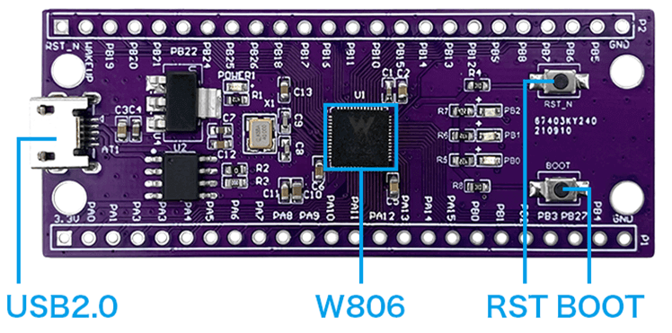

.. _w806:

W806
===============

* 关键词：``XT804`` ``240MHz`` ``UART`` ``Tee``
* 资源库：`GitHub <https://github.com/SoCXin/W806>`_

.. contents::
    :local:

Xin简介
-----------

.. image:: ./images/W806.png
    :target: https://h.hlktech.com/Mobile/download/fdetail/143.html

规格配置
~~~~~~~~~~~

基本参数
^^^^^^^^^^^

* 发布时间：2021年9月
* 发布价格：
* 工作温度：-40°C to +125°C
* 处理性能：300 :ref:`DMIPS`
* RAM容量：288 KB (64MB PSRAM)
* Flash容量：1 MB
* 封装规格：:ref:`w806_qfn56` (6x6mm)

特征参数
^^^^^^^^^^^

* 240MHz :ref:`xt804` 内置 DSP、浮点运算单元与安全引擎
* 6x UART 高速接口
* 4ch 16 bit :ref:`sigma_delta` ADC(1KMSPS)
* 内置 Tee 安全引擎

电源参数
^^^^^^^^^^^

* 供电电压：3.0 to 3.6 V

封装规格
~~~~~~~~~~~

.. _w806_qfn56:

QFN56
^^^^^^^^^^

QFN56 封装，至多44组GPIO可用

Xin选择
-----------

.. contents::
    :local:

品牌对比
~~~~~~~~~

主要对标为 :ref:`espressif` 的 :ref:`esp32c3`

.. list-table::
    :header-rows:  1

    * - :ref:`list`
      - Core
      - Performance
      - SRAM/ROM
      - WiFi/BLE
      - UART/SPI/SDIO
      - Package
    * - :ref:`w806`
      - :ref:`xt804`
      - 300 DMIPS
      - 288KB/1MB
      - 1T1R
      - 6/2/1
      - :ref:`w806_qfn56` (6x6mm)
    * - :ref:`esp32c3`
      - :ref:`esp_rv32`
      - 407.22 :ref:`CoreMark`
      - 512KB/384KB
      - 1T1R/v5.0
      - 2/3/No
      - :ref:`esp_qfn32` (5x5mm)

Xin应用
-----------

.. contents::
    :local:

开发板
~~~~~~~~~~

编译工具
~~~~~~~~~

支持平头哥CDK开发环境

开发框架
~~~~~~~~~

`SDK <https://github.com/IOsetting/wm-sdk-w806/>`_

芯片相关资料下载链接：

https://h.hlktech.com/Mobile/download/fdetail/143.html

应用笔记
~~~~~~~~~

http://bbs.eeworld.com.cn/tag_W806.html
