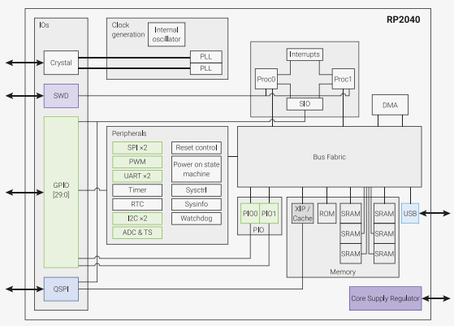
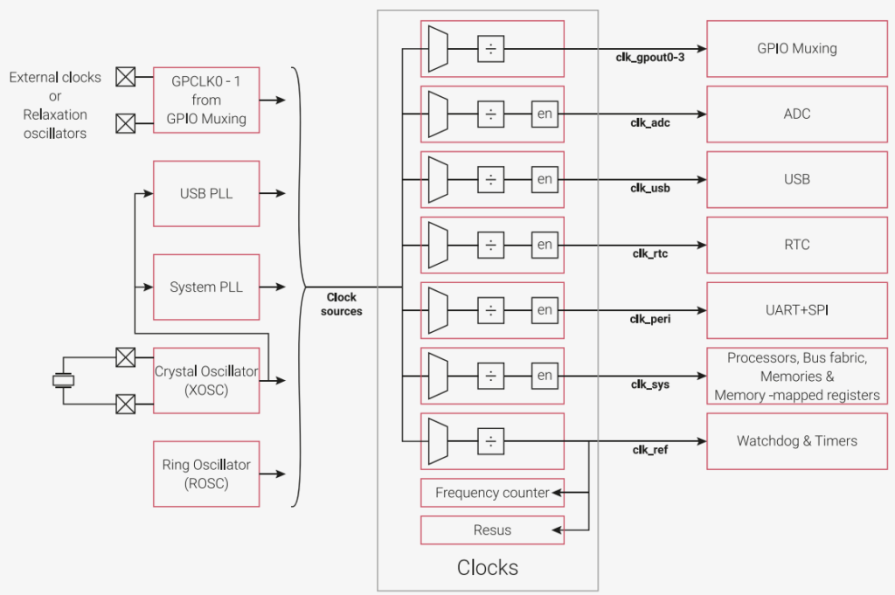

.. _zml165:

ZML165
===============

* 关键词：``Cortex-M0+`` ``QFN20`` ``48MHz`` ``24bit Σ-∆ ADC``
* 资源库：`GitHub <https://github.com/SoCXin/ZML165>`_

.. contents::
    :local:

Xin简介
-----------

:ref:`cortex_m0` MCU

关键特性
~~~~~~~~~~~~~~

* 2ch 24bit Σ-∆ ADC

计算性能
~~~~~~~~~~~~~~

**CoreMark** 已成为测量与比较处理器性能的业界标准基准测试，CoreMark的得分越高意味着性能更高，使用C语言包含列举，数学矩阵操作和状态及CRC等运算法则。

Xin选择
-----------

Xin应用
-----------

Xin总结
-----------

