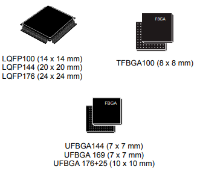

.. _NO_007:
.. _stm32h730:

STM32H730
================

* 关键词：``Cortex-M7`` ``550MHz`` ``5MSPS-12bit-DAC`` ``3.6MSPS-16bit-ADC`` ``USB-HS-OTG`` ``ULPI`` ``OctoSPI``  ``Ethernet``
* 资源库：`GitHub <https://github.com/SoCXin/STM32H730>`_ , `Gitee <https://gitee.com/socxin/STM32H730>`_

.. contents::
    :local:

Xin简介
-----------

.. image:: ./images/STM32H730.png
    :target: https://www.st.com/zh/microcontrollers-microprocessors/stm32h730-value-line.html

.. contents::
    :local:

规格参数
~~~~~~~~~~~

基本参数
^^^^^^^^^^^

* 发布时间：
* 供电电压：1.71 to 3.6 V
* 工作温度：40°C to +85°C
* 处理性能：1177 :ref:`DMIPS`, 2778 :ref:`CoreMark`
* RAM容量：564 KB
* Flash容量：128 KB
* 封装规格：:ref:`stm32_lqfp100` /LQFP144/LQFP176/UFBGA176/UFBGA169/UFBGA144/TFBGA100

特征参数
^^^^^^^^^^^

* 550 MHz :ref:`cortex_m7`
* 2x :ref:`stm32_ospi`
* :ref:`stm32_eth_mac`
* :ref:`stm32_otg_hs`
* 安全启动和安全固件升级 :ref:`stm32_sbsfu`

.. note::
    :ref:`stm32h730` 所有MCU应该具备的属性都拥有且顶级，同时具有高性能和低价优势，是一颗无法忽略的战略级MCU

芯片架构
~~~~~~~~~~~

.. image:: ./images/STM32H730s.png
    :target: https://www.st.com/zh/microcontrollers-microprocessors/stm32h730-value-line.html

.. _stm32_cache:

Cache
^^^^^^^^^^^

32-Kbyte data cache and 32-Kbyte instruction cache allowing 0-wait state

.. _stm32_sbsfu:

SBSFU
^^^^^^^^^^^

.. _stm32_ospi:

OctoSPI
^^^^^^^^^^^

Xin选择
-----------

.. contents::
    :local:

品牌对比
~~~~~~~~~

版本对比
~~~~~~~~~

.. image:: ./images/STM32H73.jpg
    :target: https://www.st.com/zh/microcontrollers-microprocessors/stm32h7-series.html

超值系列对比
^^^^^^^^^^^^^^^^^

.. list-table::
    :header-rows:  1

    * - :ref:`list`
      - DMIPS
      - RAM
      - Cache
      - GPU
      - SPI
      - USB
      - Ethernet
      - Interface
    * - :ref:`stm32h730`
      - 1177
      - 564KB
      - 32+32
      - ART
      - 2 Octo
      - :ref:`stm32_otg_hs`
      - 100M
      - 35
    * - :ref:`stm32h750`
      - 1027
      - 1 MB
      - 16+16
      - ART
      - 2 Quad
      - :ref:`stm32_otg_hs`
      - 100M
      - 35
    * - :ref:`stm32h7b0`
      - 599
      - 1.4 MB
      - 16+16
      - ART/JPEG
      - 2 Octo
      - :ref:`stm32_otg_hs`
      - No
      - 35

相似系列对比
^^^^^^^^^^^^^^^^^

.. list-table::
    :header-rows:  1

    * - :ref:`list`
      - DMIPS
      - RAM
      - Cache
      - GPU
      - SPI
      - USB
      - Ethernet
      - Interface
    * - :ref:`stm32h730`
      - 1177
      - 564KB
      - 32+32
      - ART
      - 2 Octo
      - :ref:`stm32_otg_hs`
      - 100M
      - 35
    * - STM32H725
      - 1027
      - 1 MB
      - 16+16
      - ART
      - 2 Quad
      - :ref:`stm32_otg_hs`
      - 100M
      - 35
    * - STM32H723
      - 1027
      - 1 MB
      - 16+16
      - ART
      - 2 Quad
      - :ref:`stm32_otg_hs`
      - 100M
      - 35

型号对比
~~~~~~~~~

.. image:: ./images/STM32H730diff.png
    :target: https://www.st.com/zh/microcontrollers-microprocessors/stm32h730-value-line.html

封装规格对比
^^^^^^^^^^^^^^^^^

.. list-table::
    :header-rows:  1

    * - :ref:`list`
      - Price
      - Package
      - Size
      - Interface
    * - STM32H730IBH
      - $3.67
      - UFBGA176
      - 10×10mm
      - 35
    * - STM32H730ABH
      - $3.37
      - UFBGA169
      - 7x7mm
      - 35
    * - STM32H730ZBH
      - $3.24
      - UFBGA144
      - 7x7mm
      - 35
    * - STM32H730VBH
      - $2.83
      - TFBGA100
      - 8x8mm
      - 35
    * - STM32H730IBT
      - $3.67
      - LQFP176
      - 24×24mm
      - 35
    * - STM32H730ZBT
      - $3.24
      - LQFP144
      - 20×20mm
      - 35
    * - STM32H730VBT
      - $2.83
      - LQFP100
      - 14×14mm
      - 35

.. note::
    :ref:`stm32h730` 系列 STM32H730IBK拥有STM32系列中数量最多的16bit ADC = 36通道

Xin应用
-----------

.. contents::
    :local:

开发板
~~~~~~~~~~

Xin总结
--------------

.. contents::
    :local:

能力构建
~~~~~~~~~~~~~

要点提示
~~~~~~~~~~~~~

问题整理
~~~~~~~~~~~~~

