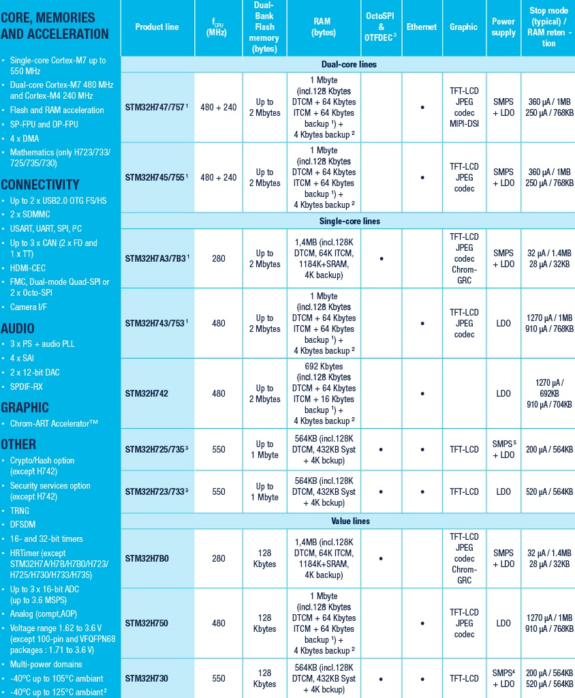

.. _stm32h745:

STM32H745
================

* 关键词：``Cortex-M7`` ``480MHz``
* 资源库：`GitHub <https://github.com/SoCXin/STM32H745>`_

.. contents::
    :local:

Xin简介
-----------

.. contents::
    :local:

规格参数
~~~~~~~~~~~

基本参数
^^^^^^^^^^^

特征参数
^^^^^^^^^^^

芯片架构
~~~~~~~~~~~

Xin选择
-----------

.. contents::
    :local:

品牌对比
~~~~~~~~~

型号对比
~~~~~~~~~

版本对比
~~~~~~~~~

Xin应用
-----------

.. contents::
    :local:

开发板
~~~~~~~~~~

H7-TOOL
~~~~~~~~~~

Xin总结
--------------

.. contents::
    :local:

能力构建
~~~~~~~~~~~~~

要点提示
~~~~~~~~~~~~~

问题整理
~~~~~~~~~~~~~

