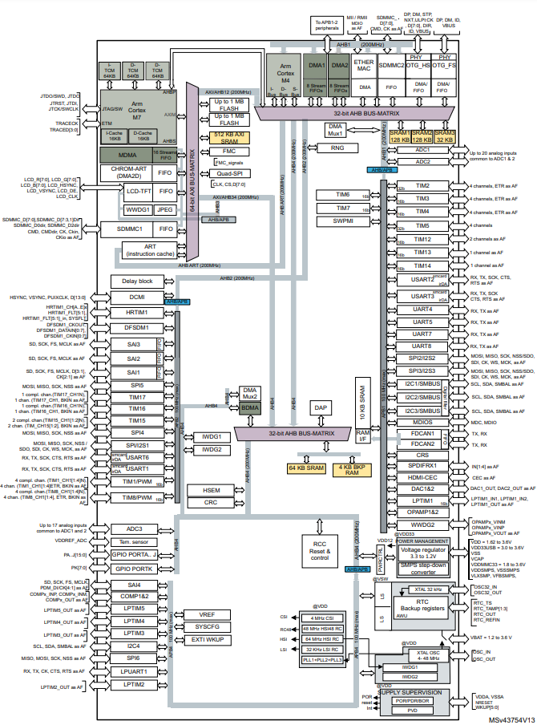

.. _stm32h745:

STM32H745
================

* 关键词：``Cortex-M7`` ``480MHz`` ``Dual Core`` ``USB-HS-OTG`` ``ULPI`` ``Ethernet`` ``DFSDM``
* 资源库：`GitHub <https://github.com/SoCXin/STM32H745>`_

.. contents::
    :local:

Xin简介
-----------

.. image:: ./images/stm32h745.jpg
    :target: https://www.st.com/content/st_com/zh/products/microcontrollers-microprocessors/stm32-32-bit-arm-cortex-mcus/stm32-high-performance-mcus/stm32h7-series/stm32h745-755/stm32h745zi.html

.. contents::
    :local:

规格参数
~~~~~~~~~~~

基本参数
^^^^^^^^^^^

* 发布时间：
* 工作温度：-40°C to +125°C
* 处理性能：1027+300 :ref:`DMIPS`, 3224 :ref:`CoreMark`
* RAM容量：1 MB (STM32H755: 2 MB)
* Flash容量：1 MB
* 封装规格：LQFP144/LQFP176/UFBGA176/UFBGA169

.. image:: ./images/STM32H745p.png
    :target: https://www.st.com/content/st_com/zh/products/microcontrollers-microprocessors/stm32-32-bit-arm-cortex-mcus/stm32-high-performance-mcus/stm32h7-series/stm32h745-755/stm32h745zi.html

特征参数
^^^^^^^^^^^

* 480 MHz :ref:`cortex_m7` + 240 MHz :ref:`cortex_m4`
* 安全固件安装（SFI）
* LCD-TFT controller up to XGA resolution
* JPEG Codec

电源参数
^^^^^^^^^^^

* 供电电压：1.62 to 3.6 V
* Standby: 2.95 μA (Backup SRAM OFF, RTC/LSE ON)

芯片架构
~~~~~~~~~~~

Xin选择
-----------

.. contents::
    :local:

品牌对比
~~~~~~~~~

系列对比
~~~~~~~~~

STM32H745系列的L1缓存(16 KB I +16 KB D)相对超值系列 :ref:`stm32h730` (32 KB I +32 KB D)没有优势，最高主频也较低，除了多 :ref:`cortex_m4` 核，并无特点。

版本对比
~~~~~~~~~

.. image:: ./images/STM32H745v.png
    :target: https://www.st.com/content/st_com/zh/products/microcontrollers-microprocessors/stm32-32-bit-arm-cortex-mcus/stm32-high-performance-mcus/stm32h7-series/stm32h745-755/stm32h745zi.html

.. _stm32h747:

STM32H747
^^^^^^^^^^^

``Arduino: Portenta H7``

* STM32H747: TFT-LCD, JPEG codec, ``MIPI-DSI``
* STM32H745: TFT-LCD, JPEG codec, optional ``-40°C to 125°C``
