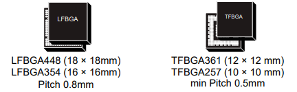

.. _stm32mp15:

STM32MP15
=====================

* 关键词：``Cortex-A7`` ``Cortex-M4`` ``32KB L1`` ``256KB L2``
* 资源库：`GitHub <https://github.com/SoCXin/STM32MP15>`_

.. contents::
    :local:

Xin简介
-----------

.. image:: ./images/stm32mp157.jpg
    :target: https://www.st.com/content/st_com/zh/products/microcontrollers-microprocessors/stm32-arm-cortex-mpus/stm32mp1-series/stm32mp157/stm32mp157c.html

.. contents::
    :local:

规格配置
~~~~~~~~~~~

STM32MP1系列依托STM32成熟的生态系统，ST可为客户提供加快成功应用STM32MP1设计开发的工具。包括STM32的Cube，CubeMX，CubeProgrammer等软件工具，探索板和全功能评估板等硬件工具，以及为客户提供全方位的客户支持等。

STM32系列主要用于解决客户对实时任务和功耗限制的重要要求，OpenSTLinux作为市场上主流的开源Linux发行版发布，将STM32系列从以实时任务和功耗限制为主的应用扩大到更广泛的市场。

基本参数
^^^^^^^^^^^

* 发布时间：
* 发布价格：$6-$11
* 工作温度：-40°C to 105°C/125°C
* 处理性能：599 :ref:`DMIPS` + 703 :ref:`CoreMark`
* RAM容量：708KB
* Flash容量：
* 封装规格：LFBGA448/LFBGA354/TFBGA361/TFBGA257

特征参数
^^^^^^^^^^^

* 650MHz/800MHz :ref:`cortex_a7` Dual Core
* 209 MHz :ref:`cortex_m4`
* DDR memory up to 1 Gbyte,  DDR3/DDR3L-1066 16/32-bit
* L1 32-Kbyte I / 32-Kbyte D , 256-Kbyte unified level 2 cache
* 2 × ADCs with 16-bit max. resolution (12 bits up to 4.5 Msps, 14 bits up to 4 Msps, 16 bits up to 3.6 Msps)
* 10/100M or Gigabit Ethernet GMAC, IEEE 1588v2 hardware, MII/RMII/GMII/RGMII
* 3x USB2.0（包括2个高速）
* 2x CAN-FD
* 3× SDMMC up to 8-bit
* 6× I2C FM+ (1 Mbit/s, SMBus/PMBus)
* 4× UART + 4 × USART (12.5 Mbit/s)
* 6× SPI (50 Mbit/s)

电源参数
^^^^^^^^^^^

* 供电电压：1.71 to 3.6 V

芯片架构
~~~~~~~~~~~

Xin选择
-----------

.. contents::
    :local:

Xin应用
-----------

.. contents::
    :local:

开发板
~~~~~~~~~~

PanGu湃兔核
^^^^^^^^^^^^^^^

.. image:: images/B_STM32MP157.png
    :target: https://item.taobao.com/item.htm?spm=a230r.1.14.24.71cc6da0Vr8eCp&id=599303130310&ns=1&abbucket=12#detail

BearPi-HM
^^^^^^^^^^^^^^^

.. image:: images/B_BearPi.png
    :target: https://item.taobao.com/item.htm?spm=a230r.1.14.18.71cc6da0Vr8eCp&id=662078665554&ns=1&abbucket=12#detail

Xin总结
--------------

.. contents::
    :local:

能力构建
~~~~~~~~~~~~~

要点提示
~~~~~~~~~~~~~

问题整理
~~~~~~~~~~~~~

