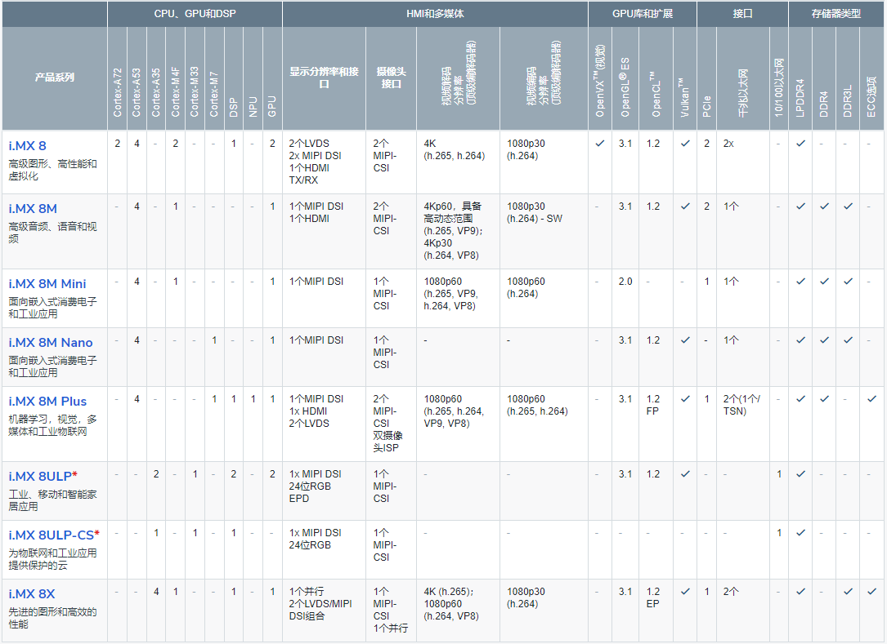

.. _stm32mp15:

STM32MP15
=====================

* 关键词：``Cortex-A7`` ``Cortex-M4`` ``32KB L1`` ``256KB L2``
* 资源库：`GitHub <https://github.com/SoCXin/STM32MP15>`_

.. contents::
    :local:

Xin简介
-----------

.. image:: ./images/stm32mp157.jpg
    :target: https://www.st.com/content/st_com/zh/products/microcontrollers-microprocessors/stm32-arm-cortex-mpus/stm32mp1-series/stm32mp157/stm32mp157c.html

.. contents::
    :local:

规格参数
~~~~~~~~~~~

STM32MP1系列依托STM32成熟的生态系统，ST可为客户提供加快成功应用STM32MP1设计开发的工具。包括STM32的Cube，CubeMX，CubeProgrammer等软件工具，探索板和全功能评估板等硬件工具，以及为客户提供全方位的客户支持等。

STM32系列主要用于解决客户对实时任务和功耗限制的重要要求，OpenSTLinux作为市场上主流的开源Linux发行版发布，将STM32系列从以实时任务和功耗限制为主的应用扩大到更广泛的市场。

基本参数
^^^^^^^^^^^

* 发布时间：
* 制程工艺：
* 参考价格：$6-$11
* 供货周期：
* 处理性能：MCU 599 :ref:`DMIPS`
* RAM容量：708 KB
* Flash容量：

硬件参数
^^^^^^^^^^^

* 电压范围：1.71 to 3.6 V
* 功耗范围：
* 工作温度：-40°C to 105°C/125°C
* 封装规格：LFBGA448/LFBGA354/TFBGA361/TFBGA257

.. image:: ./images/STM32MP15p.png
    :target: https://www.st.com/zh/microcontrollers-microprocessors/stm32mp1-series.html

特征参数
^^^^^^^^^^^

* 650MHz/800MHz :ref:`cortex_a7` Dual Core
* 209 MHz :ref:`cortex_m4`
* DDR memory up to 1 Gbyte,  DDR3/DDR3L-1066 16/32-bit
* L1 32-Kbyte I / 32-Kbyte D , 256-Kbyte unified level 2 cache
* 2 × ADCs with 16-bit max. resolution (12 bits up to 4.5 Msps, 14 bits up to 4 Msps, 16 bits up to 3.6 Msps)
* 10/100M or Gigabit Ethernet GMAC, IEEE 1588v2 hardware, MII/RMII/GMII/RGMII
* 3x USB2.0（包括2个高速）
* 2x CAN-FD
* 3× SDMMC up to 8-bit
* 6× I2C FM+ (1 Mbit/s, SMBus/PMBus)
* 4× UART + 4 × USART (12.5 Mbit/s)
* 6× SPI (50 Mbit/s)

芯片架构
~~~~~~~~~~~

.. image:: images/STM32MP15s.png
    :target: https://www.st.com/zh/microcontrollers-microprocessors/stm32mp1-series.html

Xin选择
-----------

.. contents::
    :local:

品牌对比
~~~~~~~~~

``NXP`` ``i.MX6`` ``i.MX7`` ``i.MX8``

应用类处理器异构控制器的方案厂商不少，ST可对标的主要对象为NXP，STM32MP15x系列重点对比i.MX系列

NXP i.MX 7
^^^^^^^^^^^^^^^

.. image:: images/imx7.png
    :target: https://www.nxp.com.cn/products/processors-and-microcontrollers/arm-processors/i-mx-applications-processors/i-mx-7-processors:IMX7-SERIES

其中基础版本配置规格相当，处理器 800MHz :ref:`cortex_a7` 内核, 控制器 200 MHz :ref:`cortex_m4` 内核，但是i.MX7具备千兆以太网等高速接口，同系列向上升级扩展非常容易。

.. image:: images/IMX7ULP-BD.webp
    :target: https://www.nxp.com.cn/products/processors-and-microcontrollers/arm-processors/i-mx-applications-processors/i-mx-7-processors/i-mx-7ulp-family-ultra-low-power-with-graphics:i.MX7ULP

如果需要更强的性能进行升级，可以选择i.MX8系列产品，或者采用独立的应用处理器和控制器

NXP i.MX 8
^^^^^^^^^^^^^^^

.. image:: images/IMX8MPLUS-BD2.webp
    :target: https://www.nxp.com.cn/products/processors-and-microcontrollers/arm-processors/i-mx-applications-processors/i-mx-8-processors/i-mx-8m-plus-arm-cortex-a53-machine-learning-vision-multimedia-and-industrial-iot:IMX8MPLUS

.. note::
    就1.8 GHz Cortex-A53应用处理性能而言i.MX 8M Plus已经优于树莓派3B，800 MHz Cortex-M7、双千兆以太网、PCIe Gen3、2.3TOPS NPU都是硬货，所以基本面上不再和STM32MP15系列对比

独立芯片方案
^^^^^^^^^^^^^^^

性能接近的应用处理器可采用 :ref:`allwinner` :ref:`v831`, :ref:`R329`，控制器MCU可选方案较多包括 :ref:`ref407` ， :ref:`arterytek` :ref:`at32f413`

系列对比
~~~~~~~~~

.. image:: images/STM32MP1_series.jpg
    :target: https://www.st.com/zh/microcontrollers-microprocessors/stm32mp1-series.html

版本对比
~~~~~~~~~

必选理由
~~~~~~~~~

STM32MP15x系列异构处理器，是ST向上突破的探索产物，凭借自身强大的外设配置和开发框架，十分适合用于实现复杂交互和通信的硬件终端。

选择这款芯片的出发点包括在控制器MCU之外部署嵌入式Linux处理设备，通过集成的SoC方案实现空间和能耗上的优化，数据的处理效率和通信效率更高，同时实现了ST的品质和资源接入。

Xin应用
-----------

``OpenSTLinux``

.. contents::
    :local:

开发板
~~~~~~~~~~

PanGu湃兔核
^^^^^^^^^^^^^^^

.. image:: images/B_STM32MP157.png
    :target: https://item.taobao.com/item.htm?spm=a230r.1.14.24.71cc6da0Vr8eCp&id=599303130310&ns=1&abbucket=12#detail

BearPi-HM
^^^^^^^^^^^^^^^

.. image:: images/B_BearPi.png
    :target: https://item.taobao.com/item.htm?spm=a230r.1.14.18.71cc6da0Vr8eCp&id=662078665554&ns=1&abbucket=12#detail

Xin总结
--------------

.. contents::
    :local:

能力构建
~~~~~~~~~~~~~

要点提示
~~~~~~~~~~~~~

问题整理
~~~~~~~~~~~~~

