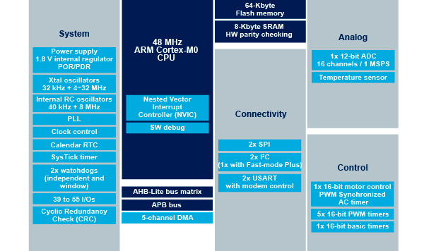

.. _stm32f030:

STM32F030
===============

* 关键词：``Cortex-M0`` ``48MHz``
* 资源库：`GitHub <https://github.com/SoCXin/STM32F030>`_

.. contents::
    :local:

Xin简介
-----------

.. contents::
    :local:

规格参数
~~~~~~~~~~~

基本参数
^^^^^^^^^^^

* 发布时间：
* 制程工艺：180 nm
* 工作温度：-40°C to +85°C
* 处理性能：59 :ref:`DMIPS`, 142 :ref:`CoreMark`
* RAM容量：4/8 KB
* Flash容量：16/32/64 KB
* 封装规格：LQFP64/LQFP48/LQFP32/ :ref:`stm32_tssop20`

.. image:: ./images/STM32F030p.png
    :target: https://www.st.com/content/st_com/zh/products/microcontrollers-microprocessors/stm32-32-bit-arm-cortex-mcus/stm32-mainstream-mcus/stm32f0-series/stm32f0x0-value-line.html

特征参数
^^^^^^^^^^^

* 48 MHz :ref:`cortex_m0`
* 12-bit ADC (1.0 MSps)

电源参数
^^^^^^^^^^^

* 供电电压: 2.4 to 3.6 V
* 运行功耗: 100μA/MHz

芯片架构
~~~~~~~~~~~

.. image:: ./images/STM32F030s.png
    :target: https://www.st.com/content/st_com/zh/products/microcontrollers-microprocessors/stm32-32-bit-arm-cortex-mcus/stm32-mainstream-mcus/stm32f0-series/stm32f0x0-value-line.html

.. _stm32_tssop20:

TSSOP20
^^^^^^^^^^^

* 封装尺寸：6.5 x 4.4 mm, 0.65mm pitch

.. image:: ./images/STM32F030p20.png

.. hint::
    封装兼容 :ref:`at32f421` :ref:`at32f421_tssop20`

Xin选择
-----------

.. contents::
    :local:

品牌对比
~~~~~~~~~

 :ref:`at32f421`

系列对比
~~~~~~~~~

型号对比
~~~~~~~~~

.. image:: ./images/STM32F030l.png
