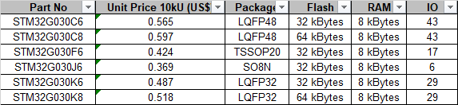

.. _NO_010:
.. _stm32g030:

STM32G030
===============

* 关键词：``Cortex-M0`` ``64MHz`` ``I2S`` ``RTC``
* 资源库：`GitHub <https://github.com/SoCXin/STM32G030>`_ , `Gitee <https://gitee.com/socxin/STM32G030>`_

.. contents::
    :local:

Xin简介
-----------

.. image:: ./images/STM32G030.jpg
    :target: https://www.st.com/zh/microcontrollers-microprocessors/stm32g0x0-value-line.html

规格参数
~~~~~~~~~~~

低阶入门级32位产品，入选 :ref:`low`

基本参数
^^^^^^^^^^^

* 发布时间：
* 工作温度：-40°C to +85°C
* 处理性能：59 :ref:`DMIPS`, 142 :ref:`CoreMark`
* RAM容量：8 KB
* Flash容量：32/64 KB
* 封装规格：LQFP48/LQFP32/TSSOP20/ :ref:`stm32_so8`

.. image:: ./images/STM32G030p.png
    :target: https://www.st.com/zh/microcontrollers-microprocessors/stm32g0x0-value-line.html

特征参数
^^^^^^^^^^^

* 64 MHz :ref:`cortex_m0`
* 12-bit ADC (2.5 MSps)
* 5ch x DMA
* 1KB OTP
* I2S
* RTC

电源参数
^^^^^^^^^^^

* 供电电压: 2.0 to 3.6 V
* 运行功耗: 100μA/MHz

芯片架构
~~~~~~~~~~~

.. image:: ./images/STM32G030s.png
    :target: https://www.st.com/zh/microcontrollers-microprocessors/stm32g0x0-value-line.html

时钟相关
^^^^^^^^^^^

* HSI 16 MHz
* LSI 32 kHz(±5 %)

.. image:: ./images/STM32G030tim.png
    :target: https://www.st.com/zh/microcontrollers-microprocessors/stm32g0x0-value-line.html

.. _stm32_so8:

SON8
^^^^^^^^^^^

.. image:: ./images/STM32G030p8.png

* 封装尺寸：4.9 x 6 mm

.. image:: ./images/SON8.png

Xin选择
-----------

.. contents::
    :local:

品牌对比
~~~~~~~~~

这个规格范围的国产替换方案非常多，如果不是为了一些特殊的功能外设和参数，也不追求极致的价格优化，STM32G030系列是一个不错的选择，当然在实际选择时，还需要同步考虑市场供应因素。

系列对比
~~~~~~~~~

相对前代 :ref:`stm32f030` 系列进行了升级，拥有更好的模拟性能，主频更高同时如CRC等外设全系标配，相对市场同类产品，拥有自家完善的资源体系和可靠性，是新推出的 ``高性价比`` 的国际一线品牌MCU。

核心更新
^^^^^^^^^^^^

.. image:: ./images/F0VSG0_Core.png
    :target: https://www.st.com/zh/microcontrollers-microprocessors/stm32g0x0-value-line.html

存储更新
^^^^^^^^^^^^

.. image:: ./images/F0VSG0_FLASH.png
    :target: https://www.st.com/zh/microcontrollers-microprocessors/stm32g0x0-value-line.html

ADC更新
^^^^^^^^^^^^

.. image:: ./images/F0VSG0_ADC.png
    :target: https://www.st.com/zh/microcontrollers-microprocessors/stm32g0x0-value-line.html

型号对比
~~~~~~~~~

.. image:: ./images/STM32G030list.png
    :target: https://www.st.com/zh/microcontrollers-microprocessors/stm32g0x0-value-line.html

官方定价
^^^^^^^^^^

.. note::
    就官方定价而言，差不多是STM32系列中最低的一个系列，算是获得STM32生态便利的低成本之选，可以作为 :ref:`low` 的参考坐标。

Xin应用
-----------

.. note::
    STM32G030系列的FLASH和RAM资源都相对受限，虽然可以运行FreeRTOS等系统（基于CMSISv1版本），但该系列8K SRAM并不是RTOS的理想载体。

.. contents::
    :local:

硬件平台
~~~~~~~~~~~

.. image:: ./images/B_STM32G030.jpg
    :target: https://item.taobao.com/item.htm?spm=a230r.1.14.24.5fcf7cd1dZFnby&id=636761611307&ns=1&abbucket=19#detail

开发工具
~~~~~~~~~

使用STM32芯片最直接方式是通过 `stm32cube <https://www.st.com/zh/ecosystems/stm32cube.html>`_ 工具构建基本运行体，不用开发者自己去研究寄存器初始化相应外设（但请注意使能）。

源圈OS-Q通过先验证的方式，集成了更多可信赖资源 `PlatformIO STM32G0 Enhanced <https://github.com/OS-Q/P215>`_ 可以作为一个启动模板，作为一个开源编译体系便于多系统下开发。

示例代码
~~~~~~~~~

1. 基于STM32CubeMX生成HAL库工程

.. code-block:: bash

    uint8_t RxData;     //中断接收串口1数据
    void HAL_UART_RxCpltCallback(UART_HandleTypeDef *huart)
    {
        if(&huart1 == huart) {
            HAL_UART_Receive_IT(huart, &RxData, 1);
        }
    }

    void HAL_TIM_PeriodElapsedCallback(TIM_HandleTypeDef *htim)
    {
        if(htim==(&htim17)) //定时器中断函数
        {
            g_run_tick++;
        }
    }

    int main(void)
    {
        /* USER CODE BEGIN 2 */
        HAL_UART_Receive_IT(&huart1, &RxData, 1);   //中断接收使能
        HAL_TIM_PWM_Start(&htim16,TIM_CHANNEL_1);   //PWM输出使能
        HAL_TIM_Base_Start_IT(&htim17);             //定时器使能
        /* USER CODE END 2 */
        while (1)
        {
            /* USER CODE BEGIN 3 */
            HAL_GPIO_TogglePin(LED_GPIO_Port, LED_Pin);
            HAL_Delay(500);
        }
        /* USER CODE END 3 */
    }

2. 通过后备寄存器判断是否初始化RTC时钟

.. code-block:: bash

    if (HAL_RTC_Init(&hrtc) != HAL_OK)
    {
        Error_Handler();
    }
    /* USER CODE BEGIN Check_RTC_BKUP */
    if(HAL_RTCEx_BKUPRead(&hrtc, RTC_BKP_DR1) == 0x1234) return;    //如果已设定则不再初始化
    else HAL_RTCEx_BKUPWrite(&hrtc,RTC_BKP_DR1,0x1234);     //如果未设定过RTC时间，则初始化
    /* USER CODE END Check_RTC_BKUP */

    /** Initialize RTC and set the Time and Date
    */
    sTime.Hours = 0x0;
    sTime.Minutes = 0x0;
    sTime.Seconds = 0x0;
    sTime.SubSeconds = 0x0;
    sTime.DayLightSaving = RTC_DAYLIGHTSAVING_NONE;
    sTime.StoreOperation = RTC_STOREOPERATION_RESET;
    if (HAL_RTC_SetTime(&hrtc, &sTime, RTC_FORMAT_BCD) != HAL_OK)
    {
        Error_Handler();
    }

开源项目
~~~~~~~~~

如果你要探索一些开源项目，可能时常遇到基于 `PlatformIO <https://platformio.org/platforms/ststm32>`_ 构建的工程，通过跨平台编译，直接在编辑器中集成，可以云端部署，比常用的IDE拥有更多的灵活性。

关于 :ref:`st` MCU构建的 `开源项目 <https://github.com/search?q=STM32>`_ ，其中最主要的类别是arduino，STM32也是arduino的最佳运行平台之一。

* `Arduino_Core_STM32 <https://github.com/stm32duino/Arduino_Core_STM32>`_
* `STM32CubeG0 <https://github.com/STMicroelectronics/STM32CubeG0>`_

Xin总结
--------------

.. contents::
    :local:

能力构建
~~~~~~~~~~~~~

要点提示
~~~~~~~~~~~~~

STM32G0系列属于较新的产品，也重点优化了ADC的性能，相较于使用最广泛的STM32F1系列，在ADC初始化阶段需要更长的时间，所以在采样的时候需要过滤开始阶段无效的数据。

问题整理
~~~~~~~~~~~~~

相较以往STM32的boot模式，新的G0系列芯片出厂默认从system flash启动，boot0管脚无论拉高或拉低都不能从系统存储区（system flash）启动（进入bootloader状态），也就是说如果烧录的程序没有配置SYS调试端口，将无法通过传统的boot0拉高来连接烧录器。

如果要使能boot 0的功能，需要修改option bytes，将nboot_sel后面的勾选去掉，断电复位，此时芯片的启动方式就由boot0引脚决定了，上拉boot0进bootloader模式。

一不小心就把芯片锁死弄成砖了，可以将PA0（NRST）接地，然后在连接STM32CubeProgrammer前断开接地，这是MCU可以被识别到，然后进行擦除或修改option bytes

why do why not
