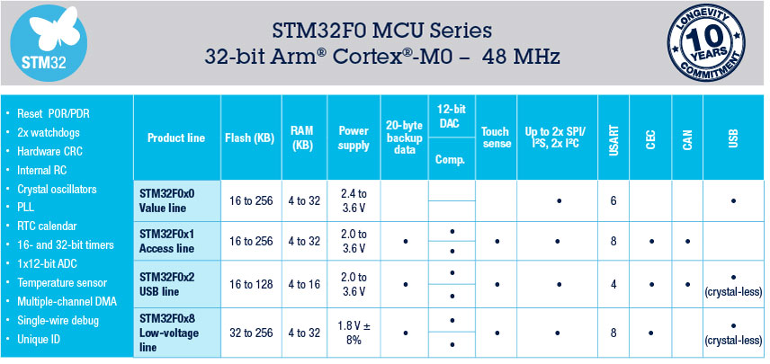
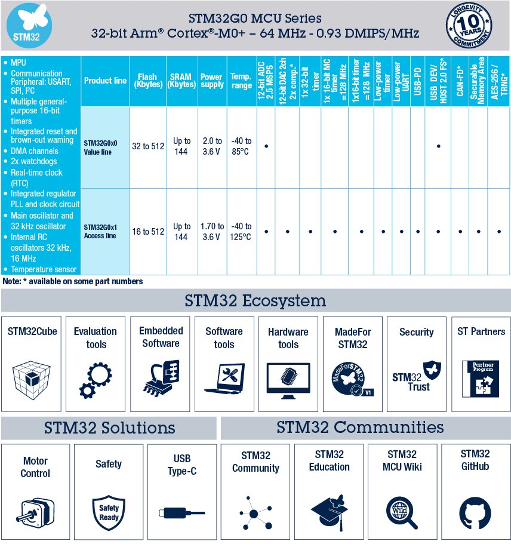
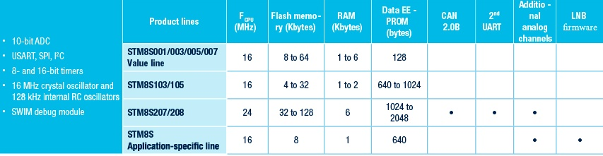

.. _st_lowend:

低阶产品
===============

.. contents::
    :local:

.. toctree::
    :maxdepth: 1

    STM32F030 <STM32F030>

.. toctree::
    :maxdepth: 1

    STM32G030 <STM32G030>
    STM32G031 <STM32G031>

.. toctree::
    :maxdepth: 1

    STM8S003 <STM8S003>

.. note::
    由于半导体的发展规律，8位MCU成本下降空间已触底直至退出，在性价比上很难有更多突破，新产品不建议再使用。

