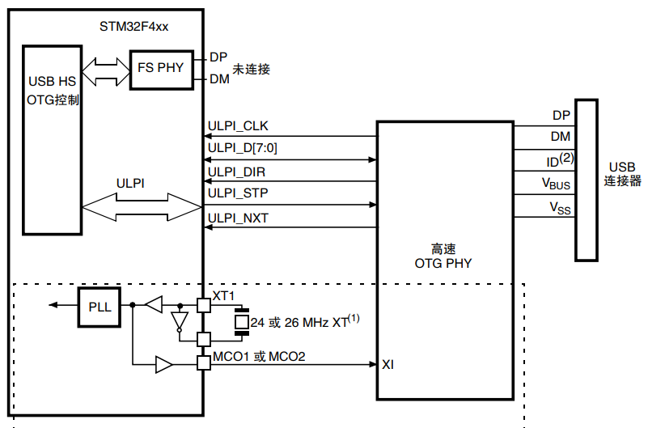

.. _stm32f429:

STM32F429
===============

* 关键词：``Cortex-M4`` ``180MHz`` ``15MSPS-DAC`` ``4MSPS-ADC`` ``Ethernet`` ``FMC`` ``ART``
* 资源库：`GitHub <https://github.com/SoCXin/STM32F429>`_

.. contents::
    :local:

Xin简介
-----------

.. image:: ./images/STM32F429.jpg
    :target: https://www.st.com/zh/microcontrollers-microprocessors/stm32f429-439.html

规格参数
~~~~~~~~~~~

基本参数
^^^^^^^^^^^

* 供电电压：1.71 to 3.6 V
* 工作温度：40°C to +85°C
* 封装规格：LQFP128
* 处理性能：225 :ref:`DMIPS`
* RAM容量：256 KB
* Flash容量：1/2 MB

特征参数
^^^^^^^^^^^

* :ref:`cortex_m4` 180 MHz
* 10/100 Ethernet MAC
* 3×12-bit 2.4 MSPS ADC: 7.2 MSPS in triple interleaved mode
* 2×12-bit DAC
* SDRAM的FMC和TFT

芯片架构
~~~~~~~~~~~

.. image:: ./images/STM32F429s.png
    :target: https://www.st.com/zh/microcontrollers-microprocessors/stm32f429-439.html

Xin选择
-----------

.. contents::
    :local:

品牌对比
~~~~~~~~~~

系列对比
~~~~~~~~~~

版本对比
~~~~~~~~~~

Xin应用
-----------

.. contents::
    :local:

.. _stm32_usb_hs:

USB HS
~~~~~~~~~~

Xin总结
--------------

.. contents::
    :local:

能力构建
~~~~~~~~~~~~~

要点提示
~~~~~~~~~~~~~

问题整理
~~~~~~~~~~~~~

