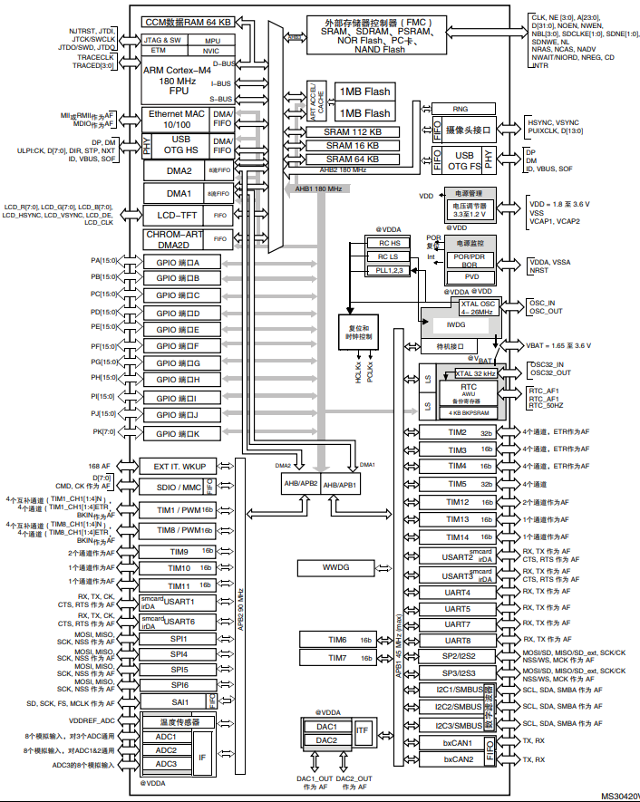

.. _stm32f429:

STM32F429
===============

* 关键词：``Cortex-M4`` ``180MHz`` ``15MSPS-DAC`` ``4MSPS-ADC`` ``Ethernet`` ``FMC`` ``ART``
* 资源库：`GitHub <https://github.com/SoCXin/STM32F429>`_ , `Gitee <https://gitee.com/socxin/STM32F429>`_

.. contents::
    :local:

Xin简介
-----------

.. image:: ./images/STM32F429.jpg
    :target: https://www.st.com/zh/microcontrollers-microprocessors/stm32f429-439.html

规格参数
~~~~~~~~~~~

基本参数
^^^^^^^^^^^

* 发布时间：
* 供电电压：1.71 to 3.6 V
* 工作温度：40°C to +85°C
* 处理性能：225 :ref:`DMIPS`
* RAM容量：256 KB
* Flash容量：2 MB
* 封装规格：LQFP100/LQFP144/LQFP176/LQFP208/UFBGA176/UFBGA169/TFBGA216

.. image:: ./images/STM32F429p.png
    :target: https://www.st.com/zh/microcontrollers-microprocessors/stm32f429-439.html

特征参数
^^^^^^^^^^^

* 180 MHz :ref:`cortex_m4`
* :ref:`stm32_eth_mac`
* 3×12-bit ADC (2.4 MSPS,7.2 MSPS in triple interleaved mode)
* 2×12-bit DAC
* SDRAM的FMC和TFT
* :ref:`stm32_lcd_tft`
* :ref:`stm32_otg_hs`
* :ref:`stm32_cam`

芯片架构
~~~~~~~~~~~

.. _stm32_lcd_tft:

LCD-TFT
^^^^^^^^^^^

LCD-TFT 控制器有高达 XGA 的分辨率，具有专用的 Chrom-ART Accelerator™，用于增强的图形内容创建 （DMA2D）

LCD-TFT 显示控制器提供了 24 位的并行数字 RGB （红、绿、蓝），传送的所有信号可直接与最高 XGA （1024x768）分辨率的广泛的 LCD 和 TFT 面板接口

Xin选择
-----------

.. contents::
    :local:

品牌对比
~~~~~~~~~~

系列对比
~~~~~~~~~~

版本对比
~~~~~~~~~~

Xin应用
-----------

.. contents::
    :local:

Xin总结
--------------

.. contents::
    :local:

能力构建
~~~~~~~~~~~~~

要点提示
~~~~~~~~~~~~~

问题整理
~~~~~~~~~~~~~

