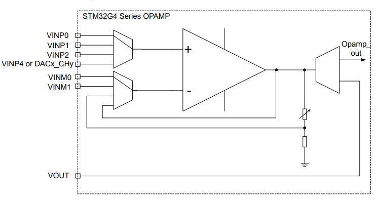

.. _NO_004:
.. _stm32g474:

STM32G474
===============

* 关键词：``Cortex-M4`` ``170MHz`` ``CAN-FD`` ``15MSPS-DAC`` ``4MSPS-ADC`` ``UCPD`` ``HRTIM`` ``AES256``
* 工程库：`GitHub <https://github.com/SoCXin/STM32G474>`_  `Gitee <https://github.com/SoCXin/STM32G474>`_

.. contents::
    :local:

Xin简介
-----------

.. image:: ./images/STM32G474.png
    :target: https://www.st.com/content/st_com/zh/products/microcontrollers-microprocessors/stm32-32-bit-arm-cortex-mcus/stm32-mainstream-mcus/stm32g4-series/stm32g4x4.html

.. contents::
    :local:

规格配置
~~~~~~~~~~~

内嵌数学运算加速器，丰富的数模外设，运放、比较器、DA、AD等，带有双安全存储区域，ART加速提高Flash读取运行速度。支持FPU和DSP指令，以及3种不同的硬件加速器：ART Accelerator™、CCM-SRAM程序执行加速器、以及数学运算加速器。

基本参数
^^^^^^^^^^^

* 供电电压：1.71 to 3.6 V
* 工作温度：-40°C to +85°C/+125°C
* 封装规格：48 to 128 Pin
* 处理性能：550 :ref:`CoreMark`，212 :ref:`DMIPS`
* RAM容量：128 KB
* Flash容量：128/256/512 KB

特征参数
^^^^^^^^^^^

* :ref:`cortex_m4` 170 MHz
* 最多3个 :ref:`stm32_canfd`
* :ref:`stm32_fsmc`
* 5个超快速12位ADC（4 Msamples/s）
* 7个12位DAC（15 Msamples/s）
* 7个超快速比较器（17ns）
* 高分辨率定时器 :ref:`stm32_hrtim`
* 6个可编程增益运算放大器 :ref:`stm32_opamp`
* USB Type-C™和电力传输控制器 :ref:`stm32_ucpd`

芯片架构
~~~~~~~~~~~~

.. image:: ./images/STM32G474s.png
    :target: https://www.st.com/content/st_com/zh/products/microcontrollers-microprocessors/stm32-32-bit-arm-cortex-mcus/stm32-mainstream-mcus/stm32g4-series/stm32g4x4.html

.. _stm32_hrtim:

HRTIM
^^^^^^^^^^^

继承自STM32F334xx系列的高分辨率定时器HRTIM外设，在G4系列更高的主频下可以到达 ``184ps`` 分辨率,易于编程实现的简单高分辨率执行流程（等同于4.6 GHz的定时器）

.. image:: ./images/STM32HRTIM.png
    :target: https://st-onlinetraining.s3.amazonaws.com/STM32G4-WDG_TIMERS-High_Resolution_Timer_%28HRTIM%29/index.html

.. _stm32_canfd:

CAN-FD
^^^^^^^^^^^

在工厂自动化中， 数据连接是必不可少的， 尤其是在工业4.0概念不断扩大其覆盖范围的今天。
许多标准被用于支持专门开发的现场总线， 包括经典CAN （Modbus和CANopen）、 RS-485（PROFIBUS、 CC-Link和Modbus）、 以及新的CAN FD和实时以太网。

.. image:: ./images/canfd.png
    :target: https://www.st.com/zh/applications/connectivity/fieldbus-and-industrial-ethernet.html#overview

计算性能
~~~~~~~~~~~~~~

:ref:`CoreMark` 已成为测量与比较处理器性能的业界标准基准测试，CoreMark的得分越高意味着性能更高，使用C语言包含列举，数学矩阵操作和状态及CRC等运算法则。

.. image:: ./images/STM32G4CoreMark.png
    :target: https://blog.csdn.net/xiaolaoban0413/article/details/107547516

**浮点运算** (FIR滤波)

.. image:: ./images/STM32G4FIR.png
    :target: https://blog.csdn.net/xiaolaoban0413/article/details/107547516

Xin选择
-----------

.. contents::
    :local:

该系列是2012年推出的STM32F3系列的延续，它继承了很多STM32F3的理念和基因，带来更强劲的性能和数模效果。

STM32G4系列最高工作温度可达到125°C，具有更强的抗电气干扰能力，可耐受4kV以上的瞬变电压，增强的可靠性也进一步扩展了其应用范围，特别是一些工业领域。

STM32G4x4系列具有高分辨率定时器和复杂波形生成器，以及事件处理器，这使其特别适合于数字电源应用，如数字开关电源、照明、焊接、太阳能和无线充电等。

品牌对比
~~~~~~~~~~

在模拟外设集成度和技术指标上，国内尚没有可以媲美的产品。

系列对比
~~~~~~~~~~

STM32G4与STM32F3系列高度兼容，作为后者的升级选项，确保在设计不同性能等级的衍生应用时提供卓越的效率。

.. image:: ./images/en.obn_stm32g4_series_ss2024.jpg
    :target: https://www.st.com/zh/microcontrollers-microprocessors/stm32g4-series.html

STM32G474在STM32G4系列中定位高分辨率，独有复杂波形生成器和事件处理器HRTIM，该功能继承自STM32F334，除该功能外，在G4系列中可选STM32G473系列，如果没有FSMC需求且对模拟外设数量要求不多，可选更高性价比的 :ref:`stm32g431`

.. list-table::
    :header-rows:  1

    * - Name
      - Mark
      - RAM
      - Flash
      - UART
      - BLE
      - USB
      - Ethernet
    * - :ref:`stm32g474`
      -
      -
      -
      -
      -
      -
      -
    * - :ref:`stm32g431`
      -
      -
      -
      -
      -
      -
      -
    * - :ref:`stm32h730`
      -
      -
      -
      -
      -
      -
      -

.. note::
    STM32G474系列配备的 :ref:`stm32_hrtim` 竞争者还包括前代 STM32F334 和高性能 :ref:`stm32h730` 系列，也就从成本和性能两端限制了该系列的扩展。

版本对比
~~~~~~~~~~

.. image:: ./images/STM32G474l.png
    :target: https://www.st.com/zh/microcontrollers-microprocessors/stm32g4-series.html

.. note::
    STM32G474、STM32G484型号共有24种封装规格，全系标配128KB RAM，存储器范围为128KB到512 KB，封装为48到128引脚。

Xin应用
-----------

.. contents::
    :local:

资源简介
~~~~~~~~~~~

使用STM32芯片最直接方式是通过 `stm32cube <https://www.st.com/zh/ecosystems/stm32cube.html>`_ 工具构建基本运行体，不用开发者自己去研究寄存器初始化相应外设（但请注意使能）。

使用ARM在线平台 `MBED <https://os.mbed.com/platforms/ST-Nucleo-G474RE/>`_ 支持NUCLEO-G474RE开发板的构建开发。

源圈OS-Q通过先验证的方式，集成了更多可信赖资源 `PlatformIO STM32G4 <https://github.com/OS-Q/P216>`_ 可以作为一个启动模板，作为一个开源编译体系便于多系统下开发。

硬件原型
~~~~~~~~~~~

.. _nucleo_stm32g474:

NUCLEO-STM32G474RE
^^^^^^^^^^^^^^^^^^^^^^^^

.. image:: ./images/B_STM32G474.jpg
    :target: https://detail.tmall.com/item.htm?spm=a230r.1.14.3.22c4235cqh3nCy&id=610087556700&ns=1&abbucket=7

外设使用
~~~~~~~~~~~

.. contents::
    :local:

HRTIM
^^^^^^^^^^^^

.. image:: ./images/STM32G4HRTIM.png
    :target: https://www.st.com/content/ccc/resource/technical/document/application_note/13/d6/48/9d/11/11/4c/08/DM00121475.pdf/files/DM00121475.pdf/jcr:content/translations/zh.DM00121475.pdf

1. HRTIM控制PWM输出

.. code-block:: bash

    /* --------------------- 定时器 D 初始化 ------------------------ */
    /* TIMD 计数器工作于连续模式，发生 REP 事件时使能预加载 */
    HRTIM1->sTimerxRegs[HRTIM_TIMERINDEX_TIMER_D].TIMxCR =
    HRTIM_TIMCR_CONT + HRTIM_TIMCR_PREEN + HRTIM_TIMCR_TREPU;

    /* 周期设置为 100kHz， CMP1 设置为周期的 25%， CMP2 设置为周期的 75% */
    HRTIM1->sTimerxRegs[HRTIM_TIMERINDEX_TIMER_D].PERxR = _100KHz_PERIOD;
    HRTIM1->sTimerxRegs[HRTIM_TIMERINDEX_TIMER_D].CMP1xR = _100KHz_PERIOD/4;
    HRTIM1->sTimerxRegs[HRTIM_TIMERINDEX_TIMER_D].CMP2xR = (3*_100KHz_PERIOD)/4;

    /* TD1 输出，在 TIMD 周期下置位，在 TIMD CMP1 事件下复位 */
    HRTIM1->sTimerxRegs[HRTIM_TIMERINDEX_TIMER_D].SETx1R = HRTIM_SET1R_PER;
    HRTIM1->sTimerxRegs[HRTIM_TIMERINDEX_TIMER_D].RSTx1R = HRTIM_RST1R_CMP1;

    /* TD2 输出，在 TIMD CMP2 下置位，在 TIMD 周期事件下复位 */
    HRTIM1->sTimerxRegs[HRTIM_TIMERINDEX_TIMER_D].SETx2R = HRTIM_SET2R_CMP2;
    HRTIM1->sTimerxRegs[HRTIM_TIMERINDEX_TIMER_D].RSTx2R = HRTIM_RST2R_PER;

    /* --------------------- 定时器 A 初始化 ------------------------ */
    /* TIMA 计数器工作于连续模式，预分频器 = 010b ( 除 以 4) */
    /* 在 REP 事件下使能预加载 */
    HRTIM1->sTimerxRegs[HRTIM_TIMERINDEX_TIMER_A].TIMxCR = HRTIM_TIMCR_CONT
    + HRTIM_TIMCR_PREEN + HRTIM_TIMCR_TREPU + HRTIM_TIMCR_CK_PSC_1;

    /* 设置周期为 33kHz，且占空比为 25% */
    HRTIM1->sTimerxRegs[HRTIM_TIMERINDEX_TIMER_A].PERxR = _33KHz_PERIOD;
    HRTIM1->sTimerxRegs[HRTIM_TIMERINDEX_TIMER_A].CMP1xR = _33KHz_PERIOD/4;
    HRTIM1->sTimerxRegs[HRTIM_TIMERINDEX_TIMER_A].CMP2xR = _33KHz_PERIOD/2;
    HRTIM1->sTimerxRegs[HRTIM_TIMERINDEX_TIMER_A].CMP3xR = (3*_33KHz_PERIOD)/4;

    /* TA1 输出，在 TIMA 周期下置位，在 TIMA CMP1 事件下复位 */
    HRTIM1->sTimerxRegs[HRTIM_TIMERINDEX_TIMER_A].SETx1R = HRTIM_SET1R_PER;
    HRTIM1->sTimerxRegs[HRTIM_TIMERINDEX_TIMER_A].RSTx1R = HRTIM_RST1R_CMP1;

    /* TA2 输出，在 TIMA CMP2 下置位，在 TIMA 周期事件下复位 */
    HRTIM1->sTimerxRegs[HRTIM_TIMERINDEX_TIMER_A].SETx2R = HRTIM_SET2R_CMP2;
    HRTIM1->sTimerxRegs[HRTIM_TIMERINDEX_TIMER_A].RSTx2R = HRTIM_RST2R_CMP3;

    /* 使能 TA1, TA2, TD1 和 TD2 输出 */
    HRTIM1->sCommonRegs.OENR = HRTIM_OENR_TA1OEN + HRTIM_OENR_TA2OEN +
    HRTIM_OENR_TD1OEN + HRTIM_OENR_TD2OEN;

    /* 初始化 HRTIM GPIO 输出 */
    GPIO_HRTIM_outputs_Config();
    /* 启动定时器 A 和定时器 D */
    HRTIM1->sMasterRegs.MCR = HRTIM_MCR_TACEN + HRTIM_MCR_TDCEN;

.. _stm32_opamp:

OPAMP
^^^^^^^^^^^^

* Input voltage offset: approx. +/- 3 mV (after built-in calibration of offset)
* Bandwidth: approx. 13 MHz
* Slew rate:Normal mode: approx. 6.5 V/µs; High speed mode: approx. 45 V/µs.
* Output saturated voltage: less than 100 mV (rai-to-rail)
* Gains: Positive +1, +2, +4, +8, +16, +32, +64; Negative -1, -3, -7, -15, -31, -63
* Typical gain error: 2%.
* Open loop gain: ~ 95 dB
* Wakeup time: 3 µs.

Xin总结
--------------

.. contents::
    :local:

能力构建
~~~~~~~~~~~~~

要点提示
~~~~~~~~~~~~~

浮点运算一般需要在运算结果前写上（float）或者标注f，否则一律会被认为双精度，将会大大增加运算时间。

除法和开方的运算周期过长，如无必要，尽量不要用，尽量将其转化为运算周期较少的加减乘运算

问题整理
~~~~~~~~~~~~~

不管选用内部时钟源还是外部晶振，只要配置成170MHz,芯片肯定会复位。经过反复测试验证，发现设置PLL所产生的时钟只有在不高于80MHz时，芯片才能正常运行。

主频的提高往往意味着功耗的增大或噪声及干扰方面可能加剧。于是试图从系统供电能力、电源稳定度、时钟稳定性方面查找原因，发现芯片的VDDA脚虚焊了，重新处理后芯片于170MHz运行稳健。

