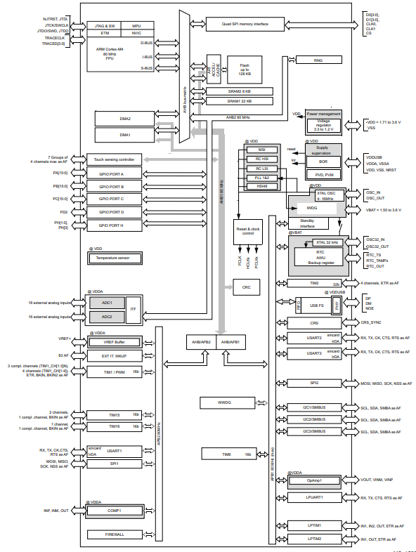

.. _stm32l412:

STM32L412
===============

* 关键词：``Cortex-M4``
* 资源库：`GitHub <https://github.com/SoCXin/STM32L412>`_

.. contents::
    :local:

Xin简介
-----------

.. image:: ./images/stm32l412.jpg
    :target: https://www.st.com/content/st_com/zh/products/microcontrollers-microprocessors/stm32-32-bit-arm-cortex-mcus/stm32-ultra-low-power-mcus/stm32l4-series/stm32l4x2/stm32l412kb.html

.. contents::
    :local:

关键特性
~~~~~~~~~~~

基本参数
^^^^^^^^^^^

* 供电电压：1.71 to 3.6 V
* 工作温度：40°C to +85°C
* 处理性能：100 :ref:`DMIPS`
* RAM容量：40 KB
* Flash容量：128 KB

特征参数
^^^^^^^^^^^

* :ref:`cortex_m4` 80 MHz
* 2 x 12-bit ADC 5 Msps
* USB FS
* 1.00 to 1.32V VDD12
* Quad SPI with XIP

芯片架构
~~~~~~~~~~~~

Xin选择
-----------

.. contents::
    :local:

品牌对比
~~~~~~~~~

版本对比
~~~~~~~~~

型号对比
~~~~~~~~~

.. image:: ./images/STM32L412l.png
    :target: https://www.st.com/content/st_com/zh/products/microcontrollers-microprocessors/stm32-32-bit-arm-cortex-mcus/stm32-ultra-low-power-mcus/stm32l4-series/stm32l4x2/stm32l412kb.html

Xin应用
-----------

.. contents::
    :local:

Xin总结
--------------

.. contents::
    :local:

能力构建
~~~~~~~~~~~~~

要点提示
~~~~~~~~~~~~~

问题整理
~~~~~~~~~~~~~

