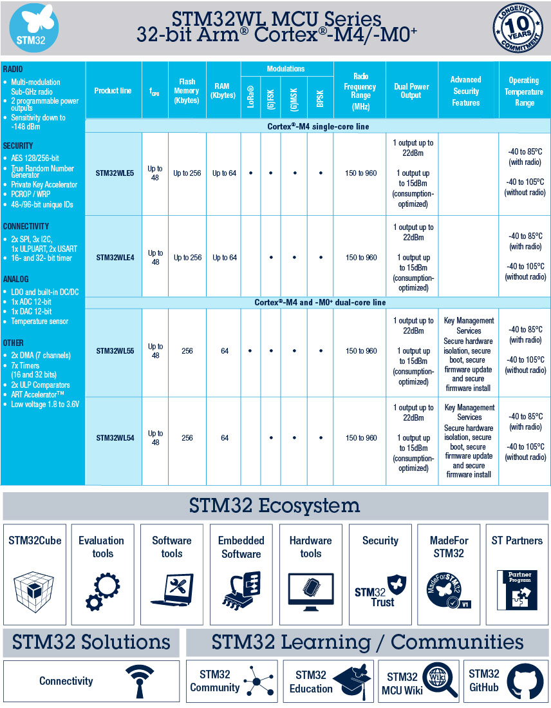

.. _stm32wl5:

STM32WLE5
===============

* 关键词：``Dual Core`` ``UFQFPN48`` ``UFBGA73`` ``UCPD`` ``HRTIM`` ``AES256``
* 资源库：`GitHub <https://github.com/SoCXin/STM32WLE5>`_

.. contents::
    :local:

Xin简介
-----------

:ref:`st` :ref:`cortex_m4` SoC

.. contents::
    :local:
.. image:: ./images/STM32WLE5.png
    :target: https://www.st.com/zh/microcontrollers-microprocessors/stm32wl-series.html

关键特性
~~~~~~~~~~~~

* 最低支持1.7V电源电压

.. hint::
    最有特色的一点是在QFN28封装内有两个USB D/H，十分方便USB连接。

芯片架构
~~~~~~~~~~~

* UFQFPN48（7x7mm）
* UFBGA73（5x5mm）

Xin选择
-----------

.. contents::
    :local:

Xin应用
-----------

.. contents::
    :local:

传感器设备
~~~~~~~~~~~

Xin总结
--------------

.. contents::
    :local:

要点提示
~~~~~~~~~~~~~

问题整理
~~~~~~~~~~~~~
