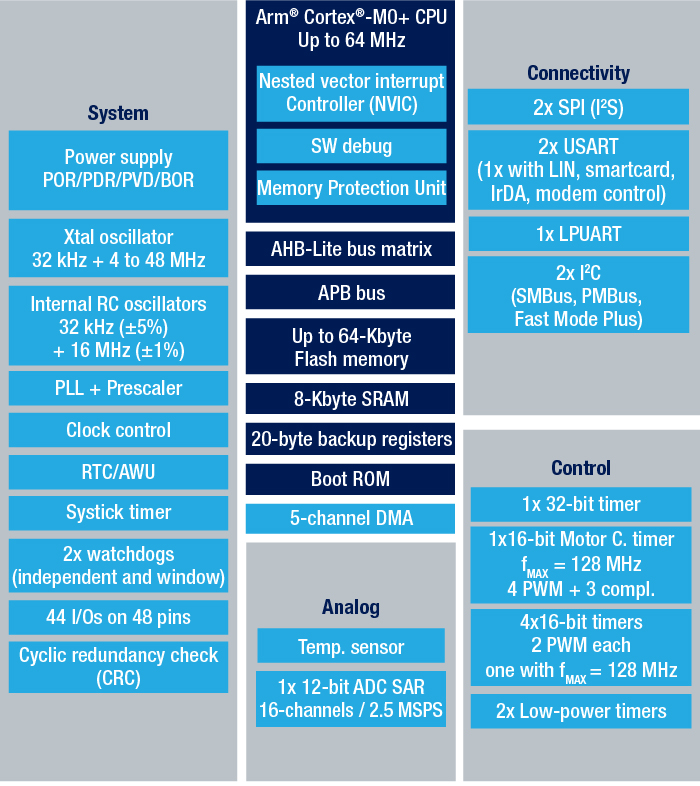
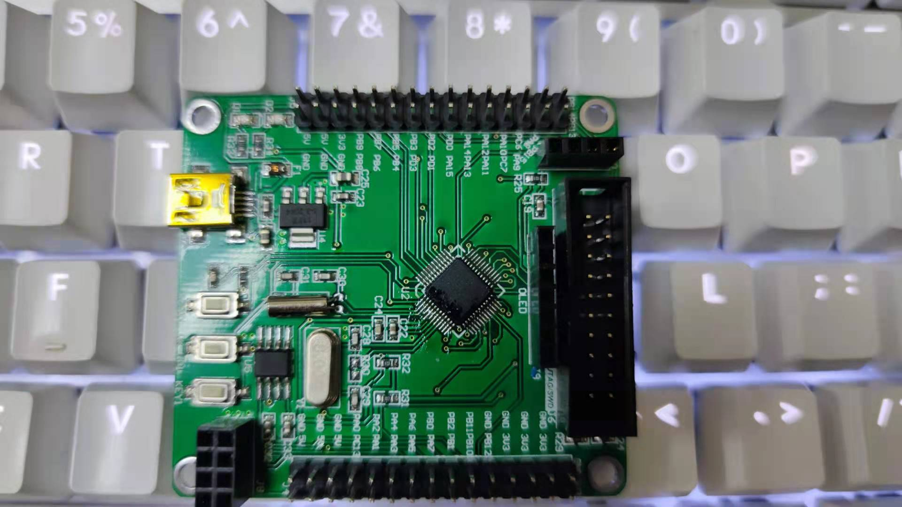

.. _st_stm32g031:

STM32G031
===============

.. contents:: Contents
    :local:

xin简介
-----------

`STM32G031 <https://www.st.com/zh/microcontrollers-microprocessors/stm32g0x1.html>`_  是一款基于Cortex M0+内核MCU，相关资源可查看
`GitHub <https://github.com/SoCXin/STM32G031>`_.

.. code-block:: bash

    pio device list [OPTIONS]

Cortex内核相关可查看  :option:`Cortex -M0`.

xin优势
-----------

List available devices.
Default is set to ``--serial`` and all available
`Serial Ports <http://en.wikipedia.org/wiki/Serial_port>`_ will be shown.

xin资源
-----------

.. image:: ./images/STM32G031.png

.. program:: pio device list

.. option::
    --serial

List available `Serial Ports <http://en.wikipedia.org/wiki/Serial_port>`_,
default.

.. option::
    --logical

List available logical devices.

.. option::
    --mdns

List multicast DNS services.

.. option::
    --json-output

Return the output in `JSON <http://en.wikipedia.org/wiki/JSON>`_ format.

点灯代码示例
------------

1. 基于STM32Cube HAL库

.. code-block:: bash

    > pio device list
    /dev/cu.SLAB_USBtoUART
    ----------
    Hardware ID: USB VID:PID=10c4:ea60 SNR=0001
    Description: CP2102 USB to UART Bridge Controller

    /dev/cu.uart-1CFF4676258F4543
    ----------
    Hardware ID: USB VID:PID=451:f432 SNR=1CFF4676258F4543
    Description: Texas Instruments MSP-FET430UIF

2. 基于STM32Cube LL库

.. code-block:: bash

    > pio device list
    COM4
    ----------
    Hardware ID: USB VID:PID=0451:F432
    Description: MSP430 Application UART (COM4)

    COM3
    ----------
    Hardware ID: USB VID:PID=10C4:EA60 SNR=0001
    Description: Silicon Labs CP210x USB to UART Bridge (COM3)

3. 基于ARM CMSIS库

.. code-block:: bash

    > pio device list --mdns --logical
    Multicast DNS Services
    ======================

    PlatformIO._bttremote._tcp.local.
    ------------------------------
    Type: _bttremote._tcp.local.
    IP: ...
    Port: 62941
    Properties: ...

    Time for PlatformIO._adisk._tcp.local.
    ---------------------------------
    Type: _adisk._tcp.local.
    IP: 192.168.0.1
    Port: 9
    Properties: ...

    PlatformIO._ssh._tcp.local.
    ------------------------
    Type: _ssh._tcp.local.
    IP: ...
    Port: 22

    PlatformIO._sftp-ssh._tcp.local.
    -----------------------------
    Type: _sftp-ssh._tcp.local.
    IP: ...
    Port: 22

    Logical Devices
    ===============
    /
    -
    Name:

    /Volumes/PIO
    -------------
    Name: PIO

    /Volumes/PLUS
    --------------
    Name: PLUS

开发板(STM32G031J6)
-----------------------

