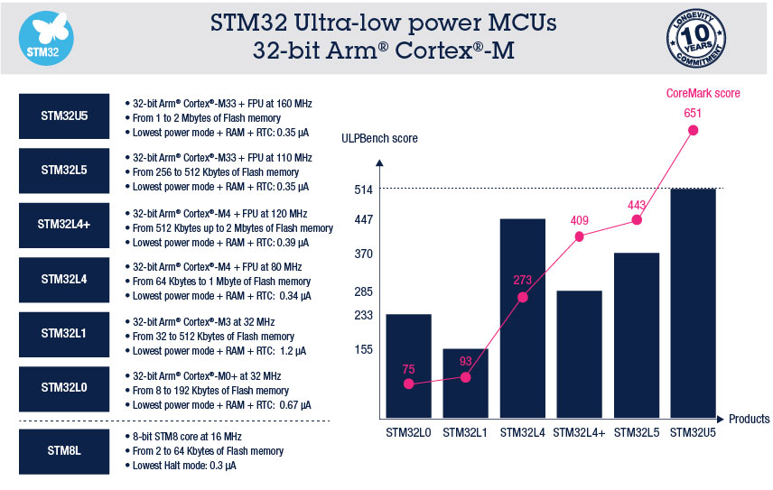

.. _st:

STMicroelectronics
======================

``MCU`` ``MPU`` ``MEMS``

.. contents::
    :local:

公司简介
-----------

作为MCU领域的龙头企业，是被广泛使用的一种范式，拥有庞大的开发团队和资源，如果你想找一颗满足需求的MCU，第一步就去https://www.st.com找一找。

.. note::
    意法半导体ST是全球最大的半导体公司之一，是MCU领域的王者，其产品系列丰富，应用广泛。

产品简介
-----------

.. list-table::
    :header-rows:  1

    * - 分类
      - 性能范围
      - 内存范围
      - 封装范围
      - 性能范围
      - 定价范围
      - 核心特点
    * - 低阶产品
      -
      -
      -
      -
      -
      -
    * - 主流产品
      -
      -
      -
      -
      -
      -
    * - 高阶产品
      -
      -
      -
      -
      -
      -

.. toctree::
    :maxdepth: 1

    低阶产品  <L/index>
    主流产品  <M/index>

性能担当
~~~~~~~~~~~
.. toctree::
    :maxdepth: 1

    超值低功耗 STM32H7B0 <H/STM32H7B0>
    超值大内存 STM32H750 <H/STM32H750>
    高频低功耗 STM32H730 <H/STM32H730>
    双核MCU: STM32H745 <H/STM32H745>
    异构MPU: STM32MP15 <H/STM32MP15>

.. list-table::
    :header-rows:  1

    * - Rank
      - Core
      - RAM
      - Flash
      - UART
      - BLE
      - USB
      - DMIPS
    * - :ref:`stm32h730`
      -
      -
      -
      -
      -
      -
      -
    * - :ref:`stm32h750`
      -
      -
      -
      -
      -
      -
      -
    * - :ref:`stm32h7b0`
      -
      -
      -
      -
      -
      -
      -

无线通信
~~~~~~~~~~~
.. toctree::
    :maxdepth: 1

    BLE SoC: STM32WB55 <M/STM32WB55>
    LoRa SoC: STM32WLE5 <M/STM32WLE5>

.. _stm32ulp:

超低功耗
~~~~~~~~~~~

.. toctree::
    :maxdepth: 1

    STM32L011 <L/STM32L011>
    STM32L412 <M/STM32L412>

.. list-table::
    :header-rows:  1

    * - Rank
      - Core
      - RAM
      - Flash
      - UART
      - BLE
      - USB
      - DMIPS
    * - :ref:`stm32l011`
      -
      -
      -
      -
      -
      -
      -
    * - :ref:`stm32l412`
      -
      -
      -
      -
      -
      -
      -

技术简介
-----------

.. _stm32_adc:

ADC
~~~~~~~~~~~

.. _stm32_dac:

DAC
~~~~~~~~~~~

.. _stm32_art:

ART
~~~~~~~~~~~

.. _stm32_fmac:

FMAC
^^^^^^^^^^^

Filter mathematical accelerator

* 16 x 16-bit multiplier
* 24+2-bit accumulator with addition and subtraction
* 16-bit input and output data
* 256 x 16-bit local memory
* Up to three areas can be defined in memory for data buffers (two input, one output),defined by programmable base address pointers and associated size registers
* Input and output sample buffers can be circular
* Buffer “watermark” feature reduces overhead in interrupt mode
* Filter functions: FIR, IIR (direct form 1)
* AHB slave interface
* DMA read and write data channels

.. _stm32_dma2d:

DMA2D
~~~~~~~~~~~

DMA2D首先是一个DMA，DMA能做的内存操作DMA2D肯定是不成问题，其次DMA2D有自己独有的颜色填充（也叫寄存器到存储器）、颜色格式转换、透明度混合（层混合）

* 颜色填充（矩形区域）（寄存器到存储器）
* 图像（内存）复制（存储器到存储器）
* 颜色格式转换（如YCbCr转RGB或RGB888转RGB565）
* 透明度混合（Alpha Blend）

