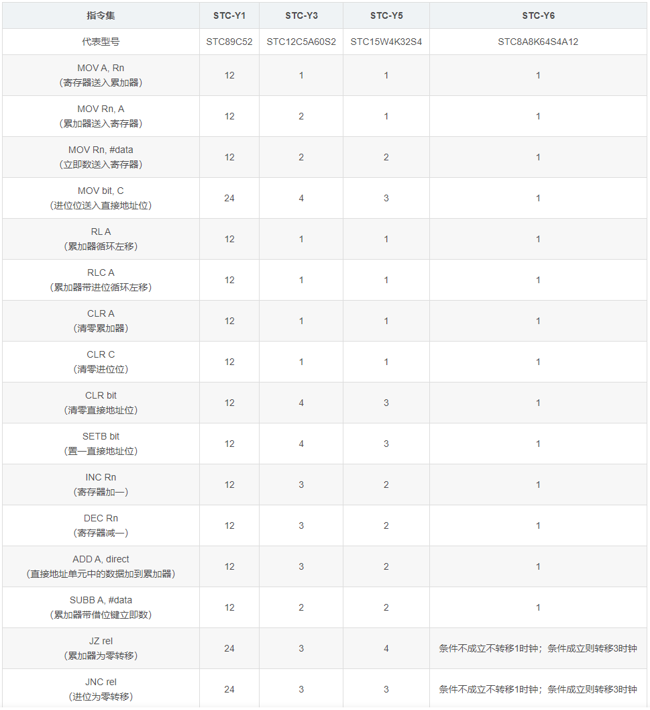

.. _stc8:

STC8
======

* 关键词：``24MHz`` ``EEPROM`` ``8051`` ``cheap``
* 资源库：`GitHub <https://github.com/SoCXin/STC8>`_

.. contents::
    :local:

选型表
-----------

STC的最大特点价格低，然后是够用和使用广泛，不需要烧录器。

.. image:: ./images/STC8.png
    :target: https://www.stcmcudata.com/

F：基础款。普通8051有的，它性能更强大、数量更多。8051没有的SPI、IIC、比较器，它也有。封装多，可以说是从普通8051过渡过来的最佳选择。
A：旗舰款。不仅拥有最大8K的RAM空间，在F的基础增加了模拟外设ADC、PWM，独立的Vref脚还能提供ADC更自由的发挥攻坚。可以说是面面俱到的旗舰。
C：模拟外设款。空间和外设数量虽然比不上其他，但是ADC和PCA的存在足以应付需要模拟外设的小应用。
G：二代虚拟外设款。和C相比，最重要的特点就是多了硬件的乘除法器。性能更提升一个台阶。分型号甚至有多达45通道的PWM。
H：二代旗舰款。虽然有H的阉割版，但是满血的H旗舰不仅拥有全部A版功能，还多了硬件的USB控制器，主频也提高到48MHz。可以说是STC8目前最强。

.. _stc8y6:

指令集
---------------

STC8H
-------

 :ref:`mcs51`
