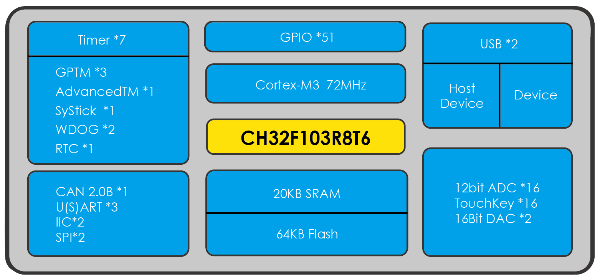

.. _ch32f103:

CH32F103
============

* 关键词：``Cortex-M3`` ``72MHz`` ``USB H/D`` ``CAN2.0B`` ``BLE4.2`` ``RTC`` ``AES128``
* 资源库：`GitHub <https://github.com/SoCXin/CH32F103>`_

.. contents::
    :local:

Xin简介
-----------

.. contents::
    :local:

关键特性
~~~~~~~~~~~

基本参数
^^^^^^^^^^^

* 供电电压：2.7V ~ 5.5V
* 工作温度：40°C to +85°C
* 处理性能：90 :ref:`DMIPS`
* RAM容量：20 KB
* Flash容量：128 KB

特征参数
^^^^^^^^^^^

* :ref:`cortex_m3` 72 MHz
* USB 2.0 x 2
* CAN 2.0B
* SPI(M/S) x 2 + UART x 3 + IIC x 2
* 12bit ADC + 12bit DAC

芯片架构
~~~~~~~~~~~~

Xin选择
-----------

.. contents::
    :local:

品牌对比
~~~~~~~~~~

系列对比
~~~~~~~~~~

型号对比
~~~~~~~~~~

.. image:: ./images/CH32F103l.png
    :target: http://www.wch.cn/products/CH32F103.html

Xin应用
-----------

.. contents::
    :local:

Xin总结
--------------

.. contents::
    :local:

能力构建
~~~~~~~~~~~~~

要点提示
~~~~~~~~~~~~~

问题整理
~~~~~~~~~~~~~

