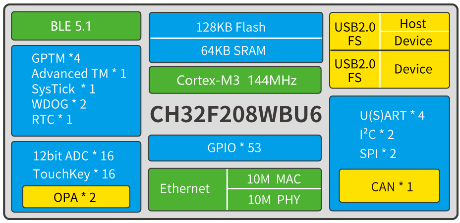

.. _ch32f208:

CH32F208
============

`官方资源 <http://www.wch.cn/products/CH32F208.html>`_ ``Cortex-M3`` ``144MHz`` ``USB`` ``10Mbps(PHY)`` ``BLE5.3`` ``CAN`` ``AES128``

`GitHub <https://github.com/SoCXin/CH32F208>`_

.. contents::
    :local:

Xin简介
-----------

CH32F208基于 :ref:`cortex_m3` 内核的无线型微控制器，主频高达144MHz, 片上集成2Mbps低功耗蓝牙BLE 通讯模块、10M以太网MAC+PHY模块、USB2.0全速设备+主机/设备接口、CAN控制器等。

规格参数
~~~~~~~~~~~

基本参数
^^^^^^^^^^^

* 发布时间：
* 参考价格：
* 制程工艺：
* 供货周期：
* 处理性能：
* 封装规格：LQFP64M/QFN68/QFN48/QFN28
* 运行环境：-40°C to 85°C
* RAM容量：64 KB
* Flash容量：128 KB

特征参数
^^^^^^^^^^^

* 144MHz :ref:`cortex_m3`
* :ref:`ch32f208_ble` 5.3
* :ref:`ch32f208_eth` 10Mbps（MAC+PHY）
* :ref:`ch32f208_usb` 2.0 FS H/D + D
* :ref:`ch32f208_can` （2.0B主动）
* 4个USART接口
* 2组IIC接口、2组SPI接口
* 2组运放比较器
* 16通道12位ADC转换，16路触摸按键TouchKey
* 5组定时器

芯片架构
~~~~~~~~~~~

.. image:: ./images/CH32F20X.png
    :target: http://www.wch.cn/products/CH32F208.html

功耗参数
^^^^^^^^^^^

.. image:: ./images/CH32F208pwr.png
    :target: http://www.wch.cn/products/CH32F208.html

连接能力
~~~~~~~~~~~

``USB OTG`` ``CAN 2.0B`` ``Ethernet``

.. list-table::
    :header-rows:  1

    * - :ref:`wch`
      - UART
      - SPI
      - I2C
      - :ref:`ch32f208_ble`
      - :ref:`ch32f208_usb`
      - :ref:`ch32f208_can`
      - :ref:`ch32f208_eth`
    * - :ref:`ch32f208`
      - 4
      - 2
      - 2
      - 5.3
      - 2(H/D+D)
      - 1(2.0B)
      - 10Mbps

.. _ch32f208_ble:

BLE
^^^^^^^^^^^

.. _ch32f208_usb:

USB
^^^^^^^^^^^

.. _ch32f208_can:

CAN
^^^^^^^^^^^
``CAN 2.0B``

.. _ch32f208_eth:

Ethernet
^^^^^^^^^^^
``10Mbps(PHY)``

Xin选择
-----------

.. contents::
    :local:

品牌对比
~~~~~~~~~~

BLE对比
^^^^^^^^^^^

ETH对比
^^^^^^^^^^^

型号对比
~~~~~~~~~~

BLE对比
^^^^^^^^^^^

.. list-table::
    :header-rows:  1

    * - :ref:`wch`
      - Core
      - Freq
      - SRAM/ROM
      - BLE
      - USB/CAN
      - SPI/I2C
      - ADC/OPA
    * - :ref:`ch32f208`
      - :ref:`cortex_m3`
      - 144MHz
      - 64KB/128KB
      - 5.3
      - 2/1
      - 2/2
      - 16/2
    * - :ref:`ch32v208`
      - :ref:`wch_riscv4c`
      - 144MHz
      - 64KB/128KB
      - 5.3
      - 2/1
      - 2/2
      - 16/2
    * - :ref:`ch579`
      - :ref:`cortex_m0`
      - 40MHz
      - 32KB/250KB
      - 4.2
      - 1/0
      - 2/0
      - 14/0

ETH对比
^^^^^^^^^^^

.. list-table::
    :header-rows:  1

    * - :ref:`wch`
      - SRAM/ROM
      - More
      - UART/SDIO
      - USB
      - Ethernet
      - Package
    * - :ref:`ch32f208`
      - 64K/128K
      - BLE5.3
      - 4/0
      - 2xUSB FS OTG
      - 10M(PHY)
      - 28/48/64/68
    * - :ref:`ch32v208`
      - 64K/128K
      - BLE5.3
      - 4/0
      - 2xUSB FS OTG
      - 10M(PHY)
      - 28/48/64/68
    * - :ref:`ch32v307`
      - 64K/256K
      - DVP/OPA
      - 8/1
      - FS(OTG)+HS(PHY)
      - 10M(PHY)/1G(MAC)
      - 100/68/64
    * - :ref:`ch32f207`
      - 64K/256K
      - DVP/OPA
      - 8/1
      - FS(OTG)+HS(PHY)
      - 10M(PHY)/1G(MAC)
      - 100/68/64

.. image:: ./images/CH32F20.png
    :target: http://www.wch.cn/products/CH32F208.html
.. image:: ./images/CH32F2.png
    :target: http://special.wch.cn/zh_cn/mcu/

版本对比
~~~~~~~~~~

.. image:: ./images/CH32F208ver.png
    :target: http://www.wch.cn/products/CH32F208.html

