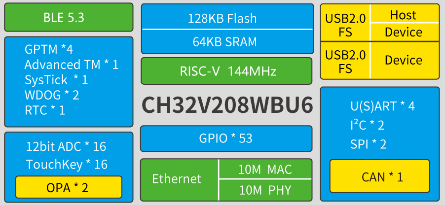
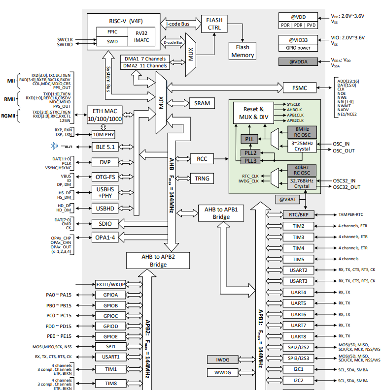
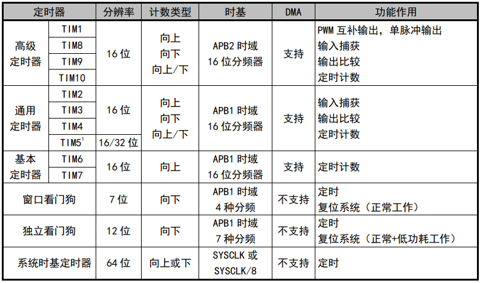

.. _ch32v208:

CH32V208
============

`标签 <http://www.wch.cn/products/CH32V208.html>`_ ``RISC-V4C`` ``144MHz`` ``USB`` ``10Mbps(PHY)`` ``BLE5.3`` ``QFN28``

.. contents::
    :local:

Xin简介
-----------

:ref:`wch_riscv` CH32V208系列是基于32位RISC-V设计的无线型微控制器，配备了硬件堆栈区、快速中断入口，在标准RISC-V基础上大大提高了中断响应速度。搭载V4C内核，加入内存保护单元，同时降低硬件除法周期。片上集成2Mbps低功耗蓝牙BLE 通讯模块、10M以太网MAC+PHY模块、USB2.0全速设备+主机/设备接口、CAN控制器等。

`GitHub <https://github.com/SoCXin/CH32F208>`_

规格参数
~~~~~~~~~~~

基本参数
^^^^^^^^^^^

* 发布时间：
* 参考价格：
* 制程工艺：
* 供货周期：
* 处理性能：
* 封装规格：LQFP64M/QFN68/QFN48/QFN28
* 运行环境：-40°C to 85°C
* RAM容量：64 KB
* Flash容量：128 KB

特征参数
^^^^^^^^^^^

* 144 MHz :ref:`wch_riscv4c`
* :ref:`ch32v208_ble` 5.3
* 10M以太网控制器（MAC+PHY）
* 2组运放比较器
* USB2.0全速主机/设备+设备接口
* :ref:`ch32v208_can` （2.0B主动）
* 2组IIC接口、2组SPI接口

.. hint::
    128K FLASH+64K SRAM 的 208 产品支持用户选择字配置为（128K FLASH+64K SRAM）、（144KFLASH+48K SRAM）、（160K FLASH+32K SRAM）几种组合中的一种。

芯片架构
~~~~~~~~~~~~

Timer
^^^^^^^^^^^

连接能力
~~~~~~~~~~~

``BLE5.3`` ``USB FS OTG`` ``CAN`` ``Ethernet``

.. _ch32v208_ble:

BLE
^^^^^^^^^^^

``-98dBm``

.. _ch32v208_usb:

USB
^^^^^^^^^^^

``USB FS``

.. _ch32v208_can:

CAN
^^^^^^^^^^^

``CAN 2.0B``

.. _ch32v208_eth:

Ethernet
^^^^^^^^^^^

``10Mbps(PHY)``

Xin选择
-----------

.. contents::
    :local:

品牌对比
~~~~~~~~~~

型号对比
~~~~~~~~~~

.. list-table::
    :header-rows:  1

    * - :ref:`wch`
      - Core
      - SRAM/ROM
      - BLE
      - ADC/OPA
      - USB
      - Ethernet
    * - :ref:`ch32v208`
      - 144MHz
      - 64KB/128KB
      - 5.3(96dBm)
      - 16/2
      - H/D + D
      - 10M(PHY)
    * - :ref:`ch32f208`
      - 144MHz
      - 64KB/128KB
      - 5.3(96dBm)
      - 16/2
      - H/D + D
      - 10M(PHY)
    * - :ref:`ch579`
      - 40MHz
      - 32KB/250KB
      - 4.2(96dBm)
      - 14/0
      - H/D
      - 10M(PHY)

.. list-table::
    :header-rows:  1

    * - :ref:`wch`
      - SRAM/ROM
      - More
      - UART/SDIO
      - USB
      - Ethernet
      - Package
    * - :ref:`ch32v208`
      - 64K/128K
      - BLE5.3
      - 4/0
      - 2xUSB FS OTG
      - 10M(PHY)
      - 28/48/64/68
    * - :ref:`ch32f208`
      - 64K/128K
      - BLE5.3
      - 4/0
      - 2xUSB FS OTG
      - 10M(PHY)
      - 28/48/64/68
    * - :ref:`ch32v307`
      - 64K/256K
      - DVP/OPA
      - 8/1
      - FS(OTG)+HS(PHY)
      - 10M(PHY)/1G(MAC)
      - 100/68/64
    * - :ref:`ch32f207`
      - 64K/256K
      - DVP/OPA
      - 8/1
      - FS(OTG)+HS(PHY)
      - 10M(PHY)/1G(MAC)
      - 100/68/64

版本对比
~~~~~~~~~~
