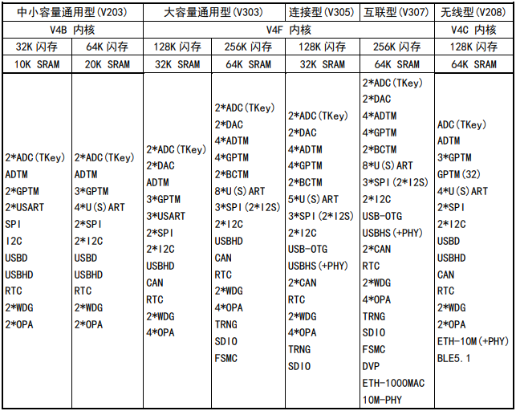

.. _NO_014:
.. _ch32v307:

CH32V307
============

`标签 <https://github.com/SoCXin/CH32V307>`_ : ``RISC-V`` ``RISC-V4F`` ``USB-HS-OTG(480Mbps)`` ``Ethernet`` ``10Mbps(PHY)`` ``1Gbps(MAC)`` ``CAN`` ``FSMC`` ``OPA`` ``DVP``

.. contents::
    :local:

Xin简介
-----------

.. image:: ./images/CH32V307.png
    :target: http://www.wch.cn/products/CH32V307.html

`GitHub <https://github.com/SoCXin/CH32V307>`_

规格参数
~~~~~~~~~~~

CH32V307基于32位RISC-V设计的互联型微控制器，配备了硬件堆栈区、快速中断入口，在标准RISC-V基础上大大提高了中断响应速度。加入单精度浮点指令集，扩充堆栈区，具有更高的运算性能。扩展串口U(S)ART数量到8组，电机定时器到4组。提供USB2.0高速接口（480Mbps）并内置了PHY收发器，以太网MAC升级到千兆并集成了10M-PHY模块。

基本参数
^^^^^^^^^^^

* 发布时间：
* 参考价格：
* 制程工艺：
* 供货周期：
* 处理性能：:ref:`level3`
* 封装规格：LQFP64M/LQFP100/QFN68
* 运行环境：-40°C to 85°C
* RAM容量：64 KB
* Flash容量：256 KB

特征参数
^^^^^^^^^^^

* 144MHz :ref:`wch_riscv4f` (青稞)
* :ref:`ch32v307_usb` FS OTG
* :ref:`ch32v307_usb` HS H/D(480Mbps PHY)
* 3x USART + 5x UART
* 2x :ref:`ch32v307_can` 2.0B主动
* 千兆以太网控制器 :ref:`ch32v307_eth` (10Mbps PHY)
* 2组18路通用DMA
* 4组运放比较器
* 2组12位DAC转换
* 2单元16通道12位ADC转换，16路触摸按键TouchKey
* 10组定时器
* SDIO接口、FSMC接口、DVP数字图像接口
* 2x IIC接口、3x SPI接口、2x IIS接口

.. hint::
    千兆以太网控制器1Gbps MAC和10Mbps PHY，USB HS设备，非常强大的有线连接能力

芯片架构
~~~~~~~~~~~

.. image:: ./images/CH32V307P.png
    :target: http://www.wch.cn/products/CH32V307.html

功耗参数
^^^^^^^^^^^

* 供电电压：2.5/3.3V，GPIO单元独立供电
* 多种低功耗模式：睡眠、停止、待机

.. image:: ./images/CH32V307pwr.png
    :target: http://www.wch.cn/products/CH32V307.html

模拟性能
^^^^^^^^^^^

``TouchKey`` ``ADC`` ``DAC`` ``OPA``

* 4x OPA
* 2x 12bit DAC
* 2x 12bit ADC (16ch)
* 16x TouchKey

连接能力
~~~~~~~~~~~

``USB-HS-OTG(480Mbps)`` ``USB-FS-OTG`` ``CAN2.0B`` ``Ethernet``

.. list-table::
    :header-rows:  1

    * - :ref:`wch`
      - UART
      - SDIO
      - SPI
      - FSMC
      - :ref:`ch32v307_usb`
      - :ref:`ch32v307_can`
      - I2C
      - I2S
      - :ref:`ch32v307_eth`
    * - :ref:`ch32v307`
      - 5+3
      - 1
      - 3
      - 1
      - HS+FS
      - 2
      - 2
      - 2
      - 1Gbps

.. _ch32v307_usb:

USB
^^^^^^^^^^^

``OTG`` ``480Mbps`` ``PHY``

* USB FS OTG
* USB HS H/D(480Mbps PHY)

.. hint::
    支持和集成USB 480Mbps PHY的MCU较少，而且性价比低，例如STM32F7系列

.. _ch32v307_eth:

ETH
^^^^^^^^^^^
``1Gbps(MAC)`` ``10Mbps(PHY)``

* 1Gbps MAC
* 10Mbps PHY

.. _ch32v307_can:

CAN
^^^^^^^^^^^
``CAN 2.0B``

Xin选择
-----------

.. contents::
    :local:

品牌对比
~~~~~~~~~~

型号对比
~~~~~~~~~~

.. list-table::
    :header-rows:  1

    * - :ref:`wch`
      - SRAM/ROM
      - More
      - Interface
      - USB
      - Ethernet
      - Package
    * - :ref:`ch32v307`
      - 64KB/256KB
      - DVP/FSMC
      - 8/1
      - FS(OTG)+HS(PHY)
      - 10M(PHY)/1G(MAC)
      - 100/68/64
    * - :ref:`ch32f207`
      - 64KB/256KB
      - DVP/FSMC
      - 8/1
      - FS(OTG)+HS(PHY)
      - 10M(PHY)/1G(MAC)
      - 100/68/64
    * - :ref:`ch32v208`
      - 64KB/128KB
      - BLE5.3
      - 4/0
      - 2xUSB FS OTG
      - 10M(PHY)
      - 28/48/64/68
    * - :ref:`ch32f208`
      - 64KB/128KB
      - BLE5.3
      - 4/0
      - 2xUSB FS OTG
      - 10M(PHY)
      - 100/64

与 :ref:`ch32v307` 规格完全相同，只是内核不同的替换方案为 :ref:`ch32f207`

速度对比
^^^^^^^^^^

    * - :ref:`wch`
      - SRAM/ROM
      - More
      - Interface
      - USB
      - Ethernet
      - Package
    * - :ref:`ch32v307`
      - 64KB/256KB
      - DVP/FSMC
      - 8/1
      - FS(OTG)+HS(PHY)
      - 10M(PHY)/1G(MAC)
      - 100/68/64
    * - :ref:`ch569`
      - 112K/512K
      - HSPI/SerDes
      - 4/0
      - SS(PHY)
      - 1G(MAC)
      - QFN68

版本对比
~~~~~~~~~~

.. _ch32v305:

CH32V305
^^^^^^^^^^^
``TSSOP20``

.. image:: ./images/CH32V307list.png
    :target: http://www.wch.cn/products/CH32V307.html

Xin应用
-----------

.. contents::
    :local:

开发板
~~~~~~~~~~

核心板
^^^^^^^^^^

.. image:: ./images/B_CH32V307.jpg
    :target: https://item.taobao.com/item.htm?spm=a230r.1.14.48.39021289jMGykq&id=659315400556&ns=1&abbucket=3#detail

