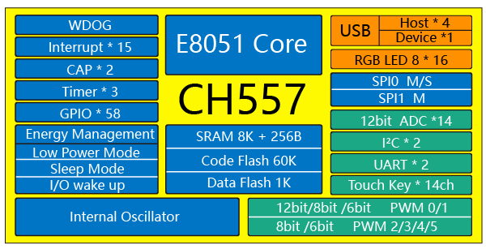

.. _wch_ch557:

CH557
==========

芯片简介
-----------
兼容MCS51的增强型E8051内核，79%指令是单字节单周期指令，3KB BootLoader + 60KB CodeFlash，8K xRAM + 256B iRAM，1K DataFlash。

内置了USB主机控制器和收发器，内置4端口USB root-hub根集线器，支持USB 2.0全速12Mbps或者低速1.5Mbps，支持USB Host主机模式和USB Device设备模式。支持最大64字节数据包，内置FIFO，支持DMA。

CH557提供丰富的接口资源，包括2组异步串口、6路PWM、14通道电容触摸按键、128组RGB三色LED控制器，其他包括2路SPI、IIC主机和IIC从机、14路12位ADC，支持电压比较；内置3组定时器和2路信号捕捉；支持最多58个GPIO。

关键特性
^^^^^^^^^^^^^

* 4端口USB root-hub集线器
* UART x 2 + SPI x 2
