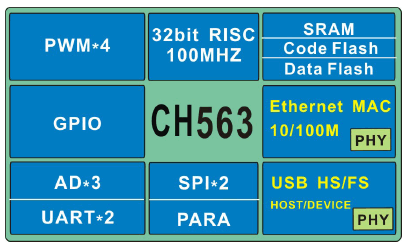
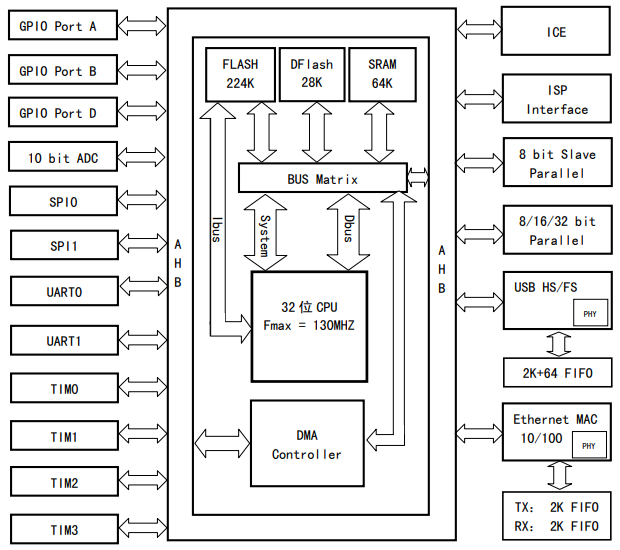

.. _ch563:

CH563
==========

* 关键词：``ARM7`` ``ARMv5TE`` ``USB-HS`` ``100M-ETH-PHY`` ``DataFlash`` ``130MHz``
* 资源库：`GitHub <https://github.com/SoCXin/CH563>`_

.. contents::
    :local:

Xin简介
-----------

规格参数
~~~~~~~~~~~

基本参数
^^^^^^^^^^^

* 供电电压：3.0 to 3.6 V
* 工作温度：-40°C to 85°C
* 封装规格：LQFP64/LQFP128
* 处理性能：300 :ref:`DMIPS`
* RAM容量：64 KB
* Flash容量：224 KB

特征参数
^^^^^^^^^^^

* :ref:`arm7` 130 MHz
* USB2.0高速主从接口（内置PHY）
* 10/100M网络接口（内置PHY）
* 4组28位定时器
* 1个被动并口及intel时序总线接口
* 3通道10位ADC
* 2组SPI接口、2组串口
* 支持低功耗睡眠模式

芯片架构
~~~~~~~~~~~~

