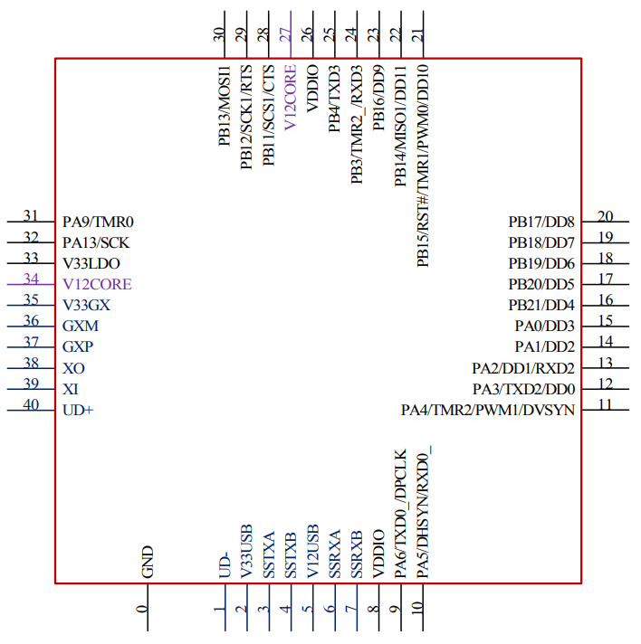
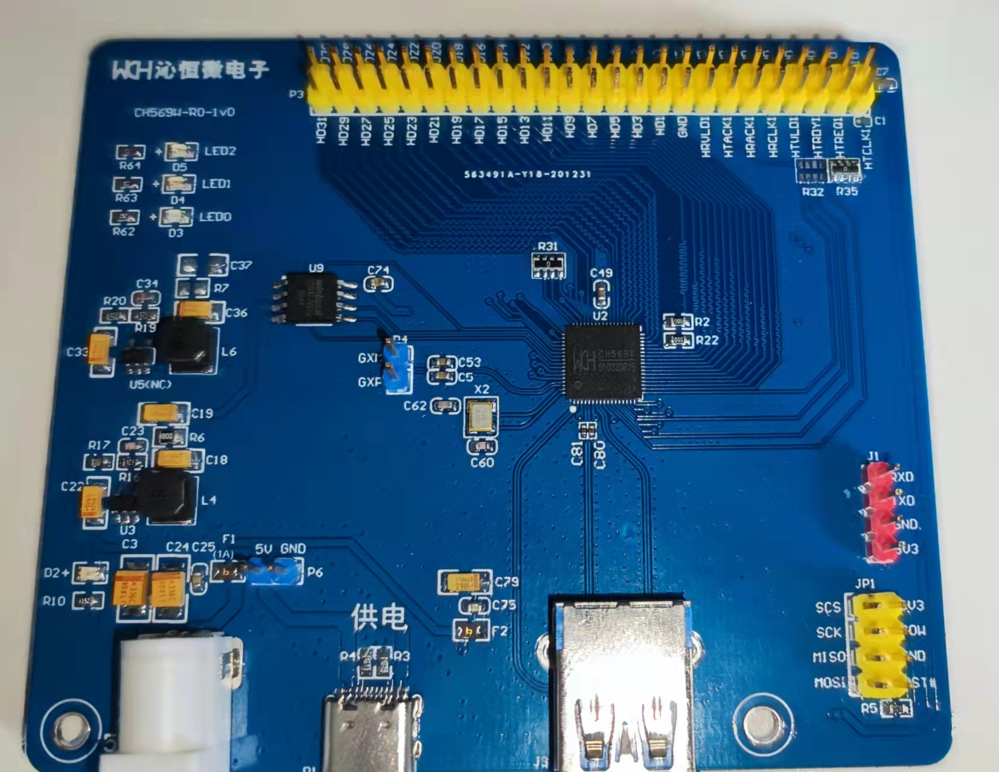

.. _NO_009:
.. _ch569:

CH569
===========

* 关键词：``RISC-V3A`` ``120MHz`` ``USB 3.0`` ``HSPI`` ``SerDes`` ``1000Mbps MAC`` ``Ethernet`` ``EMMC`` ``DVP``
* 资源库：`GitHub <https://github.com/SoCXin/CH569>`_ , `官方链接 <http://www.wch.cn/products/CH569.html>`_

.. contents::
    :local:

Xin简介
-----------

.. image:: ./images/CH569.png
    :target: http://www.wch.cn/products/CH569.html

.. contents::
    :local:

规格配置
~~~~~~~~~~~

:ref:`wch_riscv3a` 支持RISC-V指令的IMAC子集。
片上采取 128 位数据宽度的 DMA 以支持多个高速外设的高带宽需求，实现大数据量的高速传输。
外设包括 USB3.0 超速、USB2.0高速主机和设备控制器及收发器 PHY、千兆以太网控制器、专用高速 SerDes 控制器及收发器 PHY、SD/EMMC接口控制器、加解密模块、高速并行接口、数字视频接口 DVP 等，可广泛应用于流媒体、即时存储、超高速 FIFO、通讯延长、安防监控等应用场景。

基本参数
^^^^^^^^^^^

* 发布时间：
* 制程工艺：
* 发布价格：
* 工作温度：-20 °C to 85 °C
* 处理性能：145 :ref:`DMIPS`
* RAM容量：16 KB + 32/64/96 KB
* Flash容量：448 KB
* 封装规格：:ref:`wch_qfn68`

.. hint::
    :ref:`ch569` 型号目前并无QFN40封装

特征参数
^^^^^^^^^^^

* 120 MHz :ref:`wch_riscv3a`
* USB3.0控制及收发器（内置PHY），支持主机Host/设备Device模式、OTG功能，支持USB3.0 HUB
* USB2.0控制及收发器（内置PHY），支持主机Host/设备Device模式，支持控制/批量/中断/同步传输
* 千兆以太网控制器 :ref:`ch569_eth` ，提供RGMII和RMII PHY接口，支持10/100/1000Mbps速率
* :ref:`ch569_hspi`，可配置8/16/32位数据宽度，内置FIFO，支持DMA，最快传输速度约为3.8Gbps
* :ref:`ch569_serdes` 可直接驱动光纤，支持网线（仅使用1组差分线）传输90米，支持1.25Gbps高速差分信号通讯
* 内置EMMC控制器，支持单线、4线、8线数据通讯模式，符合EMMC卡4.4和4.5.1规范，兼容5.0规范

.. hint::
    :ref:`ch569` 强悍的高速外设配置十分有冲击力，但是受限于内核性能无法进行数据处理，更多是作为桥接芯片

芯片架构
~~~~~~~~~~~

.. image:: ./images/CH569s.png
    :target: http://www.wch.cn/products/CH569.html

* 供电电压：2.1 to 3.6 V

功耗参数
^^^^^^^^^^^

.. image:: ./images/CH569pwr.png
    :target: http://www.wch.cn/products/CH569.html

封装规格
^^^^^^^^^^^

:ref:`ch569` 目前仅有一个 :ref:`wch_qfn68` 封装，而 :ref:`ch565` 具有QFN68/QFN40

* 封装尺寸 8x8mm ，pitch 0.4mm

.. image:: ./images/CH569p68.png

连接能力
~~~~~~~~~~~

.. _ch569_eth:

Ethernet
^^^^^^^^^^^

``10/100/1000Mbps``

.. _ch569_serdes:

SerDes
^^^^^^^^^^^

SerDes是Serializer/Deserializer的缩写，即串行器和解串器，顾名思义是一种将并行数据转换成串行数据发送，将接收的串行数据转换成并行数据的”器件“。

SerDes主要具有以下优点：

* 减少布线冲突（无单独的时钟线，时钟嵌入在数据流中，从而也解决了限制数据传输速率的信号时钟偏移问题）；
* 抗噪声、抗干扰能力强（差分传输）；
* 降低开关噪声；
* 扩展能力强；
* 更低的功耗和封装成本；

SerDes有四种架构：1）并行时钟SerDes；2）嵌入式时钟SerDes；3）8b/10b编码SerDes；4）位交错SerDes。

`基础知识 <https://www.cnblogs.com/rouwawa/p/13524703.html>`_

.. _ch569_hspi:

HSPI
^^^^^^^^^^^

HSPI接口通讯可比拟FPGA功能，最典型的应用场景是获取高速ADC器件数据 :ref:`adc`

Xin选择
-----------

.. contents::
    :local:

品牌对比
~~~~~~~~~

系列对比
~~~~~~~~~

型号对比
~~~~~~~~~

.. image:: ./images/CH569l.png
    :target: http://www.wch.cn/products/CH569.html

.. _ch565:

CH565
^^^^^^^^^^^

 :ref:`ch565` 相较于 :ref:`ch569` 多了DVP接口，去掉了 :ref:`ch569_hspi` ，甚至在更小QFN40上去掉了以太网和调试端口。

Xin应用
-----------

.. contents::
    :local:

开发板
~~~~~~~~~~

CH569W-R0-1V0
^^^^^^^^^^^^^^^

官方示例
~~~~~~~~~~

`USB3.0超高速U盘 <http://www.wch.cn/application/532.html>`_ ，CH569配有EMMC卡控制器和USB3.0 OTG控制器及收发器，通过EMMC接口挂载SD/TF/EMMC卡后即可具备U盘设计的基本物理资源。

软件设计上，缓冲区资源共享，划分队列管理，USB3.0端数据和EMMC卡数据只进行DMA地址修改，不参与任何数据拷贝，减少MCU处理时间；添加了EMMC卡协议命令处理及USB3.0设备端命令响应过程。

实测使用一款16G EMMC卡作为存储介质(工作在HS200模式下)，在Win10平台下进行大数据拷贝，读出速度不低于90MB/s，写入速度不低于40MB/s

.. hint::
    这个方案测试速率连USB-HS的性能都远远没发挥出来！

Xin总结
--------------

.. contents::
    :local:

能力构建
~~~~~~~~~~~~~

要点提示
~~~~~~~~~~~~~

由于端口复用问题，所以烧录固件进入BOOT模式有点麻烦，特别是CH569W-R0-1V0并没有带有任何按键，在调试过程中需要自己附带更多的外部接线环境，没法开箱即用。

问题整理
~~~~~~~~~~~~~

