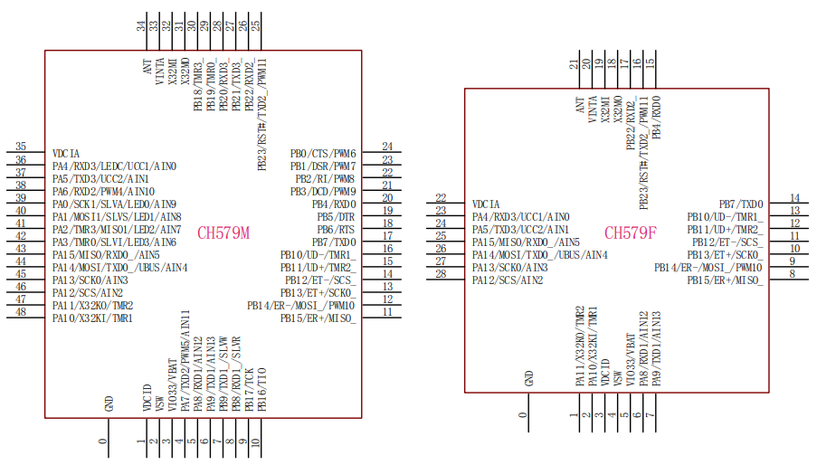

.. _NO_008:
.. _ch579:

CH579
========

* 关键词：``Cortex-M0`` ``40MHz`` ``QFN28`` ``USB FS`` ``Ethernet`` ``10M-ETH-PHY`` ``BLEv4.2`` ``RTC`` ``AES128``
* 资源库：`GitHub <https://github.com/SoCXin/CH579>`_ , `Gitee <https://gitee.com/socxin/CH579>`_

.. contents::
    :local:

Xin简介
-----------

 :ref:`sip` :ref:`eth_phy_tiny`

.. image:: ./images/CH579.png
    :target: http://www.wch.cn/products/CH579.html

规格参数
~~~~~~~~~~~

基本参数
^^^^^^^^^^^

* 发布时间：
* 制程工艺：
* 工作温度：-40°C to +85°C
* 处理性能：36 :ref:`DMIPS`, 78 :ref:`CoreMark`
* RAM容量：32 KB
* Flash容量：250 KB
* 封装规格： :ref:`qfn28` / :ref:`wch_qfn48`

特征参数
^^^^^^^^^^^

* 40 MHz :ref:`cortex_m0`
* 1x :ref:`wch_usb` FS H/D
* 以太网接口 :ref:`wch_eth_10m`
* :ref:`wch_ble` 4.2，Zigbee兼容IEEE 802.15.4规范
* SPI x 2 + UART x 4 (16C550/6Mbps)
* 内置电池电压低压监控，最低电流0.2uA
* 内置AES-128加解密单元，芯片唯一ID

.. note::
    网络库是以库文件提供的，MRU只有500多字节。

电源参数
^^^^^^^^^^^

* 供电电压: 2.1 to 3.6 V (内置DC/DC)
* 运行功耗: 100μA/MHz

.. image:: ./images/CH579pwr1.png
    :target: http://www.wch.cn/downloads/CH579DS1_PDF.html

芯片架构
~~~~~~~~~~~~

.. image:: ./images/CH579s.png
    :target: http://www.wch.cn/downloads/CH579DS1_PDF.html

电源体系
^^^^^^^^^^^

.. image:: ./images/CH579pwr.png
    :target: http://www.wch.cn/downloads/CH579DS1_PDF.html

.. _wch_ble:

BLE
^^^^^^^^^^^

接收灵敏度-93dBm，可编程+3dBm发送功率

.. _wch_usb:

USB
^^^^^^^^^^^

集成 USB 2.0 FS PHY
支持 USB type-C 主从/电流检测

.. _wch_eth_10m:

ETH-PHY-10M
^^^^^^^^^^^^^

支持帧过滤，支持 DMA ，内置50Ω匹配电阻

.. _wch_qfn48:

QFN48
^^^^^^^^^^^

* 封装尺寸(CH579M)：5 x 5 mm, 0.35mm pitch

Xin选择
-----------

.. contents::
    :local:

品牌对比
~~~~~~~~~

:ref:`ch579` 的定位非常细分小众，相比传统的BLE SoC的主要竞争优势在于以太网高度集成后带来的高性价比，特别是能够对WiFi+BLE的架构形成一种替代，特别适合在一些物联网网关类产品中。

就功能而言，需要网络连接和局域低功耗无线连接的设计还有WiFi+BLE架构的无线类芯片，这就是 :ref:`espressif` 的看家本领了。

.. list-table::
    :header-rows:  1

    * - :ref:`list`
      - Core
      - Freq
      - SRAM
      - Flash
      - :ref:`ble`
      - :ref:`eth_phy`
      - :ref:`eth_mac`
    * - :ref:`ch579`
      - :ref:`cortex_m0`
      - 40 MHz
      - 32 KB
      - 250 KB
      - 4.2
      - 10M
      - 10M
    * - :ref:`W7500P`
      - :ref:`cortex_m0`
      - 48 MHz
      - 16+32 KB
      - 128 KB
      - X
      - 10M
      - 10M
    * - :ref:`esp32`
      - :ref:`xtensa_lx6`
      - 160 MHz
      - 520 KB
      - 480 KB
      - 4.2
      - X
      - 100M

.. _W7500P:

W7500P
^^^^^^^^^^^

`W7500P GitHub <https://github.com/SoCXin/W7500P>`_

.. warning::
    W7500是工业级的，W7500P是商用级的，后者片上集成10MHz以太网PHY

系列对比
~~~~~~~~~

.. list-table::
    :header-rows:  1

    * - :ref:`list`
      - Core
      - RAM
      - Flash
      - UART
      - BLE
      - USB
      - Ethernet
    * - :ref:`ch579`
      - :ref:`cortex_m0`
      - 32
      - 250
      - 4
      - 4.2
      - H/D
      - 10M PHY
    * - :ref:`ch573`
      - :ref:`wch_riscv3a`
      - 18
      - 512
      - 4
      - 4.2
      - H/D
      - X
    * - :ref:`ch563`
      - :ref:`arm7`
      - 64
      - 224
      - 4
      - X
      - 2 x H/D
      - 100M PHY

版本对比
~~~~~~~~~

.. image:: ./images/CH579l.png
    :target: http://www.wch.cn/products/CH579.html

