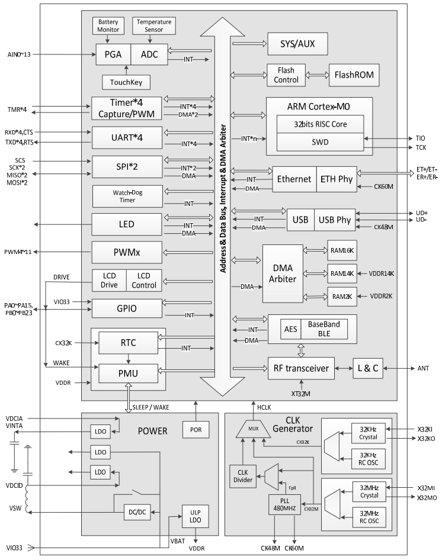
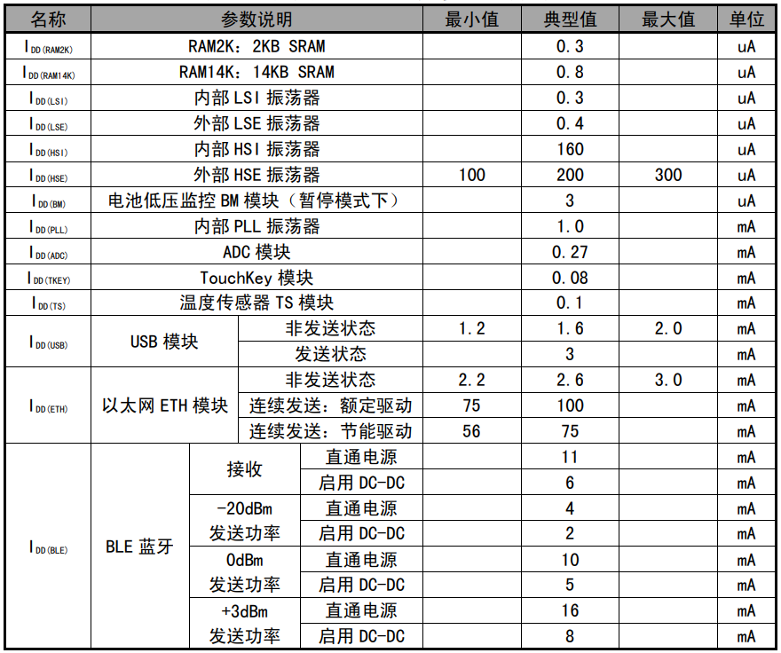

.. _NO_008:
.. _ch579:

CH579
========

`官方链接 <http://www.wch.cn/products/CH579.html>`_ ``Cortex-M0`` ``40MHz`` ``BLE 4.2`` ``USB`` ``Ethernet`` ``10Mbps(PHY)`` ``RTC`` ``AES128`` ``QFN48`` ``QFN28``

`GitHub <https://github.com/SoCXin/CH579>`_

.. contents::
    :local:

Xin简介
-----------

.. image:: ./images/CH579.png
    :target: http://www.wch.cn/products/CH579.html

规格参数
~~~~~~~~~~~

基本参数
^^^^^^^^^^^

* 发布时间：
* 参考价格：
* 制程工艺：
* 供货周期：
* 处理性能：
* 封装规格：:ref:`wch_qfn28` /:ref:`wch_qfn48`
* 运行环境：-40°C to 85°C
* RAM容量：32 KB
* Flash容量：250 KB

特征参数
^^^^^^^^^^^

* 40 MHz :ref:`cortex_m0`
* :ref:`ch579_usb` FS H/D
* 以太网 :ref:`ch579_eth`
* :ref:`ch579_ble` 4.2，Zigbee兼容IEEE 802.15.4规范
* SPI x 2 + UART x 4 (16C550/5Mbps)
* 内置电池电压低压监控，最低电流0.2uA
* 内置AES-128加解密单元，芯片唯一ID

.. note::
    网络库是以库文件提供的，MRU只有500多字节。

芯片架构
~~~~~~~~~~~~

功耗参数
^^^^^^^^^^^

* 供电电压: 2.5 to 3.6 V (内置DC/DC)
* 运行功耗: 100μA/MHz

.. image:: ./images/CH579pwr1.png
    :target: http://www.wch.cn/downloads/CH579DS1_PDF.html

电源结构
^^^^^^^^^^^

连接能力
~~~~~~~~~~~

.. list-table::
    :header-rows:  1

    * - :ref:`wch`
      - UART
      - SPI
      - :ref:`ch579_ble`
      - :ref:`ch579_usb`
      - :ref:`ch579_eth`
    * - :ref:`ch579`
      - 4
      - 2
      - 4.2
      - FS
      - 10Mbps

.. _ch579_ble:

BLE
^^^^^^^^^^^
``BLE 4.2`` ``-93dBm`` ``+3dBm``

.. _ch579_usb:

USB
^^^^^^^^^^^
``FS`` ``OTG``

* 集成 USB 2.0 FS PHY
* 支持 USB type-C 主从/电流检测

.. _ch579_eth:

Ethernet
^^^^^^^^^^^
``10Mbps(PHY)``

* 10Mbps MAC
* 10Mbps PHY

支持帧过滤，支持 DMA ，内置50Ω匹配电阻

Xin选择
-----------

.. contents::
    :local:

品牌对比
~~~~~~~~~

:ref:`ch579` 的定位非常细分小众，相比传统的BLE SoC的主要竞争优势在于以太网高度集成后带来的高性价比，特别是能够对WiFi+BLE的架构形成一种替代，特别适合在一些物联网网关类产品中。

就功能而言，需要网络连接和局域低功耗无线连接的设计还有WiFi+BLE架构的无线类芯片，这就是 :ref:`espressif` 的看家本领了。

.. list-table::
    :header-rows:  1

    * - :ref:`wch`
      - Core
      - Freq
      - SRAM/ROM
      -
      - Wireless
      - Ethernet
      - Package
    * - :ref:`ch579`
      - :ref:`cortex_m0`
      - 40 MHz
      - 32KB/250KB
      -
      - BLE4.2
      - 10M(PHY)
      - QFN48/QFN28
    * - :ref:`W7500P`
      - :ref:`cortex_m0`
      - 48 MHz
      - 32KB/128KB
      -
      - X
      - 10M(PHY)
      - LQFP48
    * - :ref:`esp32`
      - :ref:`xtensa_lx6`
      - 240 MHz
      - 520KB/480KB
      -
      - WiFi+BLE
      - 100M(MAC)
      - QFN32

.. _W7500P:

W7500P
^^^^^^^^^^^
``WIZnet`` ``Cortex-M0`` ``IOP`` ``全硬件TCP/IP协议栈``

`W7500P仓库 <https://github.com/SoCXin/W7500P>`_ , `W7500P官网 <https://www.iwiznet.cn/products/mcu/w7500p/>`_

* 48 MHz :ref:`cortex_m0`
* 全硬件TCP/IP核，8个socket，每个socket拥有最大32KB SRAM
* 128KB Flash
* 16KB-48KB SRAM（如32KB socket 缓存已用，最小可用16KB，如果socket缓存未用，最大可用48KB）
* 6KB用于Boot的ROM
* TQFP64 , 53 I/Os (16 IO x 3ea, 5 IO x 1ea)

.. warning::
    W7500是工业级的，W7500P是商用级的，后者片上集成10MHz以太网PHY

系列对比
~~~~~~~~~

以太网对比
^^^^^^^^^^^

.. list-table::
    :header-rows:  1

    * - :ref:`wch`
      - Core
      - SRAM/ROM
      - BLE
      - ADC/OPA
      - USB
      - Ethernet
    * - :ref:`ch579`
      - 40MHz
      - 32KB/250KB
      - 4.2(96dBm)
      - 14/0
      - H/D
      - 10M(PHY)
    * - :ref:`ch32v208`
      - 144MHz
      - 64KB/128KB
      - 5.3(96dBm)
      - 16/2
      - H/D + D
      - 10M(PHY)
    * - :ref:`ch32f208`
      - 144MHz
      - 64KB/128KB
      - 5.3(96dBm)
      - 16/2
      - H/D + D
      - 10M(PHY)
    * - :ref:`ch563`
      - 130MHz
      - 64KB/224KB
      - X
      - 3/0
      - 480M(PHY)
      - 100M(PHY)

低功耗对比
^^^^^^^^^^^

.. list-table::
    :header-rows:  1

    * - :ref:`wch`
      - Core
      - SRAM/ROM
      - Sleep
      - UART
      - BLE
      - USB
      - Power
    * - :ref:`ch579`
      - :ref:`cortex_m0`
      - 32KB/250KB
      - 0.2uA
      - 4
      - 4.2
      - H/D
      - 2.5V/3.6V
    * - :ref:`ch573`
      - :ref:`wch_riscv3a`
      - 18KB/512KB
      - 0.3uA
      - 4
      - 4.2
      - H/D
      - 2.25V/3.3V
    * - :ref:`ch583`
      - :ref:`wch_riscv4a`
      - 18KB/512KB
      - 0.7uA
      - 4
      - 5.1
      - 2x H/D
      - 1.8V/2.5V/3.3V

版本对比
~~~~~~~~~

.. image:: images/CH579l.png
    :target: http://www.wch.cn/products/CH579.html

.. _ch578:

CH578
^^^^^^^^^^^

CH578是集成BLE无线通讯的ARM 内核32 位微控制器。片上集成低功耗蓝牙BLE通讯模块、以太网控制器及收发器、全速USB主机和设备控制器及收发器、段式LCD驱动模块、ADC、触摸按键检测模块、RTC等丰富的外设资源。

* 6x TouchKey
* 160 KB Flash

.. _ch577:

CH577
^^^^^^^^^^^

CH577是CH578的简化版，闪存和RAM仅128KB和16KB，去掉了以太网、USB、段式LCD、ADC 等模拟模块，其它与CH578相同。

Xin应用
-----------

.. contents::
    :local:

开发板
~~~~~~~~~~

.. image:: images/B_CH579.jpg
    :target: https://item.taobao.com/item.htm?spm=a230r.1.14.18.a51ac05bwhVsnp&id=608342676773&ns=1&abbucket=19#detail

CH579Update
~~~~~~~~~~~~~

``android`` ``OTA``

