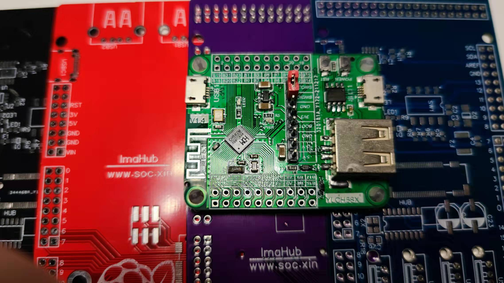

.. _NO_013:
.. _ch583:

CH583
============

* 关键词：``WCH`` ``RISC-V4A`` ``20MHz`` ``2x USB`` ``AES128`` ``BLE5.1``  ``QFN48`` ``QFN28``
* 资源库：`GitHub <https://github.com/SoCXin/CH583>`_ , `Gitee <https://gitee.com/socxin/CH583>`_

.. contents::
    :local:

Xin简介
-----------

.. image:: ./images/CH583.png
    :target: http://www.wch.cn/products/CH583.html

.. contents::
    :local:

规格参数
~~~~~~~~~~~

集成 BLE无线通讯的32位 :ref:`wch_riscv4a` 微控制器。片上集成2Mbps低功耗蓝牙BLE 通讯模块、2个全速USB主机和设备控制器及收发器、2个SPI、4个串口、ADC、触摸按键检测模块、RTC等丰富的外设资源。

基本参数
^^^^^^^^^^^

* 发布时间：
* 制程工艺：
* 发布价格：
* 工作温度：-40°C to +105°C
* 处理性能：30 :ref:`CoreMark`
* RAM容量：32 KB
* Flash容量：1 MB
* 封装规格：QFN48

特征参数
^^^^^^^^^^^

* 20 MHz :ref:`wch_riscv4a`
* 32KB SRAM，1MB Flash，支持ICP、ISP和IAP，支持OTA无线升级
* 2.4GHz RF收发器和基带及链路控制，支持BLE5.1
* 支持2Mbps、1Mbps、500Kbps、125Kbps，接收灵敏度-98dBm，可编程+7dBm发送功率
* 2组USB2.0 全速Host/Device
* 4组UART，2组SPI，12路PWM，1路IIC
* 内置温度传感器
* 内置RTC，支持定时和触发两种模式
* 40个GPIO，其中4个支持5V信号输入

.. hint::
    最有特色的一点是在QFN28封装内有两个USB OTG外设，配置的Flash容量也比较大。

电源参数
^^^^^^^^^^^

* 供电电压：1.7 to 3.6 V

芯片架构
~~~~~~~~~~~

``1.56 DMIPS``

.. image:: ./images/CH583Core.png
    :target: http://www.wch.cn/products/CH583.html

低功耗两级流水线

Xin选择
-----------

.. contents::
    :local:

品牌对比
~~~~~~~~~

系列对比
~~~~~~~~~

.. list-table::
    :header-rows:  1

    * - :ref:`list`
      - Core
      - RAM
      - ROM
      - UART
      - BLE
      - USB
      - Ethernet
    * - :ref:`ch573`
      - :ref:`wch_riscv`
      - 18
      - 512
      - 4
      - 4.2
      - USB H/D
      - X
    * - :ref:`ch583`
      - :ref:`wch_riscv`
      - 32
      - 1024
      - 4
      - 5.1
      - 2 x USB H/D
      - X
    * - :ref:`ch579`
      - :ref:`cortex_m0`
      - 32
      - 250
      - 4
      - 4.2
      - USB H/D
      - 10M PHY

版本对比
~~~~~~~~~

.. image:: ./images/CH58x.png
    :target: http://www.wch.cn/products/CH583.html

Xin应用
-----------

.. contents::
    :local:

开发板
~~~~~~~~~~

USB设备
~~~~~~~~~~~

BLE设备
~~~~~~~~~~~

Xin总结
--------------

.. contents::
    :local:

要点提示
~~~~~~~~~~~~~

问题整理
~~~~~~~~~~~~~

