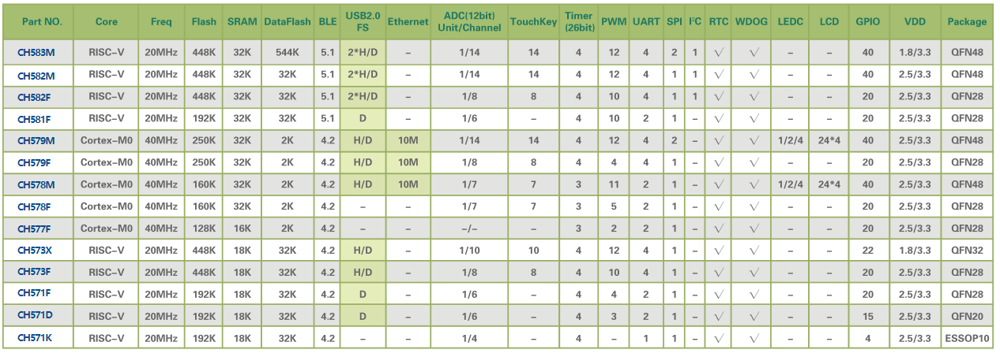
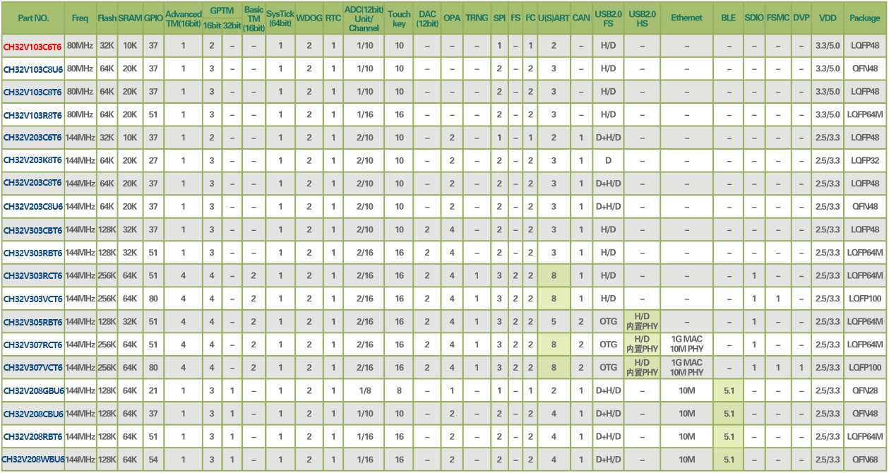

.. _wch:

WCH
============

``RISC-V`` ``8051`` ``USB`` ``Ethernet`` ``BLE``

公司简介
-----------

`南京沁恒微电子 <http://www.wch.cn/>`_ 的传统转换芯片如CH340非常普及，凭借在连接上的积累和口碑，所推出的可编程器件都具备非常丰富的连接外设资源如USB/UART/Ethernet，就产品品类而言可谓非常丰富，同时作为国产芯片也具备很高的性价比。

.. note::
    南京沁恒微电子成立于2004年，是一家专注于连接技术和MCU内核研究的射频与高速数模混合集成电路设计公司，提供以太网、蓝牙无线网络、USB和PCI类等接口芯片及集成上述接口的MCU+单片机。

产品简介
-------------

.. contents::
    :local:

转换类产品
~~~~~~~~~~~~

.. image:: ./images/wch.png
    :target: http://special.wch.cn/zh_cn/interface_conversion_expert/

USB/UART
^^^^^^^^^^^

.. image:: ./images/wchusb.png
    :target: http://special.wch.cn/zh_cn/USBChips/#/

PCI/PCIE
^^^^^^^^^^^

.. image:: ./images/pci.png
    :target: http://www.wch.cn/products/category/2.html#data

Ethernet
^^^^^^^^^^^

.. image:: ./images/eth.png
    :target: http://www.wch.cn/products/category/4.html#data

控制类产品
~~~~~~~~~~~~

包括多个系列的 :ref:`mcs51` 内核单片机， :ref:`wch_riscv3a` / :ref:`cortex_m0` 内核的无线SoC

.. warning::
    :ref:`wch` 硬件非常有性价比，基本标配USB外设，集成度比较高，但其软件生态策略保守，关键的代码资源都是通过lib方式提供，不开放源码，代码集成十分难用。

ETH ++
^^^^^^^^^^^
.. toctree::
    :maxdepth: 1

    CH579 <CH579>
    CH563 <CH563>

.. list-table::
    :header-rows:  1

    * - :ref:`list`
      - Core
      - RAM
      - Flash
      - USB
      - Ethernet
      - Package
    * - :ref:`ch563`
      - :ref:`arm7`
      - 64KB
      - 224KB
      - 480M
      - 100M
      - LQFP64M(10x10)

USB ++
^^^^^^^^^^^
.. toctree::
    :maxdepth: 1

    CH545 <CH545>
    CH557 <CH557>

.. list-table::
    :header-rows:  1

    * - :ref:`list`
      - Mark
      - RAM
      - Flash
      - UART/SPI
      - BLE
      - USB
      - Ethernet
    * - :ref:`ch545`
      - :ref:`mcs51`
      - 32K
      - 250K
      -
      -
      -
      -
    * - :ref:`ch557`
      - :ref:`mcs51`
      - 32K
      - 250K
      -
      -
      -
      -

BLE ++
^^^^^^^^^^^
.. toctree::
    :maxdepth: 1

    CH573 <CH573>
    CH583 <CH583>

.. list-table::
    :header-rows:  1

    * - :ref:`list`
      - Mark
      - RAM
      - Flash
      - UART/SPI
      - BLE
      - USB
      - Ethernet
    * - :ref:`ch579`
      - :ref:`cortex_m0`
      - 32K
      - 250K
      - 4/2
      - 4.2(+5dBm)
      - USB H/D
      - 10M
    * - :ref:`ch573`
      - :ref:`wch_riscv3a`
      - 18K
      - 512K
      - 4/1
      - 4.2(+5dBm)
      - USB H/D
      - X
    * - :ref:`ch583`
      - :ref:`wch_riscv4a`
      - 32K
      - 1024K
      - 4/1
      - 5.1(+5dBm)
      - 2 x USB
      - X

内核简介
------------------
.. contents::
    :local:

MCS51
~~~~~~~~~~~~
.. note::
    基本上都是增强的8051内核，执行效率高。

.. toctree::
    :maxdepth: 1

    CH552 <CH552>
    CH554 <CH554>
    CH549 <CH549>

.. list-table::
    :header-rows:  1

    * - :ref:`list`
      - Mark
      - RAM
      - Flash
      - UART/SPI
      - BLE
      - USB
      - Ethernet
    * - :ref:`ch552`
      - :ref:`mcs51`
      - 2KB
      - 16KB
      -
      -
      -
      -
    * - :ref:`ch554`
      - :ref:`mcs51`
      - 2KB
      - 16KB
      -
      -
      -
      -
    * - :ref:`ch549`
      - :ref:`mcs51`
      - 2KB
      - 60KB
      -
      -
      -
      -

Cortex
~~~~~~~~~~~~
.. note::
    2012年起陆续引入Cortex-M内核，我们加入了网络、USB2.0等高速接口，并设计了高速DMA仲裁机制，推出CH32F103等通用MCU芯片，适用于软件兼容、硬件引脚兼容、接口更专业的成熟生态应用。

.. toctree::
    :maxdepth: 1

    CH32F103 <CH32F103>
    CH32F207 <CH32F207>
    CH32F208 <CH32F208>

.. image:: ./images/CH32F.png
    :target: http://special.wch.cn/zh_cn/mcu/

RISC-V
~~~~~~~~~~~~

.. toctree::
    :maxdepth: 1

    内核版本  <riscv>

* 2017年开始关注并研究RISC-V开源指令集的32位MCU架构，针对快速中断响应、高带宽数据DMA进行优化
* 2019年推出基于RISC-V3A处理器的CH32V103单片机，内嵌BLE低功耗蓝牙的CH57X系列
* 2020年初推出128位数据宽度和双层DMA架构的高吞吐量的CH56X系列，现已扩展出浮点型V4F，精简型V2A，增强型V3A/V4A/V4B/V4C等内核产品

.. toctree::
    :maxdepth: 1

    CH32V103 <CH32V103>
    CH32V307 <CH32V307>
    CH32V208 <CH32V208>
    CH568 <CH568>
    CH569 <CH569>

.. image:: ./images/CH5V.png
    :target: http://special.wch.cn/zh_cn/mcu/

