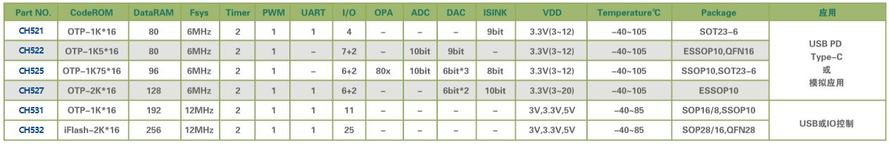

.. _wch:

WCH
============

``RISC-V`` ``8051`` ``USB`` ``USB-PD`` ``Ethernet`` ``BLE`` ``SD`` ``PCIe``

公司简介
-----------

`南京沁恒微电子 <http://www.wch.cn/>`_ 成立于2004年，是一家专注于连接技术和MCU内核研究的射频与高速数模混合集成电路设计公司，提供以太网、蓝牙无线网络、USB和PCI类等接口芯片及集成上述接口的MCU+单片机。

该厂商的转换芯片如CH340普及率非常高，凭借在有线连接上的积累，推出的可编程器件都具备非常丰富的连接资源如USB/UART/Ethernet，产品品类非常丰富，同时也具备很高的性价比。

市场定位
~~~~~~~~~~~~~

专注于连接市场，开始向无线通信和自研核心发展，产品线非常丰富，在物联网市场有明显的识别度，弱势在于应用开发，厂商没有给出足够的引导案例和软件框架

转换芯片
-------------

.. contents::
    :local:

.. image:: ./images/wch.png
    :target: http://special.wch.cn/zh_cn/interface_conversion_expert/

USB/UART
~~~~~~~~~~~

.. image:: ./images/wchusb.png
    :target: http://special.wch.cn/zh_cn/USBChips/#/

PCI/PCIE
~~~~~~~~~~~

.. image:: ./images/pci.png
    :target: http://www.wch.cn/products/category/2.html#data

Ethernet
~~~~~~~~~~~

.. image:: ./images/eth.png
    :target: http://www.wch.cn/products/category/4.html#data

主控芯片
-------------

.. contents::
    :local:

ETH ++
~~~~~~~~~~~

.. list-table::
    :header-rows:  1

    * - :ref:`wch`
      - Core
      - Performance
      - SRAM/ROM
      - Characteristics
      - Ethernet
      - Package
    * - :ref:`ch563`
      - :ref:`arm7`
      -
      - 64KB/224KB
      - 480M USB
      - 100M PHY
      - LQFP64M
    * - :ref:`ch579`
      - :ref:`cortex_m0`
      -
      - 32KB/250KB
      - BLE 4.2
      - 10M PHY
      - QFN48/QFN28
    * - :ref:`ch32v208`
      - :ref:`wch_riscv4c`
      -
      -
      - BLE 5.3
      - 10M PHY
      -
    * - :ref:`ch32f208`
      - :ref:`cortex_m3`
      -
      -
      - BLE 5.3
      - 10M PHY
      -

.. toctree::
    :maxdepth: 1

    CH579 <CH579>
    CH563 <CH563>

USB ++
~~~~~~~~~~~

.. list-table::
    :header-rows:  1

    * - :ref:`wch`
      - Mark
      - RAM
      - Flash
      - UART/SPI
      - BLE
      - USB
      - Ethernet
    * - :ref:`ch545`
      - :ref:`mcs51`
      - 32K
      - 250K
      -
      -
      -
      -
    * - :ref:`ch557`
      - :ref:`mcs51`
      - 32K
      - 250K
      -
      -
      -
      -

.. toctree::
    :maxdepth: 1

    CH545 <CH545>
    CH557 <CH557>

.. hint::
    :ref:`wch` 基本标配USB FS外设，而且在对标同类产品时，往往配置更多数量的USB，或者集成USB PHY器件

BLE ++
~~~~~~~~~~~

.. image:: ./images/BLE.png
    :target: http://special.wch.cn/zh_cn/mcu/

.. list-table::
    :header-rows:  1

    * - :ref:`wch`
      - Mark
      - RAM
      - Flash
      - UART/SPI
      - BLE
      - USB
      - Ethernet
    * - :ref:`ch579`
      - :ref:`cortex_m0`
      - 32K
      - 250K
      - 4/2
      - 4.2(+3dBm)
      - USB H/D
      - 10M
    * - :ref:`ch573`
      - :ref:`wch_riscv3a`
      - 18K
      - 512K
      - 4/1
      - 4.2(+5dBm)
      - USB H/D
      - X
    * - :ref:`ch583`
      - :ref:`wch_riscv4a`
      - 32K
      - 1024K
      - 4/1
      - 5.1(+6dBm)
      - 2 x USB
      - X

.. toctree::
    :maxdepth: 1

    CH573 <CH573>
    CH583 <CH583>

内核简介
------------

.. contents::
    :local:

MCS51
~~~~~~~~~~~~

.. image:: ./images/8051.png
    :target: http://special.wch.cn/zh_cn/mcu/

.. list-table::
    :header-rows:  1

    * - :ref:`wch`
      - Core
      - SRAM
      - Flash
      - UART/SPI
      - BLE
      - USB
      - Ethernet
    * - :ref:`ch552`
      - 24MHz
      - 2KB
      - 16KB
      -
      -
      -
      -
    * - :ref:`ch554`
      - 24MHz
      - 2KB
      - 16KB
      -
      -
      -
      -
    * - :ref:`ch549`
      - 48MHz
      - 2KB
      - 60KB
      -
      -
      -
      -
    * - :ref:`ch543`
      - 48MHz
      - 512B
      - 16KB
      -
      -
      -
      -

.. toctree::
    :maxdepth: 1

    CH552 <CH552>
    CH554 <CH554>
    CH549 <CH549>
    CH543 <CH543>

Cortex
~~~~~~~~~~~~

.. image:: ./images/CH32F.png
    :target: http://special.wch.cn/zh_cn/mcu/

.. note::
    2012年起陆续引入Cortex-M内核，我们加入了网络、USB2.0等高速接口，并设计了高速DMA仲裁机制，推出CH32F103等通用MCU芯片，适用于软件兼容、硬件引脚兼容、接口更专业的成熟生态应用。

.. toctree::
    :maxdepth: 1

    CH32F103 <CH32F103>
    CH32F207 <CH32F207>
    CH32F208 <CH32F208>

RISC-V
~~~~~~~~~~~~

青稞V4微处理器是基于标准RISC-V指令集架构，自研的32位通用MCU微处理器。支持RV32IMACF指令集和自扩展字节和半字 操作压缩指令，支持中断嵌套、硬件压栈（HPE）、免表中断（VTF），支持多种低功耗模式，增强的两线调试接口，支持标准RISC-V调试，具有物理 内存保护（PMP）等功能。

* 2017年开始关注并研究RISC-V开源指令集的32位MCU架构，针对快速中断响应、高带宽数据DMA进行优化
* 2019年推出基于RISC-V3A处理器的CH32V103单片机，内嵌BLE低功耗蓝牙的CH57X系列
* 2020年初推出128位数据宽度和双层DMA架构的高吞吐量的CH56X系列，现已扩展出浮点型V4F，精简型V2A，增强型V3A/V4A/V4B/V4C等内核产品

.. toctree::
    :maxdepth: 1

    内核版本  <riscv>

.. image:: ./images/CH32V.png
    :target: http://special.wch.cn/zh_cn/mcu/

.. toctree::
    :maxdepth: 1

    CH32V103 <CH32V103>
    CH32V307 <CH32V307>
    CH32V208 <CH32V208>

.. image:: ./images/CH5V.png
    :target: http://special.wch.cn/zh_cn/mcu/

.. toctree::
    :maxdepth: 1

    CH568 <CH568>
    CH569 <CH569>

技术简介
------------

电源管理
~~~~~~~~~~~~

.. _wch_pd:

USB-PD
^^^^^^^^^^^

``USB-PD``

接口扩展
~~~~~~~~~~~~

.. _wch_kvm:

KVM
^^^^^^^^^^^

封装规格
~~~~~~~~~~~~

.. contents::
    :local:

.. _wch_qfn68:

QFN68
^^^^^^^^^^^

``CH569W`` ``CH565`` ``CH32V307WC`` ``CH32F208W``

* 封装尺寸：8 x 8 mm, 0.4mm pitch

.. _wch_qfn48:

QFN48
^^^^^^^^^^^

``CH578M`` ``CH583M`` ``CH32V103C``

* 封装尺寸：5 x 5 mm, 0.35mm pitch

.. _wch_qfn40:

QFN40
^^^^^^^^^^^

``CH565M``

* 封装尺寸：5 x 5 mm, 0.4mm pitch

.. _wch_qfn28:

QFN28
^^^^^^^^^^^

``CH581F`` ``CH573F``

* 封装尺寸：4 x 4 mm, 0.35mm pitch

.. _wch_qfn20:

QFN20
^^^^^^^^^^^

``CH581F`` ``CH573F``

* 封装尺寸：4 x 4 mm, 0.4mm pitch
