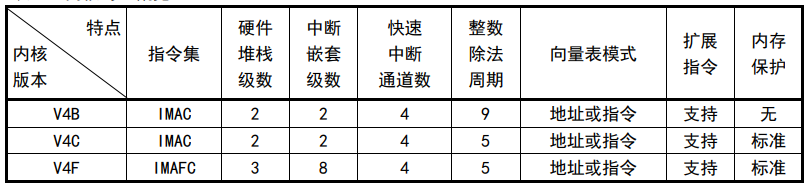

.. _wch_riscv:

WCH RISC-V
======================

:ref:`wch` :ref:`riscv` 针对安全类产品，早期外购第三方RISC-V内核，但当时该IP尚未成熟只支持4线JTAG调试占用IO多，内核架构庞大未针对嵌入式应用优化。

2017年开始关注并研究RISC-V开源指令集的32位MCU架构，针对快速中断响应、 高带宽数据DMA进行优化。形成了侧重于低功耗或高性能等多版本的RISC-V处理器。
2019年推出基于RISC-V3A处理器的CH32V103单片机，内嵌BLE低功耗蓝牙的CH57X系列，
2020年初推出128位数据宽度和双层DMA架构的高吞吐量的CH56X系列，现已扩展出浮点型V4F，精简型V2A，增强型V3A/V4A/V4B/V4C等内核产品。

.. contents::
    :local:

RISC-V版本
--------------

参数对比
~~~~~~~~~~~~~~

差异对比
~~~~~~~~~~~~~~

.. list-table::
    :header-rows:  1

    * - Name
      - Core
      - RAM
      - Flash
      - DMIPS
      - BLE
      - USB
      - Ethernet
    * - :ref:`wch_riscv4a`
      -
      -
      -
      -
      -
      -
      -
    * - :ref:`wch_riscv4b`
      -
      -
      -
      -
      -
      -
      -
    * - :ref:`wch_riscv4c`
      -
      -
      -
      -
      -
      -
      -
    * - :ref:`wch_riscv4f`
      -
      -
      -
      -
      -
      -
      -
    * - :ref:`wch_riscv3a`
      -
      -
      -
      -
      -
      -
      -

.. _wch_riscv4a:

RISC-V4A
~~~~~~~~~~~~~~

.. toctree::
    :maxdepth: 1

    CH583 <CH583>

.. _wch_riscv4b:

RISC-V4B
~~~~~~~~~~~~~~

.. _wch_riscv4c:

RISC-V4C
~~~~~~~~~~~~~~

.. _wch_riscv4f:

RISC-V4F
~~~~~~~~~~~~~~

.. _wch_riscv3a:

RISC-V3A
~~~~~~~~~~~~~~

RISC-V3A 是 32 位嵌入式处理器，内部模块化管理，支持 RISC-V 开源指令集 IMAC 子集。
包含快速可编程中断控制器（FPIC），提供了 4 个向量可编程的快速中断通道及 44 个优先级可配的普通中断，通过硬件现场保存和恢复的方式实现中断的最短周期响应；包含 2 线串行调试接口，支持用户在线升级和调试；包括多组总线连接处理器外部单元模块，实现外部功能模块和内核的交互。

.. toctree::
    :maxdepth: 1

    CH573 <CH573>
    CH568 <CH568>
    CH569 <CH569>

RISC-V产品
--------------------

.. contents::
    :local:

通用系列
~~~~~~~~~~~~

.. image:: ./images/CH32V.png
    :target: http://special.wch.cn/zh_cn/mcu/

.. toctree::
    :maxdepth: 1

    CH32V103 <CH32V103>
    CH32V307 <CH32V307>
    CH32V208 <CH32V208>

无线系列
~~~~~~~~~~~~

.. toctree::
    :maxdepth: 1

    CH573 <CH573>
    CH583 <CH583>

