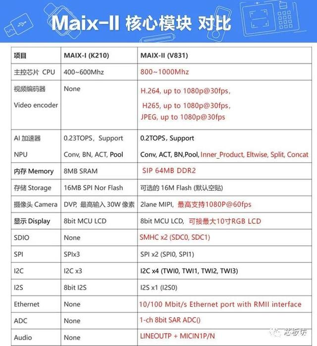
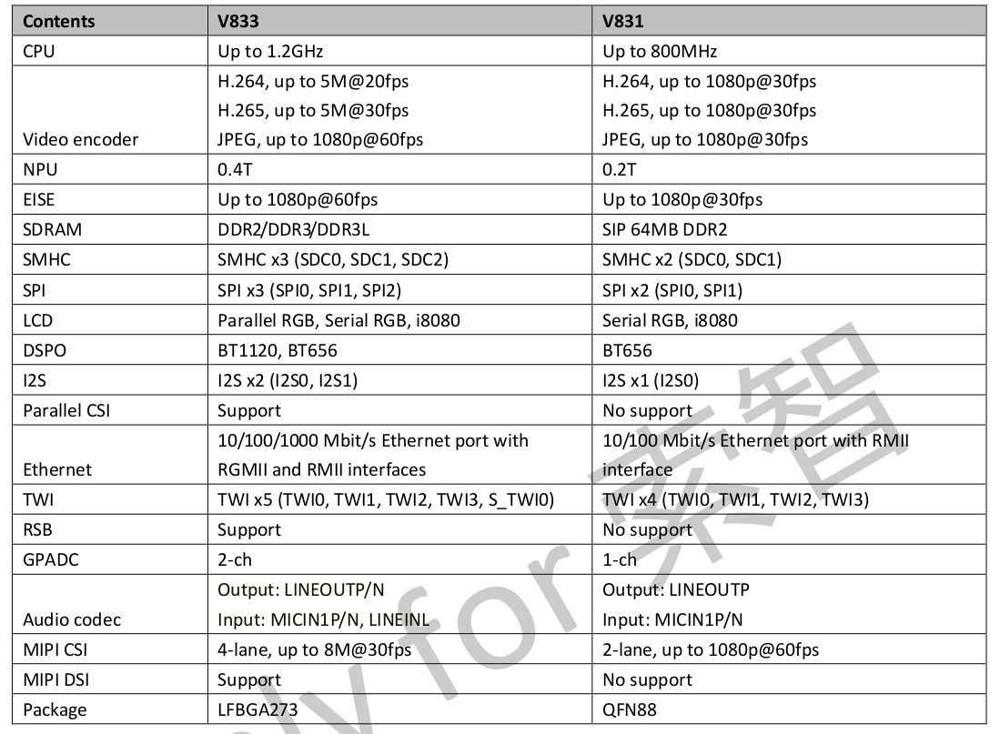

.. _v831:

V831
=============

`GitHub <https://github.com/SoCXin/V831>`_ : ``Cortex-A7`` ``800MHz`` ``64M DDR2`` ``0.2TOPS`` ``QFN88``

.. contents::
    :local:

Xin简介
-----------

.. image:: ./images/V831.png
    :target: https://www.allwinnertech.com/index.php?c=product&a=index&id=104

`datasheet <https://linux-sunxi.org/images/b/b9/V833%EF%BC%8FV831_Datasheet_V1.0.pdf>`_

规格参数
~~~~~~~~~~~

基本参数
^^^^^^^^^^^

* 发布时间：
* 参考价格：
* 制程工艺：
* 供货周期：
* 处理性能：:ref:`level6`
* 封装规格：QFN88
* 运行环境：-40°C to 85°C
* RAM容量：64 MB (DDR2)
* Flash容量：16 MB

特征参数
^^^^^^^^^^^

* 800MHz :ref:`cortex_a7`
* NPU 0.2TOPS

芯片架构
~~~~~~~~~~~

电源参数
^^^^^^^^^^^

* 供电电压：2.0 to 3.6 V

Xin选择
-----------

.. contents::
    :local:

品牌对比
~~~~~~~~~~~

.. list-table::
    :header-rows:  1

    * -
      - :ref:`architecture`
      - :ref:`frequency`
      - SRAM/ROM
      - USB/CAN
      - SPI/I2C
      -
    * - :ref:`v831`
      - :ref:`cortex_a7`
      - 800MHz
      -
      -
      -
      -
    * - :ref:`k210`
      -
      - 400MHz
      -
      -
      -
      -
    * - :ref:`k510`
      -
      - 800MHz
      -
      -
      -
      -

系列对比
~~~~~~~~~~~

.. _v833:

V833
^^^^^^^^^^^

型号对比
~~~~~~~~~~~

Xin应用
-----------

.. contents::
    :local:

开发板
~~~~~~~~~~~

MAIX-II
^^^^^^^^^^^
``Sipeed``

.. image:: images/B_V831.jpg

.. image:: images/B_V831H.jpg
    :target: https://item.taobao.com/item.htm?spm=a230r.1.14.19.1e9e53f7IwX1sQ&id=637829431223&ns=1&abbucket=12#detail

