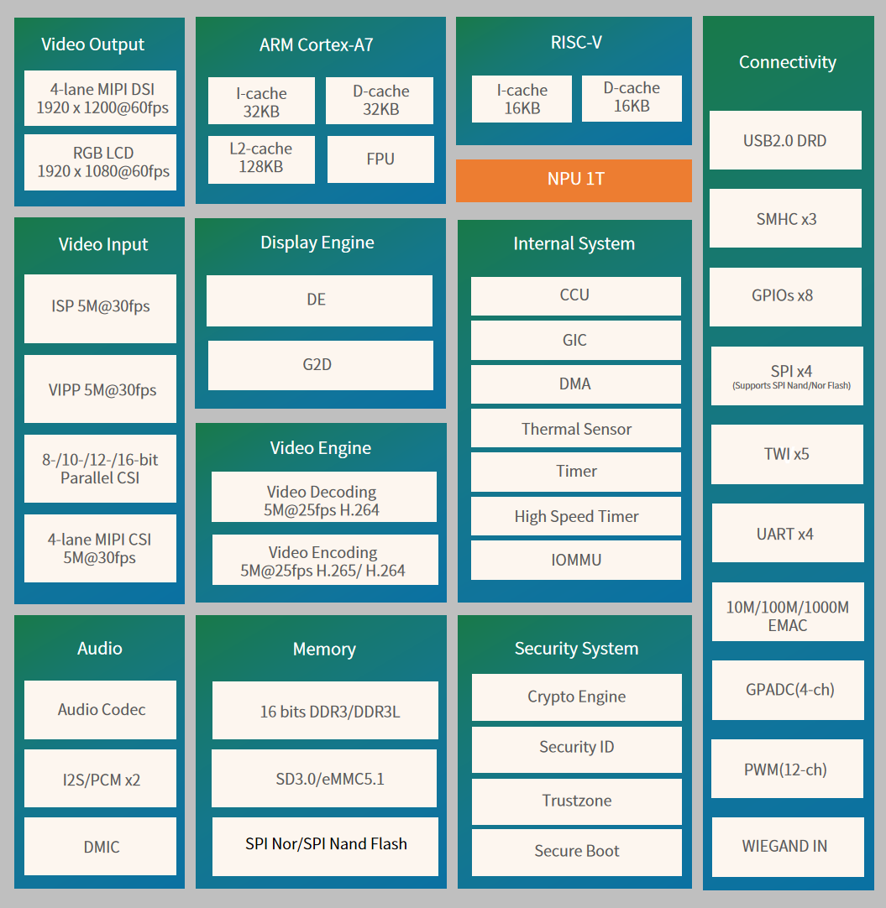

.. _v853:

V853
=============

`Allwinner <https://www.allwinnertech.com/index.php?c=news&a=index&id=344>`_ : ``Cortex-A7``

.. contents::
    :local:
    :depth: 1

Xin简介
-----------

规格参数
~~~~~~~~~~~

基本参数
^^^^^^^^^^^

* 发布时间：
* 参考价格：
* 制程工艺：
* 供货周期：
* 处理性能：:ref:`level6`
* 封装规格：
* 运行环境：-40°C to 85°C
* RAM容量：
* Flash容量：

采用高效能的三核异构设计，是由ARM Cortex™️-A7主核、RISC-V 协处理核与AI NPU结合的创新型架构。ARM Cortex™️- A7主核可适应于兼容各类应用开发调试，RISC-V 协处理核重点负责各类传感器场景，提高实时响应速度，AI NPU则专注解决复杂多变的视觉检测识别场景，其检测识别帧率相较于传统CPU方式可最少提升20倍以上。三者分工明确、相互协同，既有速度、更有品质，解决了传统单核面对复杂视觉场景体验不佳的痛点问题。

同时，V853在关键模块上进行了低功耗设计和系统层级的优化，实现了每百Gflops算力仅需20mW的优秀功耗表现，3K AI视觉典型解决方案整体能耗小于500mW。结合全志科技全新一代μA级保活待机WiFi芯片XR806，在2500mAh的可视门铃上可做到半年以上免充电；在应用于低功耗摄像机方案时，搭配太阳能面板可实现无感运维，满足用户对低功耗AI产品长时间续航的体验需求。

针对智能视觉核心多角度多深度等应用场景，V853 集成了全志科技最新一代视觉处理引擎，支持多目接入，可同步处理最高“1+4”五路输入，赋予了产品从单目到多目的物理维度升级跨越能力，为枪球联动、长短焦结合及360全景监控等一机多目智能视觉方案提供了至优选择。

同时，在星光低照度或逆光宽动态等全天候环境下，V853既能通过优异的多级降噪融合眼擎，实现清晰干净无拖影，也能采用锐化眼擎给AI NPU输入像素级增强数据，提升AI检测效果，做到既适合“人”看，也适合“机器”看的单摄双眼擎“机器人”视觉，在AI视觉类安防、看护场景下提供出色的用户体验。

疾风系统具备以下特性：闪速冷启疾风系统从芯片设计、硬件外围到软件系统都进行了全面优化，采用软硬协同、多核异构的架构，实现了100ms启动视觉传感器、200ms首帧抓拍、700ms内完成冷启动+记录+AI检测等所有工作。

超清小内存V853集成了增强在线通路技术，最高可减少40%~50%的视频处理内存占用以及编码延迟问题，3K通路带宽降低至不到0.9GB/s。V853还提供内置64MB DDR的极小封装，结合疾风系统的小内存、低延迟技术，可帮助客户实现从2M到3K的迭代升级。

