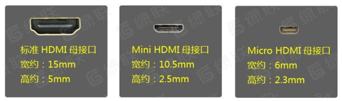

.. _hmi:

HMI
============

.. contents::
    :local:

图形框架
-----------

.. contents::
    :local:

.. list-table::
    :header-rows:  1

    * - Mark
      - :ref:`touchgfx`
      - :ref:`littlevgl`
      - :ref:`emwin`
      - :ref:`minigui`
      - :ref:`μgfx`
      - :ref:`awtk`
      - :ref:`qt`
    * - 1
      - :ref:`esp32`
      - √
      - :ref:`tkm32f499`
      - X
      - √
      - X
      - X
    * - 2
      - :ref:`stm32f429`
      - √
      - :ref:`tkm32f499`
      -
      -
      -
      - X
    * - 3
      - :ref:`tkm32f499`
      - X
      - :ref:`tkm32f499`
      -
      -
      -
      -

.. _touchgfx:

TouchGFX
~~~~~~~~~~~

Draupner Graphics公司的GUI产品，2018年7月被ST收购，在STM32上可以免费使用TouchGFX。

.. _littlevgl:

LittlevGL
~~~~~~~~~~~

免费的开源图形库，具有易于使用的图形元素以及良好的视觉效果和内存占用低等特点，可构建嵌入式 GUI。LittlevGL 是一个完整的图形框架，开发者不需要考虑原始图形如何绘制，可以使用已有图形元素来构建自己的  GUI，例如按钮，图表，图像，列表，滑块，开关，键盘等。

.. _emwin:

emWin
~~~~~~~~~~~

属于SEGGER公司下面的一种GUI产品，一种嵌入式GUI解决方案。业界领先的嵌入式图形库，专业的嵌入式GUI。

emWin支持在任何嵌入式系统上创建高效、高质量的图形用户界面，emWin支持资源受限的微控制器的系统，运行令人惊叹的交互界面。

emWin与单任务和多任务环境兼容，可以使用专有的操作系统，也可以与任何商业RTOS兼容。它以C语言源代码提供，使其成为嵌入式市场的专业、通用GUI，可用于多种不同的场景。

.. note::
    STemWin由SEGGER公司授权给ST（意法半导体），使用ST芯片的用户可以免费使用STemWin。同时，还针对ST的微控制器做了专门的优化，比如在使用STM32F4带FPU的芯片时，STemWin在需要浮点处理的地方专门做了优化。uCGUI是SEGGER公司授权给Micrium公司，并为其定制的一套图形软件库。

.. _minigui:

MiniGUI
~~~~~~~~~~~

MiniGUI是一款国产GUI，一款面向嵌入式系统的高级窗口系统和图形用户界面（GUI）支持系统，由魏永明先生于1998年底开始开发。2002 年，魏永明先生创建北京飞漫软件技术有限公司，为MiniGUI 提供商业技术支持，同时也继续提供开源版本，飞漫软件是中国地区为开源社区贡献代码最多的软件企业。

MiniGUI丰富的功能和可配置性使得它既适用于运行在30MHz CPU的低端设备，也适用于使用GPU的高端设备。为嵌入式和智能物联网设备提供一个成熟的、经过验证的跨平台GUI系统。

.. _μgfx:

μGFX
~~~~~~~~~~~

作为最小、最快和最先进的嵌入式 GUI 库，广泛用于各类显示屏和触摸屏，可构建全功能嵌入式 GUI。µGFX 禁用所有未使用功能且不会将它们关联到已完成的二进制文件中，因而轻量级为其显著特点。此外，µGFX 还具有模块化，小巧轻便特点，而且为所有用户提供完整源代码。

.. _awtk:

AWTK
~~~~~~~~~~~

ZLG开发的的一套基于C语言开发的GUI框架。支持跨平台同步开发

.. _qt:

QT
~~~~~~~~~~~

QT专门为 ARM Cortex-M 单片机开发的，目前用在 ARM Cortex M7 的微控制器上

接口驱动
-----------

.. contents::
    :local:

.. _vga:

VGA
~~~~~~~~~~~

参考方案 :ref:`rp2040`

.. _hdmi:

HDMI
~~~~~~~~~~~

嵌入平台
-----------

.. toctree::
    :maxdepth: 1

    SWM32S <../M/SWM32S>
    SWM341 <../M/SWM341>
    TKM32F499 <../M/TKM32F499>
    APT32F706 <../H/APT32F706>

.. list-table::
    :header-rows:  1

    * - Xin
      - DMIPS
      - RAM
      - Flash
      - reslution
      - interface
      - accelerator
    * - :ref:`stm32h7b0`
      - 599(280MHz)
      - 1.4 MB
      - 1/2 MB
      - XGA(1024x768)
      - RGB888
      - DMA2D/JPEC
    * - :ref:`stm32f429`
      - 225(180MHz)
      - 8 MB
      - 16 MB
      - XGA(1024x768)
      - RGB888
      - DMA2D/JPEC
    * - :ref:`tkm32f499`
      - 300(240MHz)
      - 8MB
      - 8MB(QSPI)
      - 1024x600
      - RGB888/TK80
      - :ref:`tk_ltdc`
    * - :ref:`swm32s`
      - 150(120MHz)
      - 512 KB
      - 512 KB
      - WVGA(800x480)
      - RGB565
      - No
    * - :ref:`esp32s3`
      - 600(240MHz)
      - 8 MB
      - 4 MB
      - WVGA(800x480)
      - SPI
      - No
    * - :ref:`gw1nsr`
      - 75(60MHz)
      - 24 KB
      - 32 KB
      - XGA(1024x768)
      - :ref:`hdmi`
      - No

