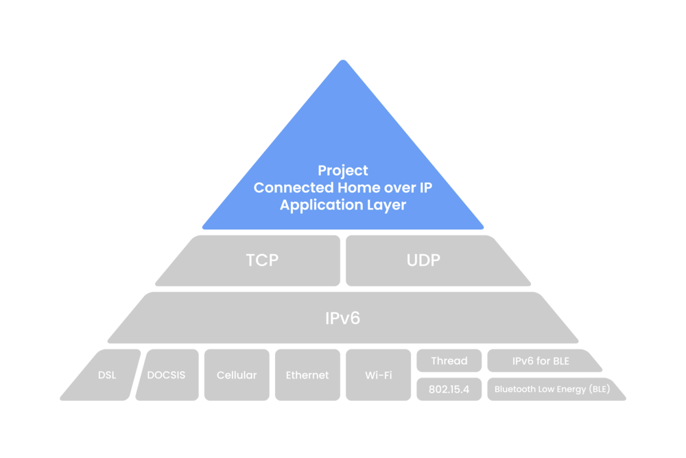

.. _application:

Application
===============

.. toctree::
    :maxdepth: 1

    通信连接 IoT  <iot>
    边缘计算 AIn  <edge>
    超低功耗 ULP  <ulp>
    驱动控制 FoC  <foc>
    人机交互 HMI  <hmi>
    信号转换 ADC  <adc>

行业协议
-----------

.. _matter:

Matter
~~~~~~~~~~~
``CSA`` ``智能家居`` ``简单性、互操作性、可靠性和安全性``

由 CSA 连接标准联盟 (Connectivity Standards Alliance) 发起，多家行业领先公司联合推出的智能家居互联协议。(Zigbee联盟改名CSA联盟)

Matter协议的前身CHIP（Connected Home Over IP），该CHIP早期是由谷歌，苹果，Zigbee联盟等牵头主导并开源的一个用于解决无线iot碎片化的协议，该协议在2021年5月份正式改名Matter

Matter协议不是为了消灭现有各种不同的无线协议，而是来统一现有不同的无线协议，其并不是一种底层无线通信协议，更具体的更像是基于IP化的应用层协议。

Matter 基于IP协议（例如Wi-Fi、以太网和Thread）而构建，提供了一个抽象的应用层，Matter协议支持多种通信方式如WiFi、蓝牙、Zigbee、Thread（802.15.4）等，后面Matter协议也会新增支持Zigbee以及ZWave协议

* Matter 离不开基于IP 的网络协议，而Zigbee 有自己的网络协议
* Matter 还通过 :ref:`ble` 和 :ref:`wifi` 二维码定义了最适合预期用户设置场景的预配方案，而Zigbee的标准调试流程使用其原生的 :ref:`802_15_4` 无线技术。

.. note::
    根据ABI research的最新预测，在2022年到2030年这个区间内，Matter设备的出货量将达到550亿。

