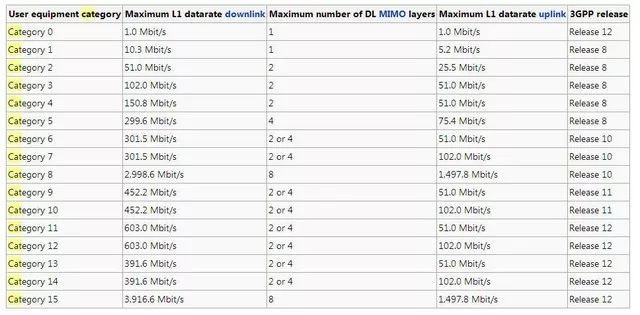

.. _iot:

IoT
============

.. list-table::
    :header-rows: 1

    * - :ref:`ic`
      - :ref:`can`
      - :ref:`ethernet`
      - :ref:`plc`
      - :ref:`wpan`
      - :ref:`wifi`
      - :ref:`lora`
      - :ref:`nbiot`
      - :ref:`cat1`
      - :ref:`cat4`
    * -
      -
      -
      -
      -
      -
      -
      -
      -
      -

.. toctree::
    :maxdepth: 1

    WPAN <wpan>
    Wi-Fi <wifi>
    Bluetooth <bluetooth>

.. contents::
    :local:
    :depth: 1

.. _lpwan:

LPWAN
----------
``LPWAN`` ``LPWA`` ``LPN``

LPWAN(低功耗广域网)，也称为LPWA)或LPN，是一种用于物联网(例如，以电池为电源的传感器)的类型，这是一种能够以低比特率进行远距离通信的无线网络。LPWAN可以同时满足覆盖和续航的要求。以最小的功耗提供最长的距离覆盖是LPWAN最大的技术优势。

.. _lora:

LoRa
~~~~~~~~~~~
``Long Range Radio``

.. toctree::
    :maxdepth: 1

.. list-table::
    :header-rows:  1

    * - :ref:`lora`
      - :ref:`architecture`
      - SRAM/ROM
      -
      - LoRa
      - Rate
      - More
      - Package
    * - :ref:`asr6501`
      - :ref:`cortex_m0`
      -
      -
      -
      -
      -
      - QFN48
    * - :ref:`stm32wl5`
      - :ref:`cortex_m4`
      -
      -
      -
      -
      -
      - QFN48

.. _nbiot:

NB-IoT
~~~~~~~~~~~

.. list-table::
    :header-rows:  1

    * - :ref:`nbiot`
      - :ref:`architecture`
      - SRAM/ROM
      -
      - LoRa
      - Rate
      - More
      - Package
    * - :ref:`mt2625`
      -
      -
      -
      -
      -
      -
      -
    * - :ref:`xy1100`
      -
      -
      -
      -
      -
      -
      -

.. toctree::
    :maxdepth: 1

    XY1100 <../miscellaneous/XY1100>

.. _emtc:

eMTC
~~~~~~~~~~~

.. _gprs:

GPRS
-----------

.. _cat1:

Cat.1
-----------

.. list-table::
    :header-rows:  1

    * - :ref:`cat1`
      - :ref:`architecture`
      - SRAM/ROM
      -
      - LoRa
      - Rate
      - More
      - Package
    * - :ref:`asr1601`
      -
      -
      -
      -
      -
      -
      -
    * - :ref:`usi8910`
      -
      -
      -
      -
      -
      -
      -

.. toctree::
    :maxdepth: 1

    USI8910DM <../miscellaneous/USI8910DM>

.. _cat4:

Cat.4
-----------

.. image:: ./images/VS.jpg

