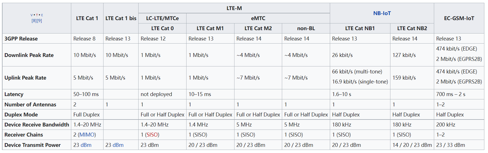

.. _lpwa:

LPWA
============

``LPWAN`` ``LPWA`` ``LPN``

LPWAN(低功耗广域网)，也称为LPWA或LPN，是一种用于物联网(例如，以电池为电源的传感器)的类型，这是一种能够以低比特率进行远距离通信的无线网络。LPWAN可以同时满足覆盖和续航的要求。以最小的功耗提供最长的距离覆盖是LPWAN最大的技术优势。

.. image:: ./images/lpwa.jpg

.. contents::
    :local:
    :depth: 1

.. _lora:

LoRa
-----------
``Long Range Radio``

.. toctree::
    :maxdepth: 1

.. list-table::
    :header-rows:  1

    * - :ref:`lora`
      - :ref:`architecture`
      - :ref:`sram`/:ref:`flash`
      - LoRa
      - Rate
      - More
      - :ref:`package`
    * - :ref:`asr6601`
      - :ref:`cortex_m0`
      -
      -
      -
      -
      - :ref:`QFN48`
    * - :ref:`stm32wl5`
      - :ref:`cortex_m4`
      -
      -
      -
      -
      - :ref:`QFN48`

.. _nbiot:

NB-IoT
-----------

.. list-table::
    :header-rows:  1

    * - :ref:`nbiot`
      - :ref:`architecture`
      -
      -
      -
      -
      -
      -
    * - :ref:`mt2625`
      -
      -
      -
      -
      -
      -
      -
    * - :ref:`xy1100e`
      -
      -
      -
      -
      -
      -
      -
    * - :ref:`xy2100s`
      -
      -
      -
      -
      -
      -
      -

.. toctree::
    :maxdepth: 1

    XY1100E <../miscellaneous/XY1100E>
    XY2100S <../miscellaneous/XY2100S>

.. _emtc:

eMTC
-----------
``enhanced Machine-Type Communication`` ``LTE-M``

.. _cat1:

Cat.1
-----------

.. image:: ./images/cat.jpg

.. list-table::
    :header-rows:  1

    * - :ref:`cat1`
      - :ref:`architecture`
      - :ref:`sram`/:ref:`flash`
      -
      - LoRa
      - Rate
      - More
      - :ref:`package`
    * - :ref:`asr1601`
      -
      -
      -
      -
      -
      -
      -
    * - :ref:`usi8910`
      -
      -
      -
      -
      -
      -
      -

.. toctree::
    :maxdepth: 1

    USI8910DM <../miscellaneous/USI8910DM>

.. _cat4:

Cat.4
-----------

.. image:: ./images/VS.jpg

