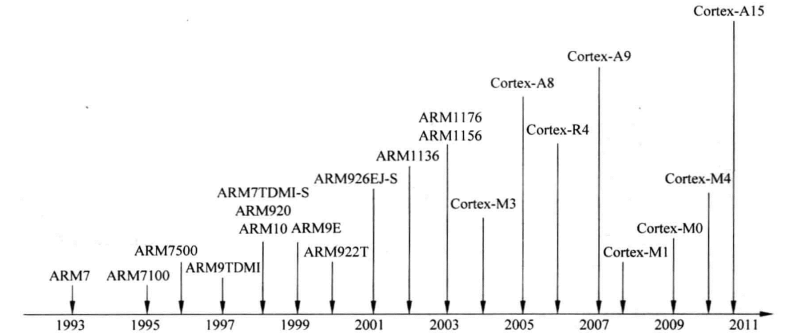

.. _arm_classic:

Classic
============

``ARMv6`` ``ARMv5`` ``ARM7`` ``ARM9`` ``ARM11``

* ARMv4：ARM7TDMI、ARM720T、ARM9TDMI、ARM940T、ARM920T、Intel的StrongARM等。
* ARMv5TE：ARM9E-S、ARM966E-S、ARM1020E、ARM1022E 以及XScale
* ARMv5EJ：ARM9EJ-S、ARM926EJ-S、ARM7EJ-S、ARM1026EJ-S

其中后缀意义如下：

* E：增强型DSP指令集。包括全部算法和16位乘法操作。
* J：支持新的Java。

ARMv6(ARM11系列)：

* ARM1136J(F)-S基于ARMv6主要特性有SIMD、Thumb、Jazelle、DBX、(VFP)、MMU
* ARM1156T2(F)-S基于ARMv6T2 主要特性有SIMD、Thumb-2、(VFP)、MPU
* ARM1176JZ(F)-S基于ARMv6KZ 在 ARM1136EJ(F)-S 基础上增加MMU、TrustZone
* ARM11 MPCore基于ARMv6K 在ARM1136EJ(F)-S基础上可以包括1-4 核SMP、MMU

.. _arm7:

ARM7
-------------

低功耗的32位RISC处理器，冯·诺依曼结构。
具有嵌入式ICE－RT逻辑，调试开发方便。
3级流水线结构。能够提供0.9MIPS的三级流水线结构
代码密度高，兼容16位的Thumb指令集。
对操作系统的支持广泛，包括Windows CE、Linux、Palm OS等。
指令系统与ARM9系列、ARM9E系列和ARM10E系列兼容，便于用户的产品升级换代。
主频最高可达130MIPS。

ARM7TDMI微处理器4种类型：ARM7TDMI、ARM7TDMI-S、ARM720T、ARM7EJ。

.. note::
    ARM7TMDI是使用很广泛的32位嵌入式RISC处理器，属低端ARM处理器核。

.. _arm9:

ARM9
-------------

5级整数流水线，哈佛体系结构。支持32位ARM指令集和16位Thumb指令集。全性能的MMU，支持Windows CE、Linux、Palm OS等多种主流嵌入式操作系统。支持数据Cache和指令Cache，具有更高的指令和数据处理能力。

* ARM9类型：ARM920T、ARM922T和ARM940T
* ARM9E类型：ARM926EJ-S、ARM946E-S和ARM966E-S

.. hint::
    ARM9E支持DSP指令集，支持VFP9浮点处理协处理器，主频最高可达300MIPS。

.. list-table::
    :header-rows:  1

    * - :ref:`vendor`
      - :ref:`architecture`
      - Freq
      - RAM
      - Flash
      - Process
      - Package
    * - :ref:`sp7021`
      - :ref:`arm926ejs`
      - 1.0 GHz
      -
      -
      -
      -

.. _arm926ejs:

ARM926EJ-S
~~~~~~~~~~~~~~

.. _arm11:

ARM11
-------------

.. hint::
    指令集ARMv6，8级流水线，1.25DMIPS/MHz

.. _arm1176jz:

ARM1176JZ
~~~~~~~~~~~~~~

共有40个32位寄存器，其中有33个通用寄存器，7个状态寄存器，其中R0-R12用于作为通用寄存器使用，用于存储数据或者数据的地址。R13,R14,R15有特殊用途

