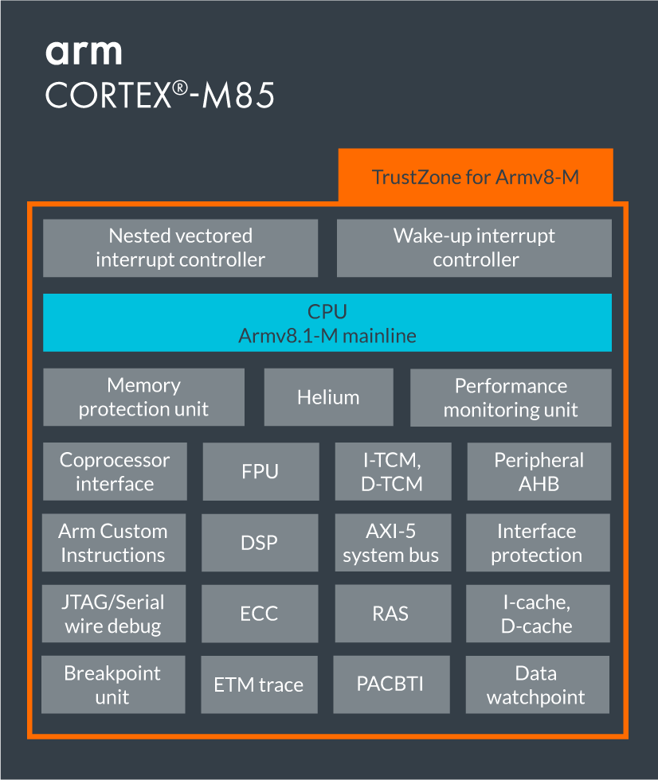

.. _cortex_m85:

Cortex-M85
====================
``迄今为止性能最强的 Cortex-M 处理器`` ``Arm Helium``

:ref:`performance` : ``6.28 CoreMark/MHz``

`Arm Cortex-M85 <https://developer.arm.com/Processors/Cortex-M85>`_ 新增增强微架构以提高标量计算的性能，也是首个从全新Arm-v8.1M架构中集成指针认证和分支目标识别 (PACBTI) 扩展的Cortex产品。

相比 :ref:`cortex_m55` 性能提高了85%，与前性能冠军 :ref:`cortex_m7` 相比，标量性能提高了30%。

Cortex-M85还增加了Arm Helium技术，支持诸如高保真音频处理等苛刻的机器学习用例，无需增加DSP，成为可用于传统和机器学习工作负载的最快的M系列CPU。

Arm Helium技术是Arm Cortex-M处理器系列的M型矢量扩展（M-Profile Vector Extension MVE），可为机器学习和数字信号处理应用程序带来显著的性能提升。

Cortex-M85是第一款提供超过 6 CoreMarks/MHz 和超过 3 DMIPS/MHz 的 Cortex-M，Cortex-M85的出现，让Cortex-M 拥有了接近Cortex-A的性能，而又保持了Cortex-M微控制器的传统优点，如确定性、低中断延迟和先进的低功耗管理模式等。

Cortex-M85的特点包括：

* 具有Arm Helium™技术，可支持终端ML和DSP工作负载，常规性能和ML机器学习性能，相比M7提升4倍。
* 搭载Arm TrustZone®技术增强安全性。它还包括指针认证和分支目标识别 (Pointer Authentication and Branch Target Identification, PACBTI)，这一全新架构功能具备增强的软件攻击威胁缓解能力，有助于实现物联网部署的安全基线PSA Certified Level 2
* Cortex-M85 具有高数据处理速率，采用更先进的内存系统架构，以确保更高的数据和代码吞吐量

.. note::
    预计在2022年内会有基于Cortex-M85的MCU发布，在工具方面也更新到了 Keil MDK v5.37 版本，编译器也来到了Arm Compiler 6.18版本。

