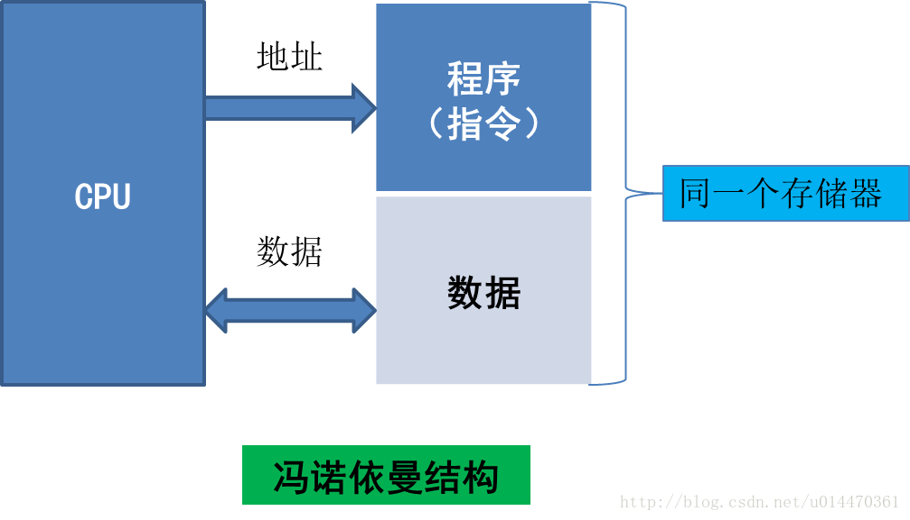
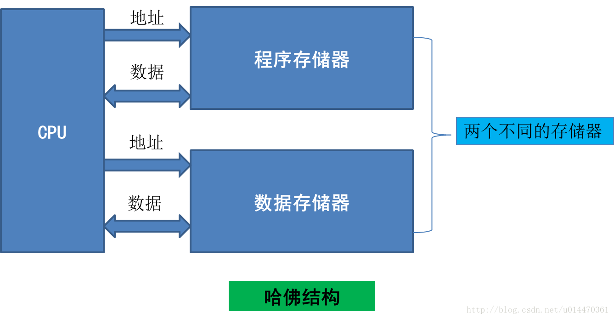
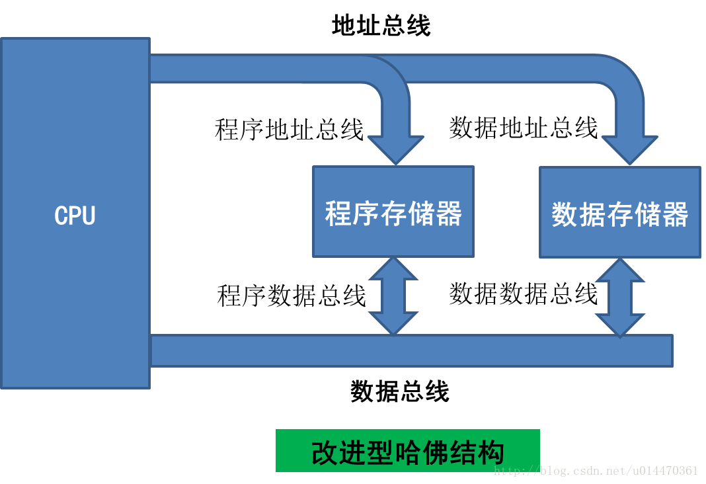

内核架构
===============

.. contents::
    :local:
    :depth: 1

.. _classification:

Classification
---------------

.. list-table::
    :header-rows:  1

    * - :ref:`architecture`
      - Series
      - Area(mm²)
      - :ref:`power`
      - :ref:`performance`
      - :ref:`frequency`
      - :ref:`foundry`
    * -
      - :ref:`cortex_m0`
      - >0.0066
      - >3.8µW
      - 2.39/MHz
      - <297MHz
      - :ref:`tsmc_40lp`
    * - :ref:`armv7`
      - :ref:`cortex_m3`
      - >0.024
      - >11.39µW
      - 3.45/MHz
      - <248MHz
      - :ref:`tsmc_40lp`
    * -
      - :ref:`cortex_m4`
      - >0.028
      - >12.26µW
      - 3.54/MHz
      - <223MHz
      - :ref:`tsmc_40lp`
    * -
      - :ref:`cortex_m7`
      - >0.052
      - >31.8µW
      - 5.29/MHz
      - <1.1GHz
      - :ref:`tsmc_28lp`
    * - :ref:`armv8`
      - :ref:`cortex_m85`
      -
      -
      -
      -
      - :ref:`tsmc_28lp`
    * - :ref:`mips`
      - :ref:`24KEc`
      -
      -
      -
      -
      - :ref:`tsmc_40lp`
    * -
      - :ref:`1004KEc`
      -
      -
      -
      -
      - :ref:`tsmc_40lp`
    * -
      - :ref:`xtensa_lx7`
      -
      -
      -
      -
      - :ref:`tsmc_40lp`
    * - :ref:`riscv`
      - :ref:`andes_d45`
      -
      -
      -
      -
      - :ref:`tsmc_28lp`
    * -
      - :ref:`xt_c906`
      -
      -
      -
      -
      - :ref:`tsmc_28lp`
    * -
      - :ref:`xt_e907`
      -
      -
      - 3.8/MHz
      -
      - :ref:`tsmc_28lp`
    * -
      - :ref:`xt804`
      -
      -
      -
      -
      - :ref:`tsmc_40lp`
    * -
      - :ref:`qingke`
      -
      -
      -
      -
      - :ref:`tsmc_40lp`

.. toctree::
    :maxdepth: 1

    X86     <x86>
    ARM     <arm>
    MIPS    <MIPS>
    FPGA    <../fpga/index>
    RISC-V  <riscv>
    MCS-51  <MCS51>

.. _performance:

Performance
--------------

.. list-table::
    :header-rows:  1

    * - :ref:`performance`
      - :ref:`DMIPS`
      - :ref:`CoreMark`
      - :ref:`consumption`
      - :ref:`vendor`
    * - :ref:`cortex_m0`
      - 0.95/MHz
      - 2.39/MHz
      -
      - :ref:`rp2040`
    * - :ref:`cortex_m3`
      - 1.24/MHz
      - 3.45/MHz
      -
      -
    * - :ref:`cortex_m4`
      - 1.26/MHz
      - 3.54/MHz
      -
      -
    * - :ref:`cortex_m7`
      - 2.31/MHz
      - 5.29/MHz
      -
      -
    * - :ref:`cortex_m23`
      - 1.03/MHz
      - 2.64/MHz
      -
      -
    * - :ref:`cortex_m33`
      - 1.54/MHz
      - 4.10/MHz
      -
      -
    * - :ref:`cortex_m55`
      - 1.69/MHz
      - 4.40/MHz
      -
      -
    * - :ref:`cortex_m85`
      - 3.13/MHz
      - 6.28/MHz
      -
      -
    * - :ref:`24KEc`
      - 1.55/MHz
      - 3.05/MHz
      -
      -
    * - :ref:`1004KEc`
      -
      -
      -
      -
    * - :ref:`xtensa_lx6`
      -
      - 2.07/MHz
      -
      - :ref:`esp32`
    * - :ref:`xtensa_lx7`
      -
      - 2.56/MHz
      -
      - :ref:`esp32s3`
    * - :ref:`andes_d45`
      -
      - 5.65/MHz
      -
      - :ref:`hpm6750`
    * - :ref:`xt_e907`
      -
      - 3.8/MHz
      -
      -

.. contents::
    :local:
    :depth: 1

.. _Geekbench:

Geekbench
~~~~~~~~~~~~~
``Geekbench5``

是一款多平台的性能测试工具。与同类软件不同的是，它几乎可以运行在所有的已知PC架构系统上，包括了Windows、Mac OSX、以及各种Linux发行版。Geekbench的测试项目重点考察CPU和内存系统的运算能力，在测试完成后会给出具体得分供用户参考比对。

`Geekbench5 Search <https://browser.geekbench.com/v5/cpu/search>`_

.. _DMIPS:

DMIPS
~~~~~~~~~~~~~

``Dhrystone Benchmark``

Dhrystone是由Reinhold P. Weicker在1984年提出来的一个基准测试程序，其主要目的是测试处理器的整数运算和逻辑运算的性能。

Dhrystone程序最初用Ada语言发布，后来Rick Richardson为Unix开发了用C语言编写的Version 1.1，这个版本也成功的推动了Dhrystone的广泛应用。Dhrystone程序的最新版本是1988年更新的Version 2.1。

Dhrystone标准的测试方法很简单，就是单位时间内跑了多少次Dhrystone程序，其指标单位为DMIPS/MHz。MIPS是Million Instructions Per Second的缩写，每秒处理的百万级的机器语言指令数。DMIPS中的D是Dhrystone的缩写，它表示了在Dhrystone标准的测试方法下的MIPS。

Dhrystone反映的是系统整体的性能，这就意味着它不单单是受CPU的性能影响还包括相应配套软件的性能, 另外由于Dhrystone benchmark本身太小，因此能衡量的东西就太少， 反应不出CPU全面的性能。

EEMBC（嵌入式微处理器基准协会）推出了一个免费的类似于Dhrystone的benchmark，称为CoreMark

.. _CoreMark:

CoreMark
~~~~~~~~~~~~~
``EEMBC``

CoreMark是由嵌入式微处理器基准评测协会EEMBC的Shay Gla-On于2009年提出的一项基准测试程序，其主要目标是测试处理器核心性能，这个标准被认为比陈旧的Dhrystone标准更有实际价值。

CoreMark能分析并为处理器管线架构和效率评分，通过执行三个主要任务来测试常用运算的执行。重要的是，CoreMark测试的设计方式，能让处理器不受内存的影响。所以目前CoreMark已迅速成为量测与比较处理器性能的业界标准基准测试。

CoreMark程序使用C语言写成，包含如下的运算法则：列举（寻找并排序），数学矩阵操作（普通矩阵运算）和状态机（用来确定输入流中是否包含有效数字），最后还包括CRC（循环冗余校验）。CoreMark程序的最新版本是Version 1.0。

CoreMark标准的测试方法也很简单，就是在某配置参数组合下单位时间内跑了多少次CoreMark程序，其指标单位为CoreMark/MHz。CoreMark数字越高，意味着性能更高。

跑分对编译器的优化等级 -O 参数有严重倚赖

`EEMBC CoreMark <https://www.eembc.org/coremark/scores.php>`_ 计算所有的核心跑分，按主频MHz计算平均(核越多数值越大)。

.. _ulpbench:

ULPBench
~~~~~~~~~~~

ULPBench 是由嵌入式微处理器基准联盟 （EEMBC） 开发的标准化基准，用于测量超低功耗 （ULP） 嵌入式微控制器 （MCU） 的能效。基准测试将一组标准化的 MCU 工作负载移植到目标，例如内存和数学运算、排序和 GPIO 交互。这些工作负载构成了分析 8 位、16 位或 32 位 MCU 的活动和低功耗条件的基础，包括活动电流、睡眠电流、内核效率、缓存效率和唤醒时间。然后使用倒数公式计算结果（1000/10 个 ULPBench 周期每秒平均能量 5 倍的中位数），根据工作负载运行期间消耗的能量量得出分数 - ULPBench。

.. _ULPMark:

ULPMark
~~~~~~~~~~~~~~

ULPMark 测试目前有三个部分，分别是 :ref:`ulp_cp` 、 :ref:`ulp_pp` 和 ULPMark-CoreMark。

.. _ulp_cp:

ULPMark-CP
^^^^^^^^^^^^^^

ULPMark-CoreProfile 在深度睡眠下整个芯片的能量消耗；因为在低功耗的应用场景下，该芯片设备可能是单电池供电，需要运行长达 10 年的时间，所以芯片设备绝大部分时间应该都是处在深度睡眠的模式，偶尔唤醒处理部分任务。

.. _ulp_pp:

ULPMark-PP
^^^^^^^^^^^^^^

ULPMark-PeripheralProfile 普通外围设备的能量对深度睡眠的影响

ULPMark-CoreMark
^^^^^^^^^^^^^^^^^^^^

ULPMark-CoreMark 活跃功耗，使用 CoreMark 作为工作负载

.. _architecture:

Architecture
---------------

CPU主要有两大指令集架构：

* 复杂指令集CISC（Complex Intruction Set Computer，CISC）架构(x86)
* 精简指令集RISC（Reduced Intruction Set Computer，RISC）架构(ARM、MIPS和RISC-V等)

.. contents::
    :local:
    :depth: 1

.. _neumann:

Neumann
~~~~~~~~~~~~~~

冯·诺依曼结构，又称为普林斯顿体系结构，是一种将程序指令存储器和数据存储器合并在一起的存储器结构。取指令和取操作数都在同一总线上，通过分时复用的方式进行；缺点是在高速运行时，不能达到同时取指令和取操作数，从而形成了传输过程的瓶颈。由于程序指令存储地址和数据存储地址指向同一个存储器的不同物理位置，因此程序指令和数据的宽度相同。

.. _harvard:

Harvard
~~~~~~~~~~~~~~

哈佛结构是一种将程序指令存储和数据存储分开的存储器结构，它的主要特点是将程序和数据存储在不同的存储空间中，即程序存储器和数据存储器是两个独立的存储器，每个存储器独立编址、独立访问，目的是为了减轻程序运行时的访存瓶颈。

哈佛结构的中央处理器首先到程序指令储存器中读取程序指令内容，解码后得到数据地址，再到相应的数据储存器中读取数据，并进行下一步的操作（通常是执行）。程序指令储存和数据储存分开，数据和指令的储存可以同时进行，可以使指令和数据有不同的数据宽度，如Microchip公司的PIC16芯片的程序指令是14位宽度，而数据是8位宽度。

.. note::
    :ref:`cortex_m` 系列是哈佛结构，而 :ref:`cortex_a` 是冯诺依曼结构（更准确说SoC是混合结构）

